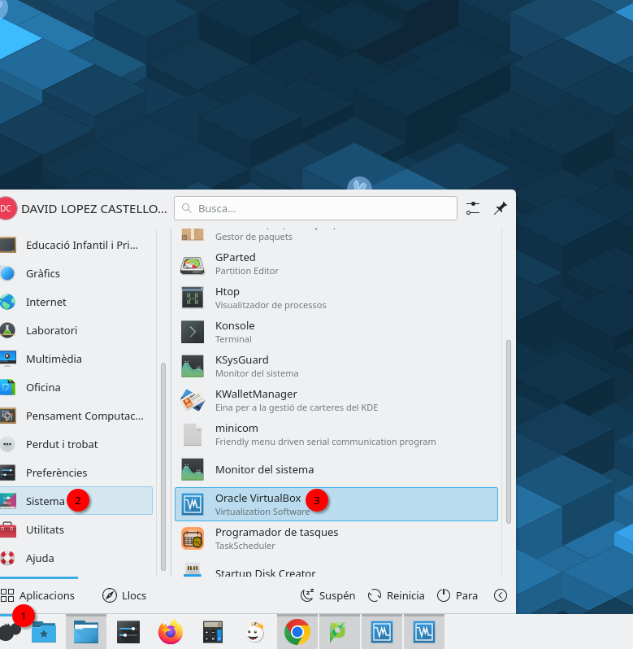
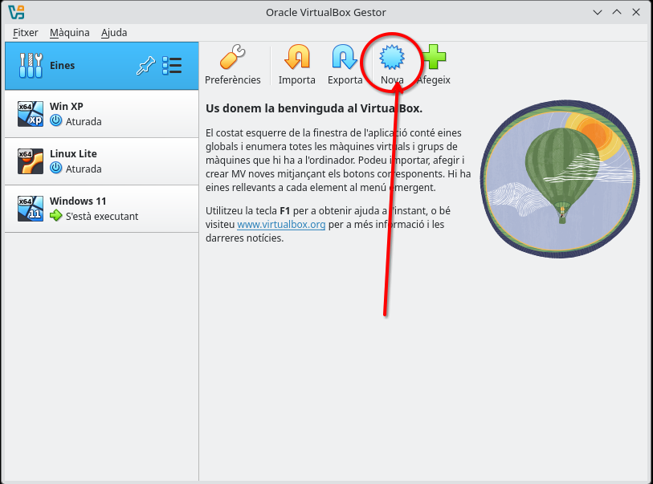
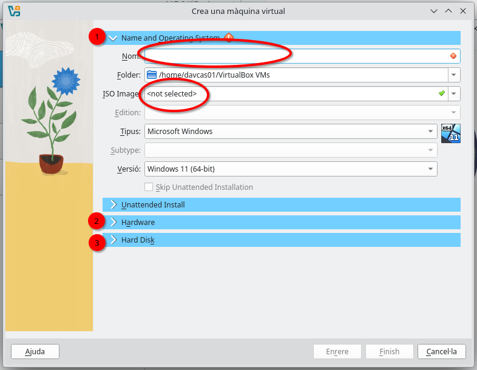

# Crear una máquina virtual en VirtualBox en Lliurex

## 1. Buscar VirtualBox en el menú de aplicaciones de Lliurex

{: .img .img-500}

## 2. Crear una nueva máquina virtual

{: .img .img-500}

## 3. Especificar los datos de la máquina virtual

> Debemos completar todos los datos de forma correcta dependiendo del sistema operativo que vayamos a instalar. **Es muy importante** especificar un nombre y el archivo **.iso** del sistema operativo.
{: .alert-warning}

{: .img .img-500}
