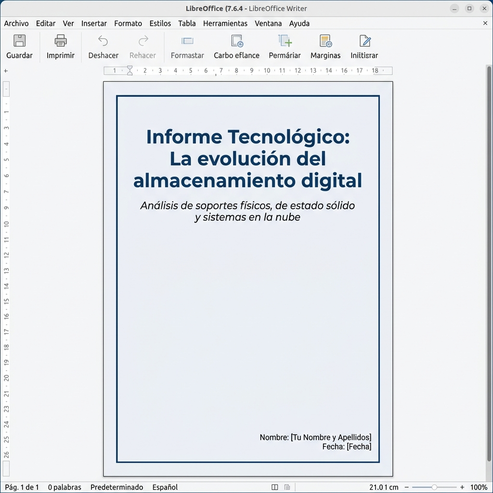

# 📝 Actividad 1 – Creación de documentos con LibreOffice Writer

## Objetivo
Dominar de forma avanzada las herramientas de maquetación y diseño de **LibreOffice Writer**. A través de esta actividad, aprenderás a trabajar con **estilos de página** (portada vs. contenido), aplicarás formatos avanzados de **carácter** (colores, resaltados, efectos) y **párrafo** (sangrías, letras capitulares, bordes con sombra), utilizarás **secciones** con fondos personalizados, insertarás imágenes con **leyendas automatizadas**, y estructurarás tablas con **estilos y alineaciones celdas personalizadas**.

---

## Pasos de la actividad

> ⚠️ **¡Atención!** Trabaja de forma ordenada. Recuerda guardar tu documento dentro de tu carpeta del curso: `Digitalizacion_4ESO/Tema_2/Actividad_1/`.
{: .alert-warning}

### 1. Portada y Estilos de Página
Una portada académica nunca debe llevar encabezado ni pie de página. Para lograr esto, utilizaremos los **Estilos de Página** de Writer.

1. Abre **LibreOffice Writer**.
2. Ve al panel lateral derecho, abre la pestaña de **Estilos** (icono de la `A` con un pincel) y haz clic en el icono de **Estilos de página** (el cuarto icono).
3. Haz doble clic sobre el estilo **Primera página**. Verás que en la barra de estado de abajo ahora pone "Primera página".
4. **Configuración de márgenes, borde y espaciado de la Portada:** 
   * Ve a *Formato -> Estilo de página...* 
   * En la pestaña **Página**, cambia los márgenes a `2,0 cm` en todos los lados (superior, inferior, izquierdo, derecho).
   * En la pestaña **Bordes**, añade un borde completo de color azul oscuro con un grosor de `1,50 pt`. En la sección **Separación** (el espaciado de seguridad para separar el borde del texto), configúralo a `1,0 cm` en todos los lados.
   * En la pestaña **Área**, pon un color de fondo muy claro (por ejemplo, azul pastel o gris claro) solo para esta primera hoja de portada.
5. Vuelve a **Estilos de párrafo** (el primer icono de la pestaña de estilos lateral). 
6. Diseña tu portada utilizando **Estilos de Párrafo**:
   * Escribe el título: **«Informe Tecnológico: La evolución del almacenamiento digital»**.
     * Con el cursor en esa línea, selecciona el estilo **Título** (Title) de la lista de estilos.
     * Modifica el formato manualmente: fuente **Liberation Sans**, tamaño **38 pt**, negrita, centrado y color **Azul oscuro** similar al del borde de la página.
     * **Actualizar el estilo:** Con el texto seleccionado, ve al panel de Estilos lateral, despliega las opciones del botón de arriba a la derecha (icono con flecha junto al botón de nuevo estilo) y haz clic en **Actualizar estilo seleccionado** (Update Selected Style). Esto hará que el estilo "Título" asuma de forma definitiva esta configuración.
   * Escribe el subtítulo: *«Análisis de soportes físicos, de estado sólido y sistemas en la nube»*.
     * Aplícale el estilo **Subtítulo** (Subtitle).
     * Modifícalo a: fuente **Liberation Sans**, tamaño **18 pt**, cursiva, centrado, color gris oscuro y actualiza el estilo con la opción **Actualizar estilo seleccionado**.
   * Deja varios espacios vacíos para desplazar los datos del autor hacia la parte inferior.
   * Escribe tu nombre, apellidos y fecha. Aplícales el estilo **Texto predeterminado** (o Cuerpo de texto). Aplica a estos datos la fuente **Liberation Sans**, tamaño de **11 pt**, y **alínealos a la derecha**.
7. Inserta un salto de página manual que cambie el estilo de la siguiente hoja a normal:
   * Ve a *Insertar -> Más saltos -> Salto manual...*
   * Elige **Salto de página** y en **Estilo** selecciona **Estilo predeterminado** (Default Page Style). Haz clic en *Aceptar*.

**Ejemplo de resultado esperado (Portada):**
{: .no-border}

---

### 2. Formato de carácter y párrafo
En esta segunda página (que ahora tiene el *Estilo predeterminado*), redactaremos la introducción aplicando formatos detallados y estructurando los encabezados mediante estilos para poder generar un índice automático en el futuro.

1. Escribe el título: **«1. Introducción al almacenamiento digital»**.
   * Selecciónalo y asígnale el estilo **Título 1** (Heading 1).
   * Modifícalo a: fuente **Liberation Sans**, tamaño **14 pt**, negrita, color **Azul oscuro** y actualiza el estilo pulsando en **Actualizar estilo seleccionado**.
2. Redacta dos párrafos de introducción (de unas 5-6 líneas cada uno) sobre la evolución del almacenamiento desde los disquetes hasta el almacenamiento moderno.
3. Aplica los siguientes formatos avanzados:
   * **Párrafo general:** Fuente *Liberation Serif*, 11 pt, **Justificado**, interlineado de `1,15 líneas`, con un espaciado de `0,25 cm` después del párrafo.
   * **Letra Capitular (Drop Cap):** Selecciona el primer párrafo, ve a *Formato -> Párrafo -> pestaña Letras capitulares*. Activa "Mostrar letras capitulares", que ocupe `3 líneas` de alto y tenga una distancia al texto de `0,2 cm`.
   * **Sangría de primera línea:** En el segundo párrafo, añade una sangría de primera línea de `1,25 cm` (*Formato -> Párrafo -> pestaña Sangrías y espaciados*).
   * **Efectos de carácter:** Destaca 3 palabras clave del texto usando negrita y **color de fuente azul**. Busca un término en inglés (ej. *cloud computing*), aplícale cursiva y un **color de fondo de carácter (resaltado) amarillo suave**.
4. **Párrafo destacado (Callout):** Inserta un tercer párrafo corto con una frase célebre o dato curioso. Selecciónalo y aplícale:
   * Sangría izquierda y derecha de `1,5 cm`.
   * Un borde izquierdo grueso (de `3,0 pt` en color azul) y ningún borde en los otros lados.
   * Un color de fondo gris muy claro y un sombreado gris (*Formato -> Párrafo -> pestaña Bordes*).

---

### 3. Secciones y columnas con personalización
1. Sal del párrafo destacado y añade un título de nivel 2: **«1.1. Comparación de soportes magnéticos y ópticos»**.
   * Selecciónalo y asígnale el estilo **Título 2** (Heading 2).
   * Modifícalo a: fuente **Liberation Sans**, tamaño **12 pt**, negrita, color **Azul oscuro** y pulsa en **Actualizar estilo seleccionado**.
2. Inserta una sección de dos columnas con fondo personalizado:
   * Ve a *Insertar -> Sección...*
   * En la pestaña **Columnas**, selecciona `2` columnas y añade un espacio de separación de `0,5 cm` entre ellas.
   * En la pestaña **Área**, selecciona un color de fondo muy suave (por ejemplo, verde pastel claro o amarillo pastel claro).
   * Haz clic en *Insertar*.
3. Escribe en la columna de la izquierda el funcionamiento básico de un disco duro mecánico (HDD) y en la de la derecha el de un disco óptico (CD/DVD).
4. Aplica una **sangría de sección** de `0,5 cm` a la izquierda y derecha para que el color de fondo de la sección no quede pegado a los márgenes generales del papel.

---

### 4. Inserción de imágenes con leyendas y tablas
1. Sal de la sección haciendo doble clic abajo y escribe el título: **«2. Comparativa de rendimiento de unidades de estado sólido»**.
   * Selecciónalo y asígnale el estilo **Título 1** (Heading 1). Verás que automáticamente adopta el formato (14 pt, negrita, azul oscuro) que definiste previamente al actualizar este estilo.
2. Busca e inserta una imagen de un disco SSD:
   * Cambia su tamaño de manera proporcional (manteniendo la relación de aspecto) para que ocupe el centro de la página.
   * **Leyenda automática:** Haz clic derecho sobre la imagen y selecciona **Insertar leyenda...**. Escribe como texto: `Estructura interna de una unidad SSD NVMe`. Writer añadirá automáticamente el texto debajo con el formato "Ilustración 1: ...".
   * Ajusta el texto para que la imagen y su leyenda tengan un ajuste **Arriba y abajo** (el texto no se colocará a los lados, sino que fluirá limpiamente antes y después).
3. **Tabla con formato avanzado:** Inserta una tabla de **4 columnas y 4 filas** para comparar tecnologías (SATA SSD, M.2 SATA, NVMe PCIe 3.0, NVMe PCIe 4.0):
   * **Fila de cabecera:** Aplica un color de fondo azul oscuro, texto en blanco, negrita y centrado.
   * **Alineación vertical:** Selecciona toda la tabla, haz clic derecho y en *Propiedades de la tabla -> pestaña Flujo de texto* (o desde el menú Alineación), asegúrate de que el texto de todas las celdas esté **centrado verticalmente**.
   * **Bordes personalizados:** Configura los bordes internos de la tabla en color gris claro (`0,5 pt`) y el borde exterior en un color azul más grueso (`1,5 pt`).
   * Añade datos de velocidad de lectura/escritura y precio estimado en las celdas.

---

### 5. Secciones horizontales y saltos de página
1. Al final del documento, introduce un salto de página manual para cambiar la orientación de la hoja:
   * *Insertar -> Salto manual... -> Salto de página*.
   * En **Estilo**, selecciona **Página horizontal** (Landscape). Haz clic en *Aceptar*.
2. En esta hoja horizontal, añade el título: **«3. Mapa de ruta y velocidades de transferencia del almacenamiento»**.
   * Selecciónalo y asígnale el estilo **Título 1** (Heading 1).
3. Inserta una tabla ancha de 6 columnas donde detalles una cronología del almacenamiento (desde 1980 hasta la actualidad). Al estar en página horizontal, aprovecha el espacio para hacer las columnas anchas.
4. Regresa al formato vertical: introduce otro salto manual (*Insertar -> Salto manual... -> Salto de página*) y selecciona en estilo: **Estilo predeterminado**.

---

### 6. Encabezados y pies de página con campos dinámicos
1. Haz clic en la cabecera de la página 2 (Estilo predeterminado) y añade un **Encabezado**.
2. Escribe a la izquierda: **«Tema 2: Documentos Digitales»**.
3. Pulsa el tabulador para ir a la derecha e inserta un campo automático: *Insertar -> Campo -> Fecha*. Verás que se inserta la fecha de hoy de manera automática.
4. En el pie de página, añade un **Pie de página**.
5. Escribe a la izquierda tu nombre completo, y a la derecha introduce la numeración en formato dinámico:
   * Escribe la palabra `Página ` e inserta el campo *Número de página* (*Insertar -> Campo -> Número de página*).
   * Escribe ` de ` e inserta el campo *Total de páginas* (*Insertar -> Campo -> Total de páginas*).
   * Debe quedar visualmente como: `Página 2 de 4` (y se actualizará solo).
6. **Verificación:** Comprueba que la página de la Portada (página 1) **no tiene** ni encabezado ni pie de página, gracias al uso de estilos de página independientes.

---

## Entregables en Aules

Sube a la tarea de Aules únicamente el archivo de LibreOffice Writer editable:
* **`actividad1_writer_tuapellido_tunombre.odt`**

---

## Rúbrica de Evaluación

| Criterio | 0 pts | 1 pt | 2 pts | 3 pts |
|----------|-------|------|------|------|
| **Estilos de página y Portada** (máx. 3 pts) | No aplica estilos de página diferenciados. La portada tiene encabezado/pie de las demás páginas. | Aplica estilos de página pero la portada carece de formato visual (bordes, fondo de área) o datos del alumno. | Configura la portada sin encabezado/pie, pero el formato visual no coincide con las especificaciones (borde de 1.5 pt, fondo de área). | Portada perfecta con estilo "Primera página" (sin cabecera/pie), borde azul de 1.5 pt, fondo de área suave y datos bien estructurados. |
| **Formato de párrafo avanzado** (máx. 2 pts) | No aplica sangrías ni letras capitulares de forma correcta. | Aplica algunos formatos de párrafo, pero carece de la letra capitular exacta (3 líneas, 0.2 cm), la sangría de primera línea (1.25 cm) o el párrafo callout. | Formato de párrafo impecable: letra capitular configurada con precisión, sangría en segundo párrafo y estilo callout destacado con borde izquierdo azul y fondo gris. | |
| **Secciones, columnas y fondos** (máx. 2 pts) | No crea secciones ni divide el texto en columnas. | Crea las columnas pero no aplica el fondo de color de sección, o no define las sangrías de sección requeridas. | Sección de dos columnas estructurada con separación de 0.5 cm, color de fondo suave y sangrías de sección laterales de 0.5 cm aplicadas. | |
| **Imágenes con leyendas y tablas avanzadas** (máx. 2 pts) | Inserta tablas e imágenes sin formato ni alineaciones avanzadas. | Imagen sin leyenda automática o tabla con texto desalineado verticalmente y bordes genéricos. | Imagen con leyenda automática e interactiva. Tabla con cabecera en azul oscuro/blanco, bordes personalizados y textos centrados verticalmente. | |
| **Alternancia de páginas (Vertical/Horizontal)** (máx. 1 pt) | No alterna la orientación de las páginas. | | | Alterna correctamente páginas verticales y horizontales de forma limpia usando saltos de página con cambio de estilo. |

**Criterios de evaluación de la programación:**
* **CE2 – 2.3.** Crear, integrar y editar contenidos digitales con sentido estético de manera individual o colectiva, seleccionando las herramientas más apropiadas para generar un nuevo conocimiento y contenidos digitales de manera creativa, y respectando los derechos de autoría.
