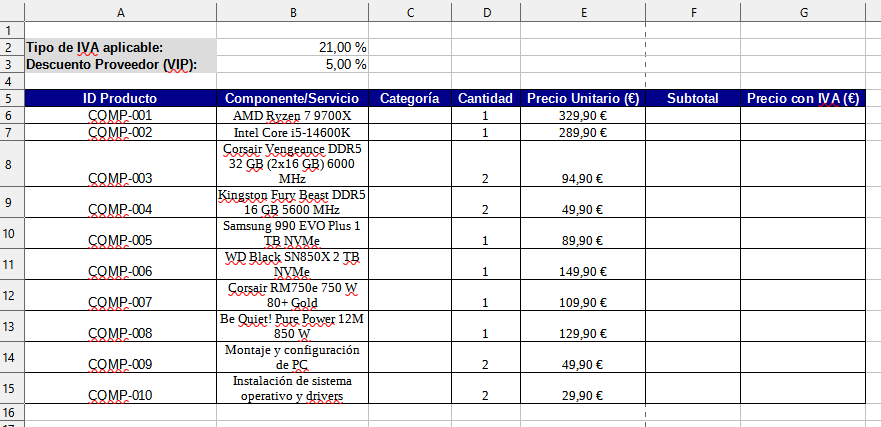
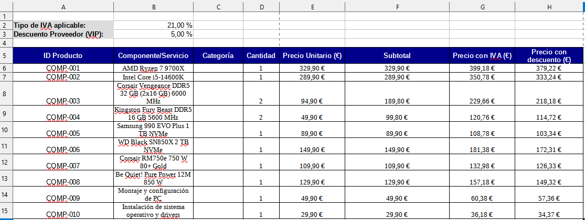
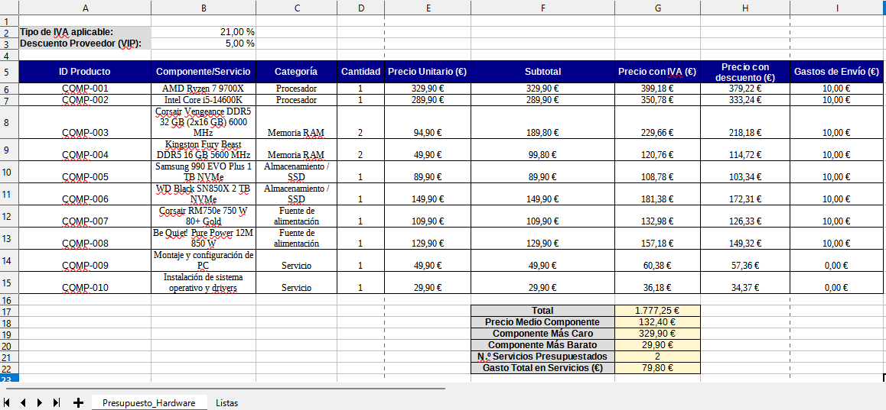
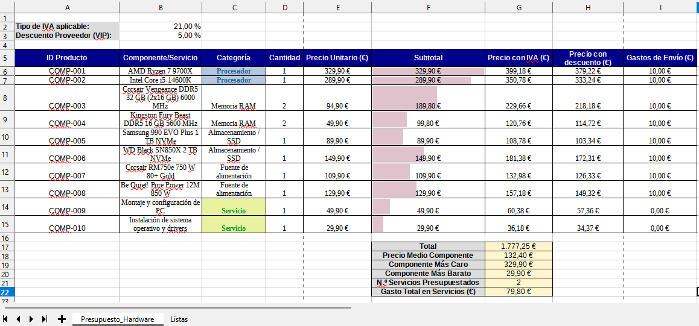
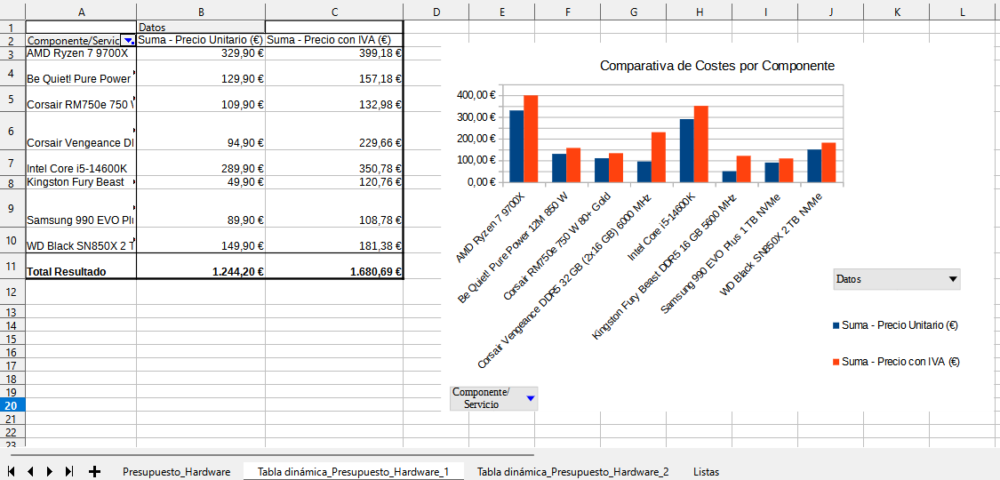
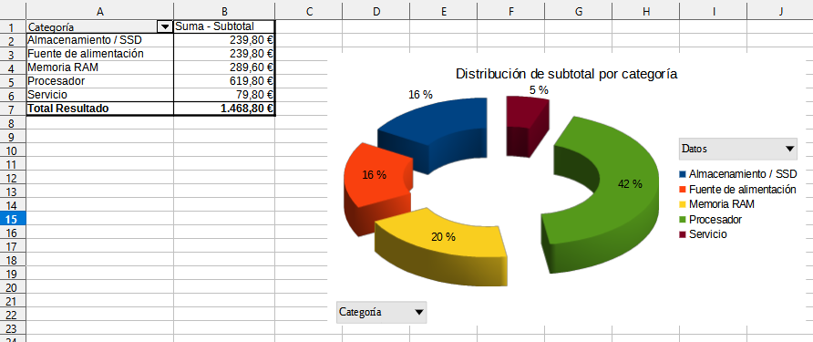
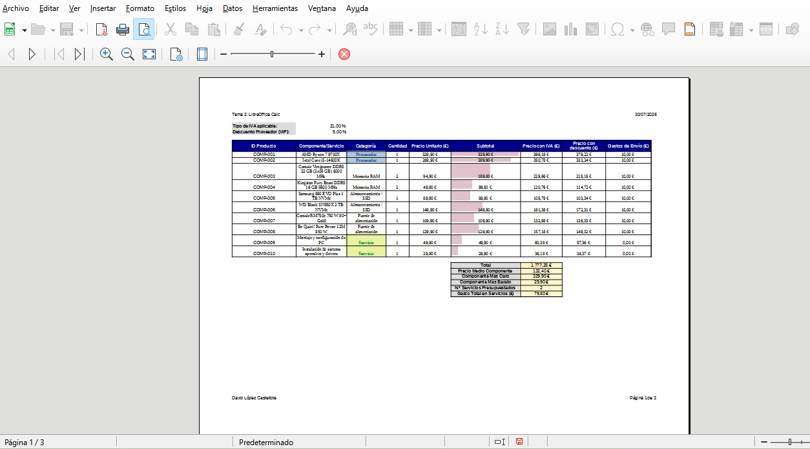

# 📊 Actividad 2 – Gestión de datos y presupuestos con LibreOffice Calc

## Objetivo
Dominar las herramientas esenciales de cálculo, análisis de datos y representación gráfica en **LibreOffice Calc**. A lo largo de esta actividad, aprenderás a estructurar una hoja de cálculo profesional aplicando **formatos de celda** (moneda, porcentajes, bordes), utilizarás **autorrelleno y series**, dominarás el uso de **referencias relativas y absolutas ($)**, crearás **listas desplegables mediante validez de datos**, construirás **tablas dinámicas**, aplicarás **funciones matemáticas, estadísticas y lógicas** (`SUMA`, `PROMEDIO`, `MAX`, `MIN`, `SI`, `CONTAR.SI`, `SUMAR.SI`), destacarás información mediante **formato condicional** y crearás **gráficos dinámicos y personalizados** aptos para informes profesionales.

---

## Pasos de la actividad

> ⚠️ **¡Atención!** Trabaja de forma organizada. Guarda tu documento de Calc en tu carpeta personal del curso: `Digitalizacion_4ESO/Tema_2/Actividad_2/actividad2_calc_tuapellido_tunombre.ods`.
{: .alert-warning}

### 1. Configuración del Libro, Estructura y Formato de Celdas
Comenzaremos creando la tabla de costes de componentes informáticos y aplicando los formatos de celda principales.

1. Abre **LibreOffice Calc** y renombra la pestaña inferior "Hoja1" a **`Presupuesto_Hardware`** (doble clic sobre la pestaña).
2. **Cuadro de Parámetros (`A2:B3`):**
   * Escribe en `A2`: `Tipo de IVA aplicable:` y en `B2`: `21%`.
   * Escribe en `A3`: `Descuento Proveedor (VIP):` y en `B3`: `5%`.
   * *Formato:* Aplica fondo gris claro y negrita a `A2:A3`. Selecciona `B2:B3` y aplica el formato **Porcentaje (`%`)** con el botón de la barra superior (o *Formato -> Celdas -> Números*).
3. **Cabecera de la Tabla (`A5:G5`):**
   * Escribe las cabeceras: `ID Producto`, `Componente / Servicio`, `Categoría`, `Cantidad`, `Precio Unitario (€)`, `Subtotal (€)` y `Precio con IVA (€)`.
   * *Estilo:* Aplica fondo azul oscuro, texto blanco, negrita y alineación centrada (horizontal y vertical).
4. **Serie de IDs (`A6:A15`):**
   * Escribe `COMP-001` en `A6` y arrastra el tirador de relleno (cuadradito negro de la esquina de la celda) hacia abajo hasta `A15` para generar los códigos (`COMP-001` a `COMP-010`).
5. **Relleno de datos y Formato Moneda (€):**
   * Rellena las filas `B6:E15` con 10 componentes y/o servicios informáticos (procesadores, SSDs, memorias RAM, fuentes de alimentación, cajas, servicio de montaje, etc.), sus cantidades y precios unitarios. Puedes utilizar una IA para que te ayude en esta tarea. **No rellenes la categoría (la seleccionaremos con una lista desplegable en el Ejercicio 3), ni el subtotal ni el precio con IVA ya que se calcularán de forma automática.**{: .rojo}.
   * Selecciona las columnas de precios (`E6:G15`) y haz clic en el icono de **Moneda (€)** en la barra de herramientas superior.
6. **Bordes y Ancho de columna:**
   * Selecciona toda la tabla (`A5:G15`) y añade **Bordes completos** desde la barra de herramientas.
   * Ajusta el ancho de las columnas (*Formato -> Columnas -> Anchura óptima...*).

**Ejemplo de resultado esperado (Estructura y formato de celdas):**
{: .centrado}

{: .no-border .img .img-450}

> **Importante**: Sube a Aules el documento con el **ejercicio 1 finalizado** y con el nombre: `actividad2_calc_tuapellido_tunombre_ej1.ods`
{: .alert-success}

---

### 2. Fórmulas básicas y Referencias Relativas y Absolutas ($)
Para realizar cálculos automáticos que se actualicen si cambian las condiciones (como el % de IVA), utilizaremos referencias fijas o absolutas.

1. **Cálculo del Subtotal (Referencia Relativa):**
   * En la celda `F6`, escribe la fórmula para calcular el subtotal de la primera fila: `=D6*E6` (Cantidad * Precio Unitario).
   * Copia la fórmula arrastrando el tirador de relleno hacia abajo hasta `F15`.
2. **Cálculo del Precio con IVA (Referencia Absoluta `$B$2`):**

   * En la celda `G6`, calcula el importe final aplicando el IVA.
   
 > **Nota:** Para calcular el precio con IVA de un producto, suma al subtotal el resultado de multiplicar el subtotal por el tipo de IVA. Es decir, la fórmula quedaría: `=F6+F6*$B$2`, ya que la celda `B2` es la celda donde tenemos anotado el IVA que se debe aplicar.
 {: .alert-info}

> 💡 **¿Por qué usamos `$B$2`?** El signo `$` puesto delante de la letra fija la fila y puesto delante del número fija la columna para que al arrastrar la fórmula hacia abajo, la celda del IVA no cambie a B3, B4, etc.
{: .alert-warning}
   * Copia la fórmula desde `G6` hasta `G15`. Comprueba que todas las filas calculan el IVA correctamente sobre la celda `B2`.

3. **Cálculo del Precio con Descuento (Referencia Absoluta `$B$3`):**
   * Añade una nueva columna a la tabla en la celda `H5` con la cabecera **«Precio con Descuento (€)»**. Puedes aplicar fácilmente el estilo y formato del resto de columnas seleccionando una celda ya formateada y haciendo clic en **Clonar formato** (icono del pincel/brocha de la barra de herramientas).
   * En la celda `H6`, **calcula el importe final aplicando el descuento del proveedor.**
{:start="3"}

 > **Nota:** Para calcular el precio con descuento de un producto, debes escribir una fórmula que reste al precio con IVA (en la columna G) el resultado de multiplicar el precio con IVA por el porcentaje de descuento (en la celda `B3`).
 {: .alert-info}

> 💡 **Recordatorio:** Al igual que con el IVA, usamos la referencia absoluta `$B$3` para fijar la celda del descuento al arrastrar la fórmula hacia abajo.
{: .alert-warning}

   * Copia la fórmula desde `H6` hasta `H15`. Comprueba que todas las filas calculan el descuento correctamente sobre la celda `B3`.

**Ejemplo de resultado esperado (Fórmulas básicas y referencias relativas y absolutas):**
{: .centrado}

{: .no-border .img .img-450}

> **Importante**: Sube a Aules el documento con el **ejercicio 2 finalizado** y con el nombre: `actividad2_calc_tuapellido_tunombre_ej2.ods`
{: .alert-success}

---

### 3. Lista Desplegable (Validez de datos), Funciones Estadísticas y Lógicas
Crearemos una pestaña auxiliar de listas, aplicaremos validación de datos para la columna Categoría y utilizaremos funciones condicionales y estadísticas para analizar el presupuesto.

1. **Creación de Pestaña Auxiliar y Lista Desplegable (`C6:C15`):**
   * Añade una nueva pestaña al libro haciendo clic en el botón **`+`** (junto a la pestaña inferior `Presupuesto_Hardware`) y renómbrala a **`Listas`** (doble clic sobre el nombre de la pestaña).
   * En la pestaña `Listas`, escribe en la columna `A` (rango `A1:A8`) las categorías válidas de componentes: `Procesador`, `Memoria RAM`, `Almacenamiento / SSD`, `Placa base`, `Tarjeta gráfica`, `Fuente de alimentación`, `Caja / Torre` y `Servicio`.
   * Vuelve a la pestaña **`Presupuesto_Hardware`**, selecciona las celdas de la columna Categoría (`C6:C15`) y ve al menú superior: *Datos -> Validez...* (o *Validación de datos...*).
   * En la pestaña **Criterios**, selecciona *Permitir:* **Lista de celdas** (o *Intervalo de celdas*).
   * En el campo **Origen** (o *Rango* o *Fuente*), escribe o selecciona el rango de la otra pestaña: `$Listas.$A$1:$A$8` y pulsa **Aceptar**.
   * Comprueba que al hacer clic en cualquiera de las celdas `C6:C15` aparece un desplegable y asigna la categoría adecuada a cada uno de los 10 productos/servicios de tu presupuesto.

2. **Fila de Totales y Resumen Estadístico (Filas 17 a 22):**
   * En `F17` escribe `Total:` y en `G17` aplica la función sumatorio: `=SUMA(G6:G15)`.
   * En `F18` escribe `Precio Medio Componente:` y en `G18` usa la función `=PROMEDIO(E6:E15)`.
   * En `F19` escribe `Componente Más Caro:` y en `G19` usa `=MAX(E6:E15)`.
   * En `F20` escribe `Componente Más Barato:` y en `G20` usa `=MIN(E6:E15)`.
   * En `F21` escribe `Nº de Servicios Presupuestados:` y en `G21` usa `=CONTAR.SI(C6:C15; "Servicio")`.
   * En `F22` escribe `Gasto Total en Servicios (€):` y en `G22` usa `=SUMAR.SI(C6:C15; "Servicio"; G6:G15)`.
   * *Estilo y formato del resumen (`F17:G22`):* Pon las celdas con el texto/etiquetas (`F17:F22`) en **negrita** y **fondo gris claro**, y las celdas de los cálculos (`G17:G22`) en **fondo naranja claro**. Aplica **alineación centrada** a todo el bloque de celdas (`F17:G22`) y borde a todas ellas.

3. **Uso de la Función Lógica `SI` (Gastos de Envío según Categoría):**
   * Añade una nueva columna a la tabla en la celda `I5` con la cabecera **«Gastos de Envío (€)»**.
   * En la celda `I6`, escribe una fórmula condicional que compruebe si la categoría es un servicio. Si es igual a `"Servicio"`, los gastos de envío son `0 €`; si es cualquier otra categoría (producto físico), son `10 €`:
     `=SI(C6="Servicio"; 0; 10)`
   * Arrastra la fórmula desde `I6` hasta `I15`. Aplica el formato **Moneda (€)** a las celdas `I6:I15`.
   * Acuérdate de **aplicar el mismo estilo** que tienen el resto de columnas a esta columna nueva.

**Ejemplo de resultado esperado (Funciones matemáticas, estadísticas, lógicas y validación de datos):**
{: .centrado}

{: .no-border .img .img-450}

> **Importante**: Sube a Aules el documento con el **ejercicio 3 finalizado** y con el nombre: `actividad2_calc_tuapellido_tunombre_ej3.ods`
{: .alert-success}

---

### 4. Formato Condicional y Código de Colores
Utilizaremos el formato condicional para destacar visualmente las categorías y los importes de los subtotales de forma automática.

1. Selecciona las celdas de la columna Categoría (`C6:C15`).
2. Ve al menú superior: *Formato -> Condicional -> Condición...*
3. **Regla 1 (Servicios):** Si el valor de la celda es *igual a* `"Servicio"` (debes poner las comillas), aplica un estilo con fondo verde claro y texto en verde oscuro/negrita. (escoge *Estilo nuevo* y busca entre las pestañas los estilos que te permitan aplicar el formato que te piden).
4. **Regla 2 (Procesadores):** Añade una segunda condición: si el valor es *igual a* `"Procesador"`, aplica un estilo con fondo azul claro y texto en azul oscuro. Para ello, vuelve a seleccionar las celdas (`C6:C15`), ve a *Formato -> Condicional -> Condición...* y añade una nueva condición.
5. **Escala de Color / Barras de datos en Subtotales:** Selecciona el rango de Subtotales (`F6:F15`), ve a *Formato -> Condicional -> Barra de datos* para añadir una barra visual proporcional al coste subtotal de cada producto. En *Más opciones* elige como *Positivo* un color distinto al azul y como *Relleno* elige *Color*.

**Ejemplo de resultado esperado (Formato condicional y código de colores):**
{: .centrado}

{: .no-border .img .img-450}

> **Importante**: Sube a Aules el documento con el **ejercicio 4 finalizado** y con el nombre: `actividad2_calc_tuapellido_tunombre_ej4.ods`
{: .alert-success}

---

### 5. Creación de Tablas Dinámicas y Personalización de Gráficos
Para resumir y representar visualmente los datos de forma agrupada, crearemos tablas dinámicas (Pivot Tables) y generaremos los gráficos a partir de ellas.

1. **Tabla Dinámica 1 y Gráfico 1: Comparativa de Precios por Componente (Gráfico de Columnas)**
   * Selecciona toda la tabla principal (`A5:I15`).
   * Ve al menú superior: *Insertar -> Tabla dinámica...* (o *Insertar -> Tabla pivote...*) y pulsa **Aceptar**.
   * En el diseñador de la tabla dinámica:
     * Arrastra **`Componente / Servicio`** a **Campos de fila**.
     * Arrastra **`Precio Unitario (€)`** y **`Precio con IVA (€)`** a **Campos de datos**.
     * Pulsa **Aceptar** para generar la tabla dinámica.
   * **Crear el gráfico:** Selecciona los datos de la tabla dinámica generada (menos la fila de totales), ve a *Insertar -> Gráfico...* y elige el tipo **Columna (Barra vertical)**.
   * Ponle como Título: `Comparativa de Costes por Componente`.
   * En la tabla dinámica, en la columna de *Componente/Servicio*, **quita de la selección la instalación y el montaje**, para que solo aparezcan en la tabla y el gráfico los componentes de hardware.

2. **Tabla Dinámica 2 y Gráfico 2: Distribución por Categorías (Gráfico Circular / Tarta)**
   * Vuelve a la pestaña principal y selecciona toda la tabla (`A5:I15`).
   * Ve a *Insertar -> Tabla dinámica...*, escoge *Selección actual* y pulsa **Aceptar**.
   * En el diseñador de la tabla dinámica:
     * Arrastra **`Categoría`** a **Campos de fila**.
     * Arrastra **`Subtotal (€)`** a **Campos de datos** (comprueba que realice la *Suma*).
     * Pulsa **Aceptar** (esto agrupará automáticamente los subtotales por cada categoría única).
   * **Crear el gráfico:** Selecciona la tabla dinámica agrupada por categorías (excepto la fila de totales), ve a *Insertar -> Gráfico...* y elige el tipo **Circular (Tarta)**.
   * Elige *Aspecto 3D* realista y estilo *Gráfico de anillos esparcido*.
   * Título: `Distribución del Subtotal por Categoría`.
   * Muestra las **etiquetas de datos** en porcentaje (`%`) sobre cada porción del gráfico:
     * Haz doble clic en el gráfico para entrar en modo de edición (aparece un borde gris).
     * Haz clic derecho sobre la tarta/anillo y selecciona **Insertar etiquetas de datos**.
     * Haz clic derecho sobre los números que han aparecido y selecciona **Formato de etiquetas de datos...**
     * En la pestaña *Etiquetas de datos*, marca **Mostrar valor como porcentaje** y desmarca *Mostrar valor como número*.
     * Mueve algún número manualmente si no se visualiza de forma adecuada.

**Ejemplo de resultado esperado (Tablas dinámicas y gráficos):**
{: .centrado}

{: .no-border .img .img-450}

{: .no-border .img .img-450}

> **Importante**: Sube a Aules el documento con el **ejercicio 5 finalizado** y con el nombre: `actividad2_calc_tuapellido_tunombre_ej5.ods`
{: .alert-success}

---

### 6. Maquetación, Encabezado/Pie y Exportación
1. En la pestaña **`Presupuesto_Hardware`** (y en las pestañas creadas con las tablas dinámicas y gráficos), ve al menú superior: *Formato -> Estilo de página...* (o *Formato -> Página...*).
2. En la pestaña **Página**, pon la orientación en **Horizontal** (para que la tabla de presupuesto, las tablas dinámicas y los gráficos quepan perfectamente a lo ancho sin cortarse).
3. En la pestaña **Cabecera**, activa el encabezado y haciendo clic en *Editar* añade a la izquierda: `Tema 2: LibreOffice Calc` y a la derecha el campo **Fecha**.
4. En la pestaña **Pie de página**, activa el pie y añade a la izquierda tu nombre completo y a la derecha el campo **Página X de Y**.
5. Para ajustar el contenido a 1 sola página: en la ventana de *Formato -> Página...*, ve a la pestaña **Hoja**, en la sección **Modo de escala** elige la opción **"Ajustar zonas de impresión en número de páginas"** y pon el valor en `1`. Revisa cómo queda el resultado desde *Archivo -> Previsualización de impresión*.

**Ejemplo de resultado esperado (Maquetación, encabezado/pie y previsualización):**
{: .centrado}

{: .no-border .img .img-450}

> **Importante**: Sube a Aules el documento con el **ejercicio 6 finalizado** y con el nombre: `actividad2_calc_tuapellido_tunombre_ej6.ods`
{: .alert-success}

---

## Entregables en Aules

Sube a la tarea de Aules los siguientes **dos archivos**:
* **`actividad2_calc_tuapellido_tunombre_final.ods`** (Libro editable de LibreOffice Calc con fórmulas funcionales)
* **`actividad2_calc_tuapellido_tunombre_final.pdf`** (Para ello, selecciona las pestañas de `Presupuesto_Hardware` y las dos pestañas de Tablas Dinámicas manteniendo la tecla **Ctrl**, ve a *Archivo -> Exportar a PDF...*, marca la opción *Selección/Hojas seleccionadas*, añade tu **Nombre y Apellidos** en el campo **Marca de agua** y guarda el archivo)

---

## Rúbrica de Evaluación

| Criterio | 0 pts | 0.5 pts | 1 pt | 1.5 pts | 2 pts |
|----------|-------|---------|------|---------|-------|
| **1. Estructura y formato de celda** (máx. 1 pt) | No aplica formatos de celda ni estructura adecuada. | Diseña la tabla pero no aplica formatos de moneda (€), porcentaje (%), series completas o alineaciones. | Aplica formatos de celda correctos y autorrelleno, pero comete errores en la cabecera fija de parámetros o en la estética general. | Estructura perfecta: parámetros fijos (IVA/Dto), serie `COMP-001` a `010`, formatos de moneda (€) y porcentaje (%), cabecera azul y anchos óptimos. | |
| **2. Referencias Relativas y Absolutas ($)** (máx. 1.5 pts) | Escribe valores numéricos a mano sin usar fórmulas. | Usa fórmulas pero no aplica referencias absolutas (`$`), provocando errores al arrastrar la fórmula del IVA. | Calcula subtotales e IVA con fórmulas, pero comete algún fallo menor en la sintaxis de fijación de celdas (`$B$2` / `$B$3`). | Domina las referencias relativas y absolutas fijando correctamente las celdas `$B$2` (IVA) y `$B$3` (Descuento) sin errores al copiar. | |
| **3. Listas Desplegables, Funciones Matemáticas y Lógicas** (máx. 2 pts) | No utiliza funciones automáticas ni listas desplegables. | Usa solo la función SUMA pero omite las funciones estadísticas (`PROMEDIO`, `MAX`, `MIN`), la lista desplegable de categorías o la función `SI`. | Configura la lista desplegable y usa funciones pero comete errores en la sintaxis de `CONTAR.SI`, `SUMAR.SI` o en la condición de la función `SI`. | | Configura correctamente la lista desplegable desde la pestaña `Listas` y aplica `=SUMA`, `=PROMEDIO`, `=MAX`, `=MIN`, `=CONTAR.SI`, `=SUMAR.SI` y `=SI(C6="Servicio";0;10)` impecablemente. |
| **4. Formato Condicional y Alertas** (máx. 1 pt) | No aplica formato condicional. | Aplica color manual a las celdas en lugar de usar reglas de formato condicional automático. | Configura formato condicional pero solo con 1 regla o sin códigos de color bien contrastados. | Reglas de formato condicional automáticas perfectamente aplicadas por categorías ("Servicio", "Procesador") y barras de datos en subtotales. | | |
| **5. Representación Gráfica y Tablas Dinámicas** (máx. 1.5 pts) | No genera gráficos ni tablas dinámicas o son ilegibles. | Genera 1 solo gráfico sin tabla dinámica o sin títulos/leyendas. | Crea gráficos pero omite la generación previa de las tablas dinámicas o las etiquetas de porcentaje. | Construye 2 tablas dinámicas agrupadas y genera sus 2 gráficos correspondientes (Columnas y Tarta en %) impecablemente. | |
| **6. Encabezado, Pie e Impresión PDF** (máx. 1 pt) | No configura la página ni exporta a PDF. | Exporta a PDF pero las tablas/gráficos quedan cortados en varias páginas, carecen de encabezado/pie dinámico o no incluyen marca de agua. | Configuración de página horizontal impecable, encabezado/pie dinámicos, marca de agua con su nombre y exportación PDF ajustada a 1 página por pestaña. | | |
| **7. Entrega en plazo** (máx. 2 pts) | No entrega o entrega con un retraso de más de una semana. | Entrega con un retraso importante de hasta una semana. | Entrega con un pequeño retraso de máximo 2 días. | | Entrega la actividad a tiempo dentro del plazo establecido. |

> ⚠️ **Nota importante sobre la puntuación de entrega:** Los 2 puntos asignados al criterio de entrega en plazo solo se contabilizarán si el alumno/a ha realizado un esfuerzo real y significativo por completar la actividad. En ningún caso se otorgará esta puntuación por entregas simbólicas, archivos vacíos, o contenidos sin sentido o sin intencionalidad de resolver la tarea.
{: .alert-error}

**Criterios de evaluación de la programación:**
* **CE2 – 2.1.** Buscar, seleccionar y organizar la información en el entorno personal de aprendizaje.
* **CE2 – 2.2.** Evaluar la fiabilidad y calidad de la información.
* **CE2 – 2.3.** Crear, integrar y editar contenidos digitales con sentido estético de manera individual o colectiva.
* **CE2 – 2.5.** Organizar y almacenar la información de forma estructurada.
* **CE2 – 2.6.** Publicar y difundir contenidos digitales respetando las normas de propiedad intelectual.
