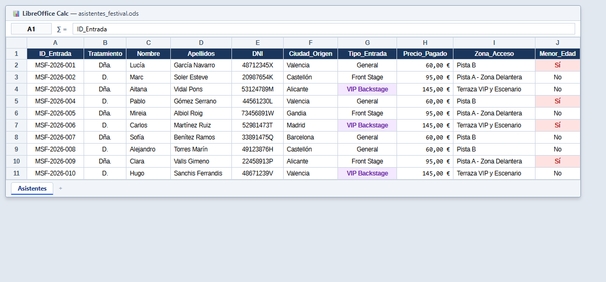
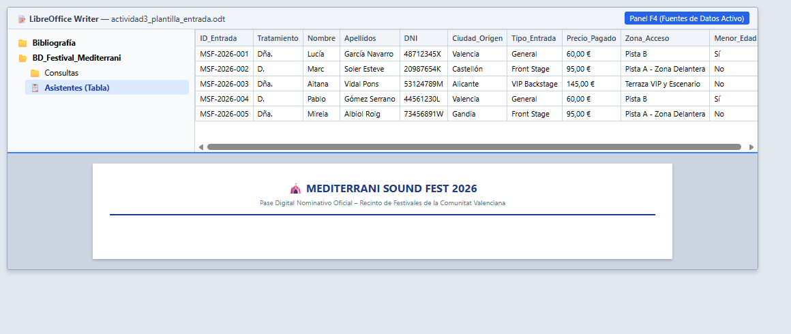
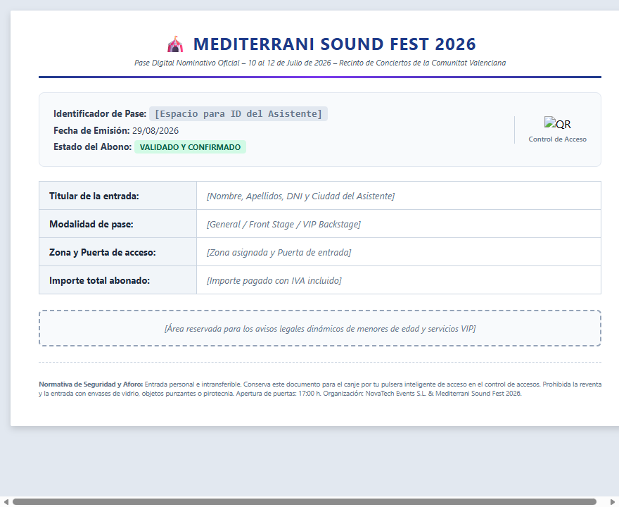
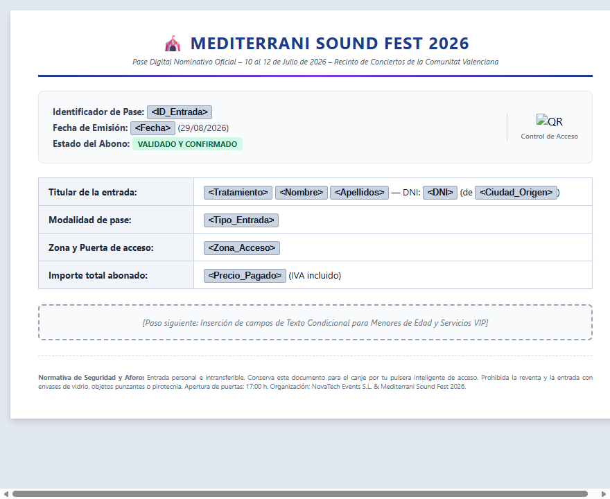
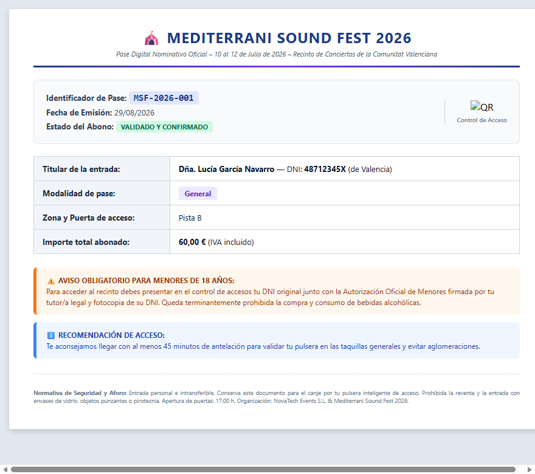
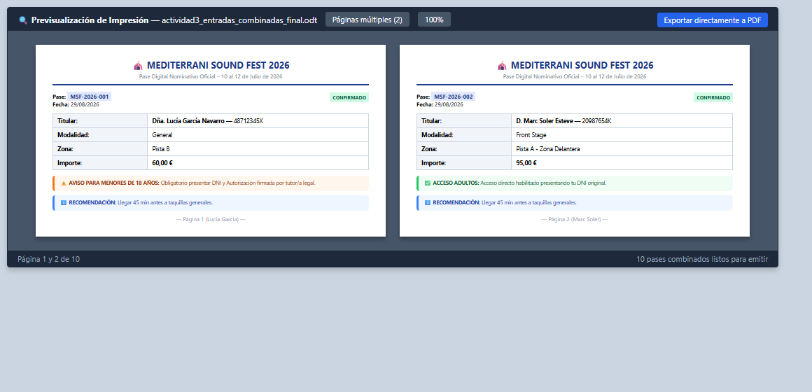

> 🛑 **PENDIENTE DE REVISAR**: Actividad pendiente de revisión paso a paso y de forma manual.
{: .alert-error}

# 🎪 Actividad 3 – Automatización de documentos: Pases Oficiales de Festival con Combinación de Correspondencia (Writer + Calc)

## Objetivo
Aprender a automatizar la creación masiva de documentos personalizados combinando la potencia de estructuración y gestión de datos de **LibreOffice Calc** con el diseño y maquetación avanzada de **LibreOffice Writer**. A través de esta actividad, actuarás como el equipo técnico de acreditaciones del festival de música **«Mediterrani Sound Fest 2026»**, crearás la base de datos de asistentes con diferentes perfiles de compra, registrarás la fuente de datos, diseñarás una **plantilla de entrada/pase digital nominativo**, insertarás **campos de combinación dinámicos**, aplicarás **lógica condicional (control legal de menores de edad y ventajas exclusivas VIP)** y generarás el lote final de entradas personalizadas en formato PDF listas para su emisión.

---

## Pasos de la actividad

> ⚠️ **¡Atención!** Trabaja de forma organizada. Guarda todos los archivos generados dentro de tu carpeta personal del curso: `Digitalizacion_4ESO/Tema_2/Actividad_3/`.
{: .alert-warning}

### 1. Preparación del Origen de Datos en LibreOffice Calc
Para que una combinación de correspondencia funcione a la perfección, la hoja de cálculo debe estar rigurosamente organizada: cada columna representa un **campo** (con su nombre en la fila 1) y cada fila posterior representa un **registro único de asistente** (sin celdas combinadas ni filas intermedias en blanco).

1. Abre **LibreOffice Calc** y guarda el archivo con el nombre `asistentes_festival.ods` en tu carpeta de la actividad.
2. Renombra la primera pestaña como **`Asistentes`** (doble clic sobre la pestaña inferior "Hoja1").
3. **Cabecera de campos (`A1:J1`):**
   * Escribe en la primera fila los siguientes nombres de columna:
     `ID_Entrada`, `Tratamiento`, `Nombre`, `Apellidos`, `DNI`, `Ciudad_Origen`, `Tipo_Entrada`, `Precio_Pagado`, `Zona_Acceso`, `Menor_Edad`.
   * *Formato de la cabecera:* Aplica color de fondo azul oscuro, texto blanco en negrita, alineación centrada (horizontal y vertical) y añade bordes a la cabecera.
4. **Serie de identificadores (`A2:A11`):**
   * Escribe en `A2`: `MSF-2026-001` y arrastra el tirador de autorrelleno hacia abajo hasta `A11` para generar los códigos (`MSF-2026-001` a `MSF-2026-010`).
5. **Introducción de los 10 registros de asistentes (`Filas 2 a 11`):**
   * Rellena las filas con **10 asistentes distintos** (hombres y mujeres, combinando varias ciudades de origen):
     - `Tratamiento`: Asigna `D.` o `Dña.` según corresponda.
     - `Nombre` y `Apellidos`: Nombres realistas.
     - `DNI`: Formato de 8 dígitos y letra (ej. `48712345X`).
     - `Ciudad_Origen`: Combina ciudades como *Valencia, Alicante, Castellón, Madrid, Barcelona, etc.*
     - `Tipo_Entrada`: Debe haber variedad: asigna al menos 4 asistentes con `General`, 3 con `Front Stage` y 3 con `VIP Backstage`.
     - `Precio_Pagado`: Asigna `60,00 €` para General, `95,00 €` para Front Stage y `145,00 €` para VIP Backstage. Aplica formato **Moneda (€)** a toda la columna `H2:H11`.
     - `Zona_Acceso`: Asigna `Pista B` (para General), `Pista A - Zona Delantera` (para Front Stage) o `Terraza VIP y Escenario` (para VIP Backstage).
     - `Menor_Edad`: Asigna el valor `Sí` a 4 de los asistentes y `No` a los otros 6 (para que podamos comprobar más adelante la lógica condicional de menores).
6. **Ajuste y guardado:**
   * Aplica bordes completos a toda la tabla (`A1:J11`) y ajusta el ancho de las columnas (*Formato -> Columnas -> Anchura óptima...*).
   * Guarda el archivo `asistentes_festival.ods` y **ciérralo en Calc** (es fundamental cerrar Calc para que Writer pueda conectarse al archivo sin bloqueos de lectura).

**Ejemplo de resultado esperado (Origen de datos en Calc):**
{: .centrado}

{: .no-border .img .img-450}

> **Importante**: Sube a Aules el archivo con el **ejercicio 1 finalizado**: `actividad3_calc_tuapellido_tunombre.ods`
{: .alert-success}

---

### 2. Conexión y Registro de la Fuente de Datos en LibreOffice
Para que LibreOffice Writer pueda leer las columnas de nuestra hoja de Calc como campos dinámicos, debemos registrar el archivo como fuente de datos en el sistema.

1. Abre **LibreOffice Writer** con un documento nuevo en blanco.
2. Pulsa la tecla **`F4`** (o ve al menú superior: *Ver -> Fuentes de datos*). Aparecerá un panel en la parte superior con las bases de datos registradas.
3. Para registrar tu hoja de cálculo:
   * Ve al menú superior: *Editar -> Intercambiar base de datos...* (o desde *Herramientas -> Opciones -> LibreOffice Base -> Bases de datos -> Nuevo...*).
   * Haz clic en el botón **Examinar...** y selecciona tu archivo `asistentes_festival.ods`.
   * En el nombre registrado escribe: **`BD_Festival_Mediterrani`** y pulsa *Aceptar*.
4. Vuelve al panel superior de fuentes de datos (`F4`), despliega el árbol de la izquierda: **`BD_Festival_Mediterrani -> Tablas -> Asistentes`**.
5. Comprueba que en la cuadrícula superior aparecen perfectamente tus 10 asistentes con todas sus columnas.

**Ejemplo de resultado esperado (Panel de Fuentes de Datos F4 en Writer):**
{: .centrado}

{: .no-border .img .img-450}

> **Importante**: Sube a Aules el documento con la conexión preparada: `actividad3_writer_tuapellido_tunombre_ej2.odt`
{: .alert-success}

---

### 3. Diseño y Maquetación de la Plantilla de Entrada en Writer
Diseñaremos una entrada / pase oficial con estilo moderno, limpio y profesional aplicando los conocimientos de formato y maquetación de la Actividad 1.

1. **Configuración de página:**
   * Márgenes: Superior e inferior `1,5 cm`, izquierdo y derecho `2,0 cm` (*Formato -> Estilo de página... -> pestaña Página*).
2. **Cabecera gráfica y Banner del Festival:**
   * Inserta un encabezado corporativo:
     - Título principal: **«MEDITERRANI SOUND FEST 2026»** (fuente *Liberation Sans*, 22 pt, negrita, color Azul oscuro / Morado festival).
     - Subtítulo: *«Pase Digital Nominativo Oficial – 10 al 12 de Julio de 2026 – Recinto de Conciertos de la Comunitat Valenciana»*.
     - Inserta una línea horizontal divisoria de color azul de `1,5 pt`.
3. **Bloque de Localizador y Código QR de Control de Accesos:**
   * Inserta una imagen de muestra de un código QR simulado alineada a la derecha.
   * A la izquierda del QR, escribe el texto identificativo:
     `Identificador de Pase:` *(aquí irá el campo del ID)*
     `Fecha de Emisión:` *(inserta un campo dinámico: Insertar -> Campo -> Fecha)*
4. **Caja / Tabla de Información de Acceso:**
   * Inserta una tabla de **2 columnas y 4 filas** con fondo suave y bordes corporativos:
     - Fila 1: `Titular de la entrada:` | *(espacio para tratamiento, nombre, apellidos y DNI)*
     - Fila 2: `Modalidad de pase:` | *(espacio para tipo de entrada)*
     - Fila 3: `Zona y Puerta de acceso:` | *(espacio para zona y puerta)*
     - Fila 4: `Importe total abonado:` | *(espacio para precio)*
   * Aplica alineación vertical centrada en todas las celdas y texto en negrita para la primera columna.
5. **Pie con Cláusulas de Seguridad y Aforo:**
   * Añade al final de la hoja un texto formal en tamaño 8 pt (gris) con las condiciones generales: prohibición de introducción de envases de vidrio, aforo regulado, derecho de admisión y política de pulseras de acceso.

**Ejemplo de resultado esperado (Maquetación base de la entrada):**
{: .centrado}

{: .no-border .img .img-450}

> **Importante**: Sube a Aules la plantilla maquetada: `actividad3_plantilla_base_tuapellido_tunombre_ej3.odt`
{: .alert-success}

---

### 4. Inserción de Campos de Combinación de Correspondencia
Sustituiremos los textos genéricos de la plantilla por **campos de combinación** vinculados a la base de datos registrada.

1. Abre el panel de fuentes de datos (`F4`) o ve al menú: *Insertar -> Campo -> Más campos... -> pestaña Base de datos -> tipo Campos de combinación de correspondencia*.
2. Asegúrate de tener seleccionada la base de datos `BD_Festival_Mediterrani` y la tabla `Asistentes`.
3. **Inserción del identificador:**
   * Junto a `Identificador de Pase:`, selecciona el campo **`ID_Entrada`** e insértalo. Verás que aparece `<ID_Entrada>`.
4. **Inserción de los datos del Titular (en la tabla):**
   * En la celda del Titular, inserta en orden: `<Tratamiento> <Nombre> <Apellidos> — DNI: <DNI> (de <Ciudad_Origen>)`.
5. **Inserción de los datos del Pase:**
   * En la celda de Modalidad: inserta el campo `<Tipo_Entrada>`.
   * En la celda de Zona y Puerta: inserta `<Zona_Acceso>`.
   * En la celda de Importe: inserta `<Precio_Pagado>`.
6. **Comprobación interactiva:**
   * En la barra de herramientas de *Combinar correspondencia*, activa el icono **Datos a campos** o navega con las flechas de registros para verificar que los datos de los 10 asistentes se cargan dinámicamente en sus celdas correspondientes.

**Ejemplo de resultado esperado (Campos de combinación vinculados):**
{: .centrado}

{: .no-border .img .img-450}

> **Importante**: Sube a Aules la plantilla con los campos insertados: `actividad3_plantilla_campos_tuapellido_tunombre_ej4.odt`
{: .alert-success}

---

### 5. Lógica Condicional Avanzada (Control de Menores y Ventajas VIP)
Para que las entradas muestren instrucciones personalizadas según el perfil de cada asistente, utilizaremos **campos de Texto Condicional**.

#### 🔹 Regla Condicional 1: Control de Menores de 18 Años (Normativa Legal)
1. Coloca el cursor debajo de la tabla de accesos.
2. Ve a *Insertar -> Campo -> Más campos...* y entra en la pestaña **Funciones**.
3. En la lista de tipos de campo, selecciona **Texto condicional**.
4. En el panel derecho, configura:
   * **Condición:** `BD_Festival_Mediterrani.Asistentes.Menor_Edad == "Sí"`
   * **Entonces:** `⚠️ AVISO OBLIGATORIO PARA MENORES DE 18 AÑOS: Para acceder al recinto debes presentar en el control de accesos tu DNI original junto con la Autorización Oficial de Menores firmada por tu tutor/a legal y fotocopia de su DNI. Queda terminantemente prohibida la compra y consumo de bebidas alcohólicas.`
   * **De lo contrario:** `✅ ACCESO ADULTOS: Acceso directo habilitado presentando tu DNI o pasaporte original en vigor junto a este pase.`
5. Haz clic en **Insertar**.
6. Aplica a este párrafo un estilo destacado: borde izquierdo de 3 pt (naranja), fondo gris muy claro y sangría lateral.

#### 🔹 Regla Condicional 2: Beneficios Exclusivos para Pases VIP
1. Introduce una línea en blanco debajo del aviso de menores.
2. Vuelve a *Insertar -> Campo -> Más campos... -> pestaña Funciones -> Texto condicional*.
3. Configura:
   * **Condición:** `BD_Festival_Mediterrani.Asistentes.Tipo_Entrada == "VIP Backstage"`
   * **Entonces:** `🌟 SERVICIOS VIP INCLUIDOS: Tu pulsera incluye acceso al carril prioritario Fast-Track sin colas, 2 consumiciones de cortesía, catering en zona lounge y pase exclusivo a la terraza VIP.`
   * **De lo contrario:** `ℹ️ RECOMENDACIÓN DE ACCESO: Te aconsejamos llegar con al menos 45 minutos de antelación para validar tu pulsera en las taquillas generales y evitar aglomeraciones.`
4. Haz clic en **Insertar**.
5. Navega entre los 10 registros y comprueba cómo cambian ambos avisos en tiempo real dependiendo de si el asistente es menor de edad y del tipo de entrada que tiene.

> 💡 **Recordatorio importante:** En la condición de LibreOffice Writer, el nombre del campo debe coincidir exactamente con el nombre de la tabla y la columna, y el texto a comparar debe ir siempre entre comillas dobles (por ejemplo: `== "Sí"` o `== "VIP Backstage"`).
{: .alert-info}

**Ejemplo de resultado esperado (Texto condicional dinámico):**
{: .centrado}

{: .no-border .img .img-450}

> **Importante**: Sube a Aules la plantilla con la lógica condicional: `actividad3_plantilla_condicional_tuapellido_tunombre_ej5.odt`
{: .alert-success}

---

### 6. Fusión Masiva (*Mail Merge*), Generación del Lote y Exportación a PDF
En este paso final realizaremos la combinación para generar el lote definitivo de entradas.

1. Con la plantilla abierta, ve al menú superior: *Archivo -> Imprimir* (o haz clic en el icono **Combinar correspondencia** de la barra de herramientas).
2. LibreOffice detectará los campos dinámicos y mostrará el mensaje: *¿Desea imprimir una carta en serie?* -> Haz clic en **Sí**.
3. En el cuadro de diálogo de Combinación de correspondencia:
   * En la sección **Registros**, selecciona **Todos** (para incluir los 10 asistentes).
   * En la sección **Salida**, marca **Guardar como documento**.
   * Selecciona la opción **Guardar como documento único** (esto creará un solo archivo `.odt` que contendrá las 10 entradas, una por página).
   * Haz clic en **Aceptar** y guarda el archivo con el nombre: `actividad3_entradas_combinadas_final.odt`.
4. Abre el archivo `actividad3_entradas_combinadas_final.odt`:
   * Comprueba que contiene exactamente **10 páginas**.
   * Revisa que cada página corresponde a un asistente distinto con sus datos, importes y textos condicionales correctamente actualizados.
5. Exporta todo el documento a PDF (*Archivo -> Exportar a -> Exportar a PDF...*) y guárdalo como `actividad3_entradas_combinadas_tuapellido_tunombre.pdf`.

**Ejemplo de resultado esperado (Documento combinado multipágina):**
{: .centrado}

{: .no-border .img .img-450}

> **Importante**: Sube a Aules los entregables finales indicados a continuación.
{: .alert-success}

---

## Entregables en Aules

Sube a la tarea de Aules los siguientes **tres archivos**:
1. **`actividad3_calc_tuapellido_tunombre.ods`**: Hoja de cálculo de Calc con los 10 asistentes y sus datos estructurados.
2. **`actividad3_plantilla_maestra_tuapellido_tunombre.odt`**: Plantilla de Writer con el diseño gráfico, los campos de combinación y las dos reglas de texto condicional.
3. **`actividad3_entradas_combinadas_tuapellido_tunombre.pdf`**: Documento final combinado en PDF con las 10 entradas personalizadas listas para su emisión.

---

## Rúbrica de Evaluación

| Criterio | 0 pts | 0.5 pts | 1 pt | 1.5 pts | 2 pts |
|----------|-------|---------|------|---------|-------|
| **1. Estructura del Origen de Datos en Calc** (máx. 1.5 pts) | No crea la hoja de cálculo o la estructura no es válida para combinación. | Crea la tabla pero contiene menos de 10 registros, faltan campos clave o incluye celdas combinadas que impiden la lectura. | Tabla con 10 asistentes y cabecera completa, pero comete errores en tipos de formato (Moneda €, Tratamiento) o en nombres de columna. | Hoja `Asistentes` impecable: 10 registros completos, 10 campos bien tipados (Moneda €, Texto, ID en serie) y sin fallos estructurales. | |
| **2. Conexión y Registro de la Fuente de Datos** (máx. 1 pt) | No registra la base de datos en LibreOffice. | Vincula la base de datos pero la conexión genera errores de lectura o rutas absolutas rotas. | Fuente de datos registrada y operativa en el panel F4 de LibreOffice lista para inserción. | | |
| **3. Maquetación y Diseño Gráfico de la Entrada en Writer** (máx. 1.5 pts) | Plantilla sin diseño ni formato de entrada/ticket. | Maqueta la entrada pero carece de banner corporativo, estilos de carácter/párrafo, fecha dinámica o QR de muestra. | Buen diseño general pero con márgenes o tablas descuidadas, o ausencia de cláusulas de seguridad al pie. | Pase digital impecable: banner del festival, estilos tipográficos limpios, fecha dinámica, QR de muestra y pie de aforo/seguridad bien alineado. | |
| **4. Inserción de Campos de Combinación** (máx. 1.5 pts) | No inserta campos dinámicos (escribe los datos a mano). | Inserta algunos campos pero faltan datos del titular o no utiliza la tabla de accesos e importes. | Campos de combinación insertados pero con errores de espaciado o etiquetas repetidas. | Todos los campos (`<ID_Entrada>`, `<Tratamiento>`, `<Nombre>`, `<Apellidos>`, `<DNI>`, `<Tipo_Entrada>`, `<Zona_Acceso>`, `<Precio_Pagado>`) perfectamente dispuestos y sincronizados. | |
| **5. Lógica Condicional Avanzada (Menores y VIP)** (máx. 1.5 pts) | No implementa campos condicionales. | Intenta insertar texto condicional pero la sintaxis de las condiciones es errónea o los mensajes no varían. | Implementa solo 1 condición funcional o comete errores leves de redacción en los avisos. | Dos reglas de texto condicional (`Menor_Edad == "Sí"` y `Tipo_Entrada == "VIP Backstage"`) perfectamente configuradas y operativas con estilos diferenciados. | |
| **6. Fusión Masiva y Generación del Lote Multipágina PDF** (máx. 1 pt) | No genera el documento combinado. | Genera solo 1 entrada en lugar del lote completo de 10 páginas, o la exportación a PDF está incompleta. | Lote de 10 entradas generado con éxito en un único archivo combinado `.odt` y exportado a PDF sin errores de paginación. | | |
| **7. Entrega en plazo** (máx. 2 pts) | No entrega o entrega con un retraso de más de una semana. | Entrega con un retraso importante de hasta una semana. | Entrega con un pequeño retraso de máximo 2 días. | | Entrega la actividad a tiempo dentro del plazo establecido. |

> ⚠️ **Nota importante sobre la puntuación de entrega:** Los 2 puntos asignados al criterio de entrega en plazo solo se contabilizarán si el alumno/a ha realizado un esfuerzo real y significativo por completar la actividad. En ningún caso se otorgará esta puntuación por entregas simbólicas, archivos vacíos, o contenidos sin sentido o sin intencionalidad de resolver la tarea.
{: .alert-error}

**Criterios de evaluación de la programación:**
* **CE2 – 2.1.** Buscar, seleccionar y organizar la información en el entorno personal de aprendizaje.
* **CE2 – 2.3.** Crear, integrar y editar contenidos digitales con sentido estético de manera individual o colectiva.
* **CE2 – 2.5.** Organizar y almacenar la información de forma estructurada.
* **CE2 – 2.6.** Publicar y difundir contenidos digitales respetando las normas de propiedad intelectual.
