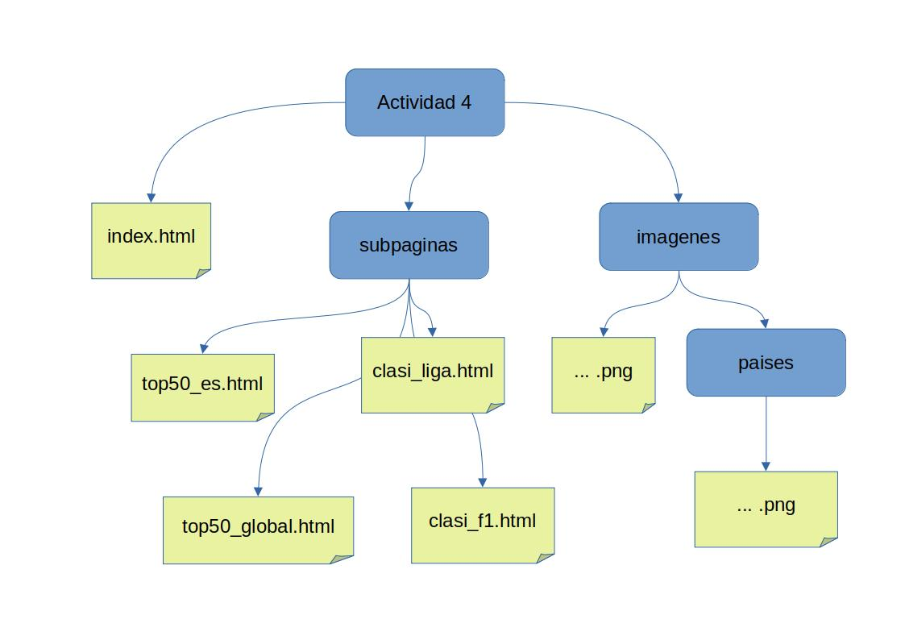
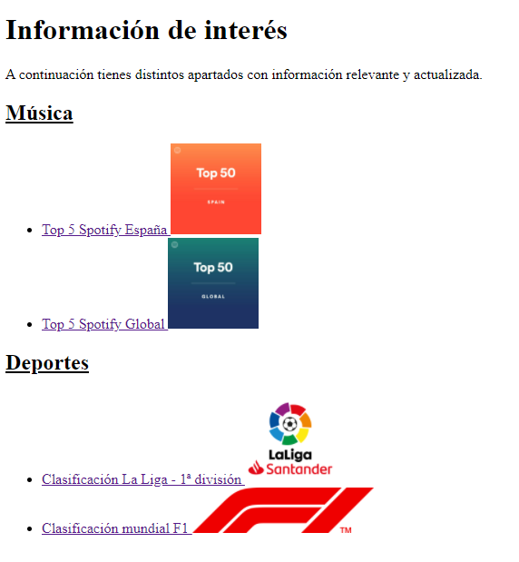
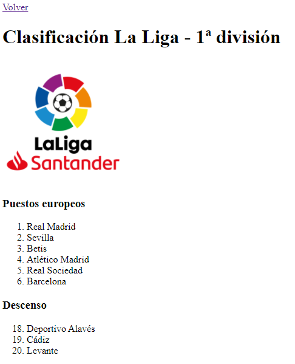
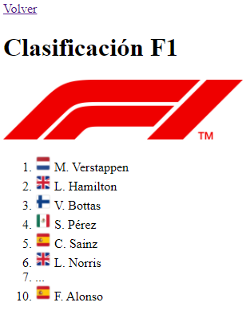

# SA1 - Actividad 4: Listas + enlaces + imágenes

## Vídeo demostración de la actividad:

<video src="./demostracion_resultado_actividad-4.mp4" width="320" height="240" controls></video>

## Pautas

- Tienes disponible las imágenes y los enlaces externos a YouTube en el archivo [actividad4.zip](./actividad4.zip) adjunto a esta tarea
- Debes crear los 4 archivos HTML de las subpáginas dentro de una carpeta llamada **subpaginas** (llámales como quieras, tienes un ejemplo en el esquema de abajo).
- Debes utilizar las etiquetas y atributos que consideres adecuados de los que hemos visto en clase
Llama a la página principal **index.html**
- Los enlaces de la página **index.html** son enlaces a las páginas HTML que has creado dentro de la carpeta **subpaginas**
- Cada una de estas subpáginas deberá tener al principio un enlace llamado "Volver" que permitirá volver a la página **index.html**

## Entrega

Sube un archivo **.zip** con toda la carpeta de la web comprimida, conteniendo las imágenes, las subpáginas y el archivo HTML principal

## Páginas

