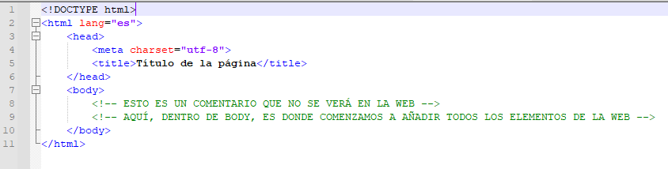

# Digitalización

⏯️ [Evaluación Inicial](https://forms.office.com/e/rPu4EFsWTq)

## SA1. Montando nuestro ordenador con HTML

### Teoría

- [Apuntes HTML](https://drive.google.com/drive/folders/1NSkcZkjUyqr1B7XVVDeVJct5uXwGXDbA?usp=sharing)
- [Validador HTML (W3S)](https://validator.w3.org/)
- [Todas las etiquetas HTML (W3S)](https://www.w3schools.com/tags/default.asp)

### Estructura básica página web



### Pautas para escribir código HTML

*   Las etiquetas y los atributos se escriben **en minúscula**
*   Para añadir espacio a la izquierda se utiliza la **tecla TABULADOR**, NO espacios
*   **CASI TODAS** las etiquetas **se abren y se cierran;** por ejemplo: `<p> ... </p>` . Hay algunas excepciones, como por ejemplo ``, `<hr>` o `<br>`
*   Siempre que ponemos una etiqueta dentro de otra (es decir, antes del cierre de la anterior) se tabula a la derecha.
*   Las etiquetas que se cierran primero son las que están más hacia dentro. Por ejemplo:

```html
<head> <!-- ABRO HEAD -->

   <title> Título </title> <!-- ABRO y CIERRO TITLE -->

</head> <!-- CIERRO HEAD -->
```

### Actividades

- [Actividad 0](./sa1/actividad0/index.md)
- [Actividad 1](./sa1/actividad1/index.md)