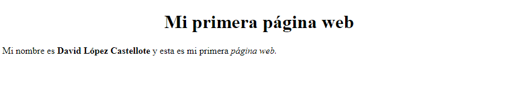

# Tema 1 - Actividad 0

Guarda el archivo **index.html** que hemos hecho en clase. **No te olvides de pasarlo por [el validador](https://validator.w3.org/)**.

Debe contener:

*   Etiqueta **DOCTYPE**
*   Etiqueta **HTML** con atributo **lang**, valor **es**

    *   Etiqueta **HEAD**

        *   Etiqueta **META** con atributo **charset**, valor **UTF-8**
        *   Etiqueta **TITLE**

    *   Etiqueta **BODY**

        *   Etiqueta **H1** con atributo **align**, valor **center**
        *   **Etiqueta P**

            *   Etiqueta **B** para resaltar en negrita tu nombre y apellidos
            *   Etiqueta **I** para resaltar en cursiva el texto "página web"
        * Etiqueta **IMG** con atributos **src**, **alt** y **height**

**Resultado:**

