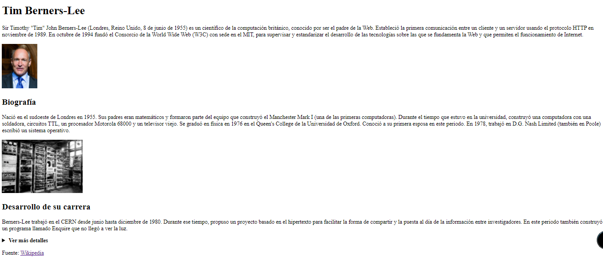
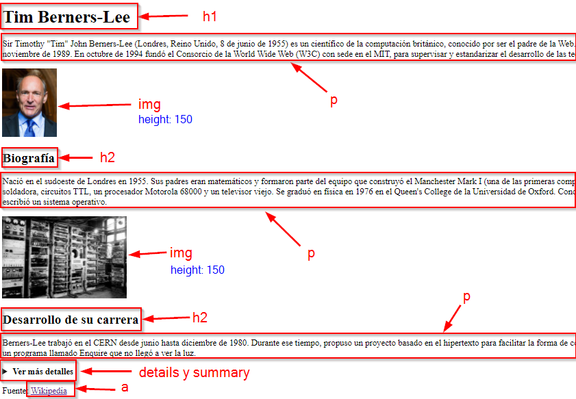
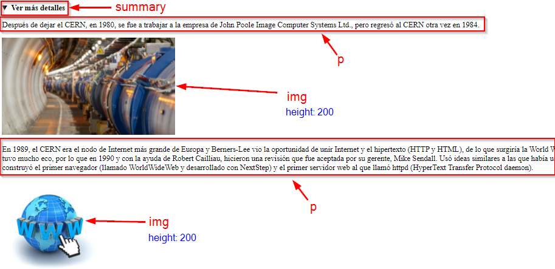

# SA1 - Actividad 1

En esta actividad debes elaborar la siguiente página web:

A continuación tienes las **pautas que debes seguir**:

*   Descárgate los archivos necesarios que están adjuntos a la tarea ([**actividad1.zip**](./actividad1.zip)). Descomprime el archivo y asegúrate de que comienzas a trabajar dentro de una carpeta llamada **actividad1**
*   En el archivo **texto.txt** tienes todo el texto para que lo puedas copiar y pegar más fácilmente en la web. También tienes las imágenes descargadas en la carpeta **imagenes**
*   Deberás crear un archivo **index.html** dentro de la carpeta **actividad1.** Aquí es donde escribirás el código HTML para elaborar la web.
*   **IMPORTANTE**: debes añadir la estructura adecuada de las etiquetas DOCTYPE, HTML, HEAD, META, TITLE, BODY...
*   Ponle de **título** (etiqueta TITLE): Tim Berners-Lee
*   Aquí tienes la referencia completa de todas las etiquetas HTML para que te sirva de ayuda: [https://www.w3schools.com/tags/default.asp](https://www.w3schools.com/tags/default.asp)
*   También puedes consultar los [**apuntes**](https://drive.google.com/drive/folders/1NSkcZkjUyqr1B7XVVDeVJct5uXwGXDbA?usp=sharing)
*   A continuación tienes una imagen donde puedes ver las etiquetas que debes utilizar para hacer cada una de las partes de la web:

  

##### Para poder hacer la parte desplegable de la **etiqueta** **_details:_**

  

### **Entrega**

*   **NO OLVIDES** validar tu página en el validador ([https://validator.w3.org/](https://www.w3schools.com/tags/default.asp)) antes de subirla
*   Sube el archivo HTML que has creado y dale el nombre **actividad1_<tu-nombre>.html**; por ejemplo: **actividad1_david-lopez.html**