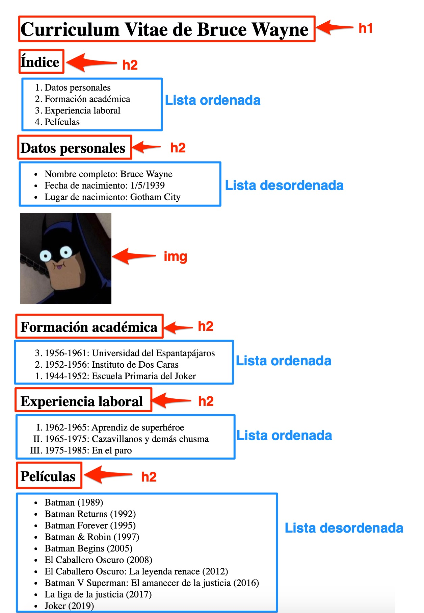

# SA1 - Actividad 2

En esta actividad debes elaborar la siguiente página web. Tienes anotados los elementos que deberás utilizar en cada caso.

Algunas pautas:

*   Puedes descargar el texto y la imagen del archivo adjunto a la tarea [**actividad2.zip**](./actividad2.zip)
*   Como ayuda, consulta los apuntes y la referencia de las etiquetas HTML ([https://www.w3schools.com/TAGS/default.ASP](https://www.w3schools.com/TAGS/default.ASP))

#### **Entrega**

*   **NO OLVIDES** **validar tu página** en el validador ([https://validator.w3.org/](https://validator.w3.org/)) antes de subirla
*   Sube el archivo HTML que has creado y dale el nombre **actividad2_<tu-nombre>.html**; por ejemplo: **actividad2_david-lopez.html**

