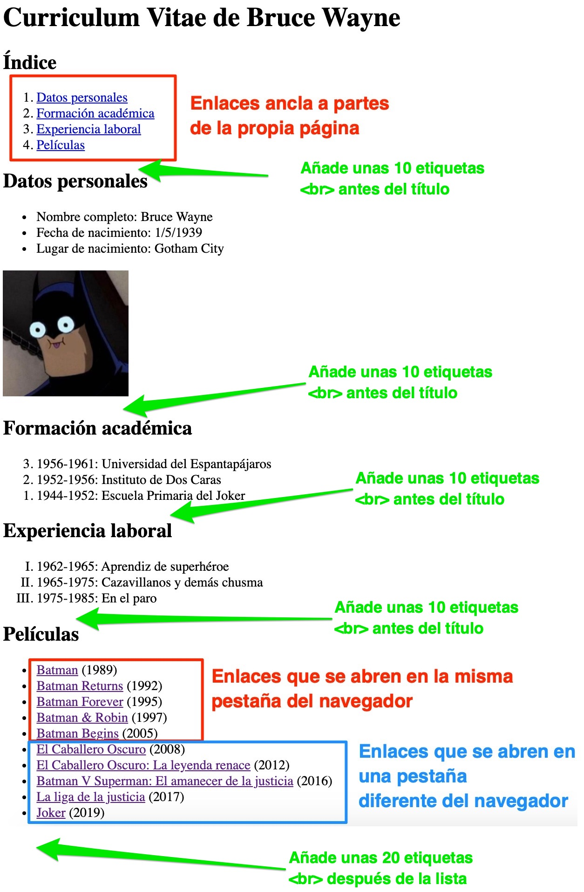

# SA1 - Actividad 3 (Enlaces)

En esta actividad debes **elaborar la siguiente página web**. Para ello, **deberás hacer una copia de la carpeta donde tienes la web de la actividad anterior**. Tienes anotados los elementos que deberás utilizar en cada caso.

Algunas pautas:

- Los enlaces los tienes en el archivo [enlaces.txt](./enlaces.txt)
- Los enlaces están explicados en los [apuntes de enlaces](https://drive.google.com/drive/folders/1jP7eOTEU3ST_U4TRgDo63nj0nfD51037?usp=drive_link)
- Como ayuda, consulta los apuntes y la referencia de las etiquetas HTML (https://www.w3schools.com/TAGS/default.ASP)

#### **Entrega**

*   **NO OLVIDES** **validar tu página** en el validador ([https://validator.w3.org/](https://validator.w3.org/)) antes de subirla
*   **Comprime** toda la carpeta de la web de la actividad (archivo **.zip**) y sube dicho archivo comprimido a aules.

