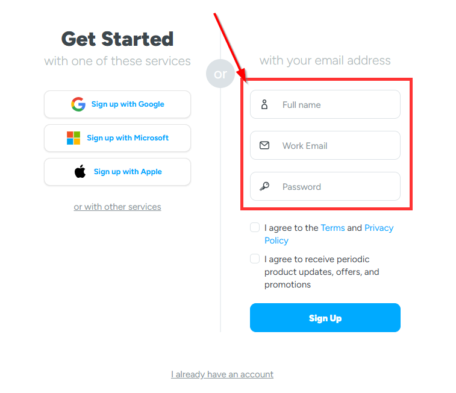

# 🗂️ Actividad 0 – Uso (muy básico) del sistema operativo

## Objetivo

Aprender a organizar el sistema de archivos en LliureX, reconocer diferentes tipos de archivo y practicar con las herramientas básicas del sistema operativo.

>**Definición**:
> Un **sistema de archivos** es el método y la estructura que utiliza un sistema operativo para organizar, almacenar y acceder a los datos en un dispositivo de memoria, como un disco duro, una memoria USB o una tarjeta SD.

---

## Pasos de la actividad

> ⚠️ **Advertencia:** Recuerda guardar todo lo que hagas dentro de la carpeta **Documentos** ya que es la que se sincroniza con el servidor de la clase. De lo contrario, podrías perder tus trabajos.
{: .alert-warning}

### 1. Crear la estructura inicial de carpetas

1. Abre la carpeta **Documentos** en tu usuario de LliureX.
2. Dentro de **Documentos**, crea una carpeta llamada **Digitalización**.
3. Dentro de **Digitalización**, crea 5 carpetas, una por cada tema de la asignatura:
   - Tema 1
   - Tema 2
   - Tema 3
   - Tema 4
   - Tema 5
4. Dentro de la carpeta **Tema 1**, crea otra carpeta llamada **Actividad 0**.

---

### 2. Descargar archivos de diferentes tipos

1. Abre tu navegador web.
2. Busca en Google usando el operador **filetype** para encontrar archivos con diferentes extensiones. Ejemplos:
   - `filetype:pdf` → un archivo PDF.
   - `filetype:ppt` → una presentación de diapositivas PowerPoint.
   - `filetype:epub` → una libro electrónico.
   - `filetype:xsl` → un documento de hoja de cálculo de Excel.
   - `filetype:odt` → un documento de texto de LibreOffice.
3. Descarga al menos **5 archivos de distintos tipos** y guárdalos en la carpeta **Tema 1/Actividad 0**.

---

### 3. Abrir los archivos y comprobar programas

1. Intenta abrir cada archivo descargado.
2. Anota con qué programa se abre en LliureX.
3. Crea un archivo de texto llamado **extensiones.txt** en la misma carpeta (**Tema 1/Actividad 0**).
4. Dentro de ese archivo, escribe una lista de cada extensión y el programa que has utilizado para abrirlo.

---

### 4. Representar la estructura de carpetas

1. Busca en Internet qué es un **árbol de carpetas**.
2. Utiliza **LibreOffice Draw** (u otro programa de dibujo) para crear un esquema en forma de árbol que muestre la estructura de carpetas y archivos que has creado. Ejemplo:
   ```
   Digitalización
   ├── Tema 1
   │   └── Actividad 0
   │       ├── archivo1.pdf
   │       ├── archivo2.jpg
   │       ├── extensiones.txt
   │       └── ...
   ├── Tema 2
   ├── Tema 3
   ├── Tema 4
   └── Tema 5
   ```
3. Guarda el dibujo en la carpeta **Tema 1/Actividad 0** con el nombre **arbol\_carpetas.odg**.

---

### 5. Un poco de IA...


{: .img .img-350}

**Regístrate en MeindMeister con tu correo de Outlook**
{: .centrado}

1. Utiliza **ChatGPT** para que te genere un archivo de texto con el esquema de las carpetas que has creado. Debe ser importable en la plataforma [**MindMeister**](https://www.mindmeister.com/es) (deberás registrarte en MindMeister con el correo electrónico de Outlook del instituto). **Pista**: puedes pedirle que te pregunte cuál es tu estructura de carpetas y archivos para que te sea más sencillo indicárselo, y no olvides decirle que debe ser importable en MindMeister
2. Importa el archivo de texto en MindMeister para generar el esquema.
3. Haz una **captura de pantalla** de la **conversación con ChatGPT** y **otra del esquema** y guárdala dentro de la carpeta de la **Actividad 0**.


**Importar archivo de texto en MindMeister**
{: .centrado}

## Entregables en Aules

Deberás subir a la plataforma Aules:

1. Archivo comprimido de la carpeta **Actividad 0** con la estructura de carpetas creada. El archivo debe llamarse **actividad0\_\<nombre>.zip** (sustituye \<nombre> por tu nombre y apellidos).
2. Captura de pantalla donde se vea **en tu sistema de archivos** las **carpetas** que has creado y los **archivos** que has guardado.
3. Capturas de pantalla de la conversación con ChatGPT de la tarea 5
4. Esquema creado en MindMeister en la tarea 5

---

## Criterio de evaluación relacionado

**CE2 – 2.2. Organizar y gestionar el entorno personal de aprendizaje mediante la integración de recursos digitales de manera autónoma.**

