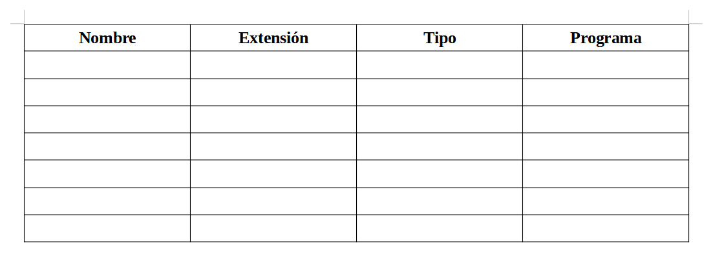

# 🗂️ Actividad 1 – Conociendo LliureX y el sistema de archivos

## Objetivo
Aprender a organizar el sistema de archivos local en LliureX, conocer las especificaciones de tu ordenador de clase, identificar extensiones comunes de archivos y utilizar herramientas de diagramación y reflexión con la ayuda de la Inteligencia Artificial.

> **Definición clave**:
> Un **sistema de archivos** es la estructura que utiliza el sistema operativo para organizar, nombrar y almacenar los datos en el disco duro o unidad de almacenamiento.

---

## Pasos de la actividad

> ⚠️ **¡Atención!** Recuerda guardar todo tu trabajo dentro de la carpeta **Documentos**.
{: .alert-warning}

### 1. Crear la estructura de carpetas
Antes de empezar a trabajar, vamos a preparar tu espacio de trabajo para este curso.

1. Abre el gestor de archivos (el explorador de carpetas de LliureX).
2. Entra en **Documentos** y crea una carpeta llamada **Digitalizacion_4ESO**.
3. Dentro de ella, crea las carpetas para estructurar los bloques del curso:
   * `Tema_1`
   * `Tema_2`
   * `Tema_3`
   * `Tema_4`
   * `Tema_5`
4. Dentro de la carpeta `Tema_1`, crea una subcarpeta llamada `Actividad_1`. 
*(Nota: Evita usar espacios en los nombres de las carpetas; acostúmbrate a usar guiones bajos `_` en informática).*

---

### 2. Crear la hoja de respuestas y conocer tu equipo
Todas las respuestas y datos que se te soliciten a lo largo de esta actividad deberás redactarlos en un único documento de texto.

1. Abre **LibreOffice Writer** (el procesador de textos de LliureX).
2. Crea un documento nuevo y escribe como título de portada o cabecera: **Actividad 1: Uso del sistema operativo LliureX - [Tu Nombre y Apellidos]**.
3. Guarda inmediatamente este documento vacío en la carpeta que acabas de crear: `Digitalizacion_4ESO/Tema_1/Actividad_1/` con el nombre `actividad1_respuestas.odt`. **Ve guardando (Ctrl+S) constantemente**.
4. Ahora, abre el menú de inicio de LliureX (abajo a la izquierda) y busca la aplicación **Centro de información** (en valenciano: *Centre d'informació*).
5. En tu documento `actividad1_respuestas.odt`, bajo un apartado llamado **«Ejercicio 2: Especificaciones del ordenador»**, anota los siguientes datos técnicos de tu máquina de clase:
   * ¿Qué modelo de procesador (CPU) tiene tu ordenador?
   * ¿Cuánta memoria RAM tiene instalada?
   * ¿En qué sistema operativo GNU/Linux (distribución base) se apoya la versión actual de LliureX que utilizas?
   * ¿Qué versión exacta de LliureX estás utilizando en este momento?
   * Anota la marca y modelo del ordenador (Fabricante y Nombre del producto).
   * Anota el número de serie del ordenador que estás utilizando.
   * Busca en internet: ¿qué es y para qué sirve un número de serie?

---

### 3. Resolver «Tipos de archivos y extensiones» (Asociación de archivos)

A partir de un **archivo comprimido**, deberás resolver las siguientes cuestiones acerca de los **tipos de archivos y extensiones** del sistema operativo.

1. Descarga el archivo comprimido [act1_ej3.zip](./act1_ej3.zip) y muévelo a tu carpeta `Actividad_1`.
2. Haz clic derecho sobre él y selecciona **Extraer --> Extraer archivo comprimido aquí, autodetectar subcarpeta** para descomprimirlo.
3. Verás que aparecen varios archivos con extensiones diferentes (ej. `.odt`, `.pdf`, `.png`, `.mp3`, `.csv`).
4. Intenta abrir cada uno de ellos haciendo doble clic.
5. En tu documento de respuestas (`actividad1_respuestas.odt`), bajo el encabezado **«Ejercicio 3: Tipos de archivos y extensiones»**, crea una tabla como la siguiente donde indiques:
   * Nombre del archivo.
   * Extensión de cada archivo.
   * Qué tipo de archivo es (audio, vídeo, documento de texto, etc.).
   * Qué programa nativo de LliureX se ha abierto por defecto para leerlo (ej: LibreOffice Writer, Visor de documentos, Reproductor VLC, etc.).

{: .no-border}

---

### 4. Primeros pasos con la IA y reflexión
Antes de pedirle tareas complejas a la Inteligencia Artificial, vamos a realizar una pequeña prueba para analizar cómo nos explica la tecnología y reflexionar sobre las respuestas que nos ofrece.

1. Abre el navegador web y accede a **ChatGPT** (o la herramienta de IA que te indique el profesor).
2. Escribe el siguiente prompt en el chat:
   > Qué es un sistema operativo? Explícalo de forma sencilla para un alumno de 15 años.
3. **Haz una captura de pantalla completa de tu conversación con la IA**. 
4. En tu documento de respuestas (`actividad1_respuestas.odt`), bajo el encabezado **«Ejercicio 4: Introducción a la IA»**, realiza las siguientes tareas:
   * **Pega la captura de pantalla** del chat con la IA.
   * **Copia y pega** el texto de la respuesta completa que te ha proporcionado la IA.
   * Indica, de todo lo que ha explicado la IA, **una cosa que ya sabías** previamente sobre los sistemas operativos.
   * Indica **una cosa nueva que hayas aprendido** o entendido mejor gracias a la explicación de la IA.

---

### 5. Generar un mapa mental del S.O. con Freeplane e Inteligencia Artificial
Vamos a crear un mapa mental sobre qué compone un Sistema Operativo. El mapa debe incluir cinco ramas principales: **Qué es**, **Hardware**, **Software**, **Ejemplos** y **Funciones principales**. 

Para ayudarnos, utilizaremos el programa **Freeplane** (instalado de forma local y segura en LliureX) e interactuaremos con una Inteligencia Artificial (como ChatGPT) para que nos ahorre el trabajo de diseñar el archivo que importaremos directamente en Freeplane.

1. Abre de nuevo tu chat de Inteligencia Artificial.
2. Pídele que te ayude a crear tu mapa mental proporcionándole un ejemplo de cómo es la estructura de un archivo `.mm` (que en realidad es un código tipo XML) para que imite su estructura. 
3. Para ello, **copia y pega el siguiente prompt ADAPTÁNDOLO a tu chat:**

> Quiero crear un mapa mental en Freeplane que resuma qué es un ...... . Necesito que me generes el código XML estructurado y limpio para poder guardarlo como un archivo de extensión `.mm` e importarlo directamente en el programa. El mapa debe tener como nodo central "Sistemas Operativos" y debe dividirse en: ...... (con subnodos detallados para cada uno). Para ayudarte a entender el formato que lee Freeplane, aquí tienes un ejemplo corto de cómo estructurar los nodos:
> 
> ```xml
> <map version="freeplane 1.9.13">
>   <node TEXT="Sistemas Operativos" ID="ID_ROOT">
>     <node TEXT="¿Qué son?" POSITION="right">
>       <node TEXT="Software fundamental del sistema"/>
>       <node TEXT="Gestiona recursos del ordenador"/>
>     </node>
>     <node TEXT="Hardware" POSITION="right">
>       <node TEXT="CPU"/>
>       <node TEXT="Memoria RAM"/>
>     </node>
>   </node>
> </map>
> ```
> Por favor, genera el código completo con todos los apartados requeridos usando este mismo formato exacto.

4. Copia la respuesta en formato de código que te devuelva la IA (similar al que ves arriba pero más extenso).
5. En tu ordenador, abre un editor de texto plano (como **KWrite** o **Kate**, que vienen preinstalados en LliureX).
6. Pega el código XML de la IA y guárdalo en tu carpeta de la `Actividad_1` como `mapa_sistema_operativo.mm` (¡asegúrate de que la extensión del archivo sea `.mm` y no `.txt`!).
7. Abre **Freeplane** en LliureX, ve a *Archivo -> Abrir* y selecciona tu archivo `mapa_sistema_operativo.mm`, o bien haz doble clic directamente sobre él.
8. Organiza visualmente el mapa si es necesario y **añade tu nombre y apellidos**.
9. Guarda el mapa editado.
10. Expórtalo como imagen (*Archivo -> Exportar mapa -> JPG*) con el nombre `mapa_sistema_operativo.jpg`.
11. Haz una captura de pantalla de la conversación que has tenido con la IA y pégala dentro de tu documento de respuestas (`actividad1_respuestas.odt`) bajo el título **«Ejercicio 5: Mapa mental e IA»**, junto a una breve reflexión de qué te ha parecido este método.
12. Pega también la imagen del mapa mental en tu documento de respuestas.

---

### 6. Empaquetar y comprimir la entrega
Para enviar el trabajo de forma limpia y profesional, utilizaremos el compresor del sistema operativo.

1. En el gestor de archivos, ve a la carpeta `Tema_1`.
2. Haz clic derecho sobre la carpeta `Actividad_1` y selecciona **Comprimir...**
3. Elige el formato `.zip` y nómbralo como `actividad1_tuapellido_tunombre.zip`.

---

## Entregables en Aules

Deberás subir a la tarea de Aules únicamente:

1. El archivo comprimido **`actividad1_tuapellido_tunombre.zip`**. 

Dentro del `.zip`, el profesor comprobará que la estructura de carpetas es correcta y que dentro de la carpeta `Actividad_1` se encuentran:
* Tu documento de respuestas finalizado: **`actividad1_respuestas.odt`** (con las Especificaciones del Ejercicio 2, la tabla de Tipos de archivos y extensiones del Ejercicio 3, la captura de pantalla, texto y reflexiones sobre la IA del Ejercicio 4, y las capturas e imágenes del Ejercicio 5).
* El archivo editable del mapa mental: **`mapa_sistema_operativo.mm`**.
* La exportación del mapa mental en imagen: **`mapa_sistema_operativo.jpg`**.

---

## Rúbrica de Evaluación

| Criterio | 0 pts | 0.5 pts | 1 pt | 1.5 pts | 2 pts |
|----------|-------|---------|------|---------|-------|
| **1.    Estructura de carpetas y Compresión** (máx. 1.5 pts) | No crea la estructura o entrega carpetas sueltas sin comprimir. | Estructura de carpetas incorrecta o el archivo comprimido está dañado o mal nombrado. | Estructura de carpetas correcta, pero comete errores en los nombres de las carpetas o la ubicación de los archivos. | Estructura perfecta (`Digitalizacion_4ESO/Tema_1/Actividad_1`), archivos organizados y entrega en un único `.zip` bien nombrado. | |
| **2. Especificaciones e Info de LliureX (ODT)** (máx. 1.5 pts) | No identifica las especificaciones técnicas ni entrega el archivo `.odt`. | Entrega el `.odt` muy incompleto, o faltan la mayoría de los datos técnicos solicitados. | Entrega el `.odt` con la información técnica de su máquina, pero le faltan algunos datos o no responde a la pregunta sobre el número de serie. | Identifica perfectamente la CPU, RAM, número de serie, fabricante, versión de LliureX y su distribución base en el `.odt`. | |
| **3. Asociación y Tipos de archivos (ODT)** (máx. 1.5 pts) | No realiza la clasificación de los archivos descomprimidos. | Clasifica muy pocos archivos de prueba o comete errores graves al identificar sus extensiones. | Clasifica la mayoría de los archivos de prueba, pero no asocia correctamente todos los programas por defecto de LliureX. | Identifica con precisión todas las extensiones, tipos de archivo y programas asociados por defecto en una tabla limpia. | |
| **4. Primeros pasos con la IA** (máx. 1.5 pts) | No utiliza la IA o no entrega las evidencias en el documento. | Usa la IA pero falta la captura del chat o no incluye la respuesta de texto completa. | Presenta la captura y el texto, pero la reflexión sobre el aprendizaje (conceptos sabidos/nuevos) es muy escasa. | Presenta la captura del chat, el texto copiado y elabora una reflexión clara diferenciando conceptos conocidos y nuevos conocimientos. | |
| **5. Mapa Mental (Freeplane & IA)** (máx. 2 pts) | No genera el mapa mental o no presenta evidencias de la IA. | Genera el mapa mental en Freeplane pero no muestra evidencias del chat de IA o el archivo no se abre. | Importa el XML generado por la IA en Freeplane pero no exporta la imagen `.jpg` o no incluye la reflexión en el documento `.odt`. | | Proceso excelente de uso de IA, importación impecable del XML en Freeplane, mapa exportado en `.jpg` e integrado en el `.odt` con su captura. |
| **6. Entrega en plazo** (máx. 2 pts) | No entrega o entrega con retraso de más de una semana. | Entrega con un retraso importante de hasta una semana. | Entrega con un pequeño retraso de máximo 2 días. | | Entrega la actividad a tiempo dentro del plazo establecido. |

**Criterio de evaluación de la programación:**
* **CE2 – 2.2.** Organizar y gestionar el entorno personal de aprendizaje mediante la integración de recursos digitales de manera autónoma (Digitalización 4º ESO - Comunidad Valenciana).

