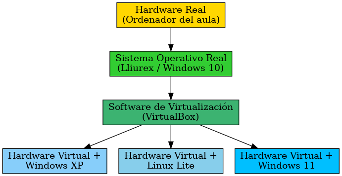
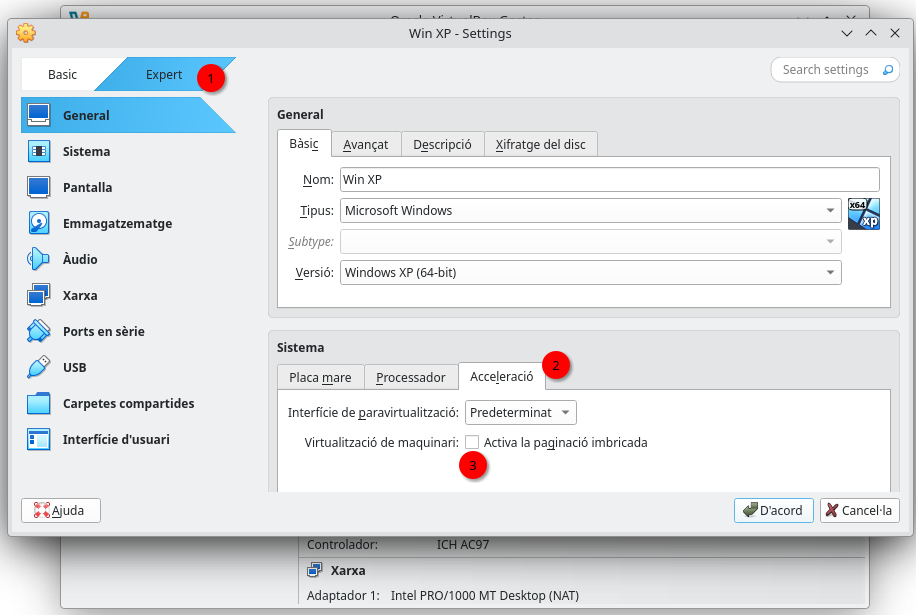
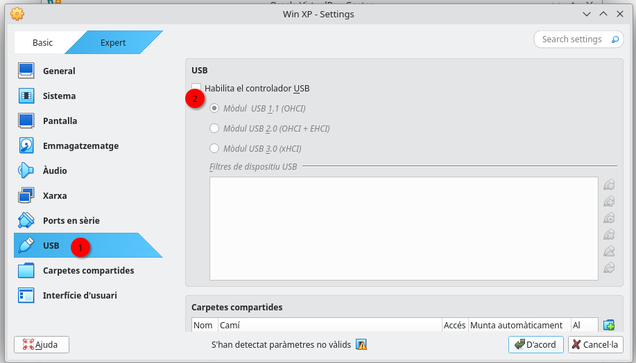
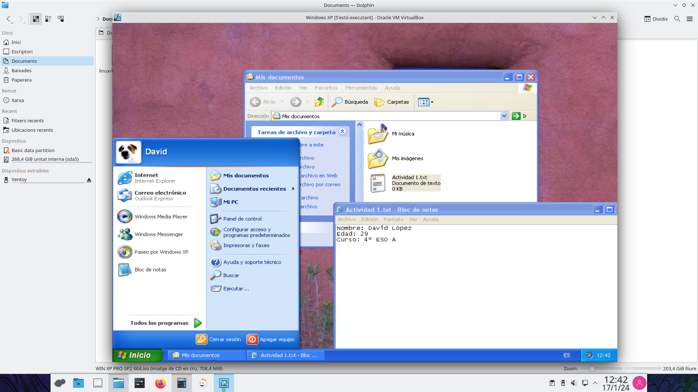
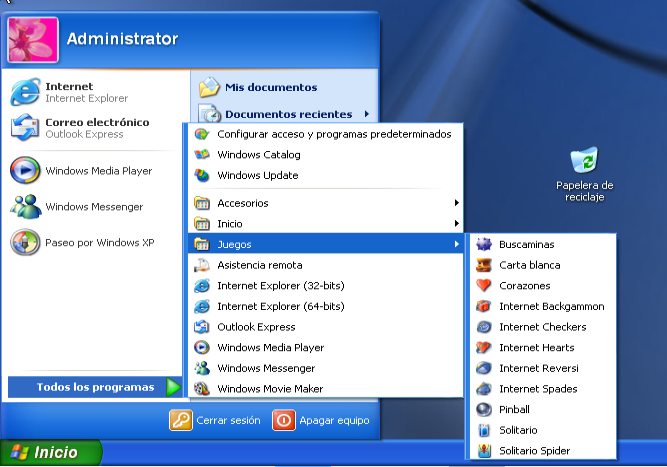
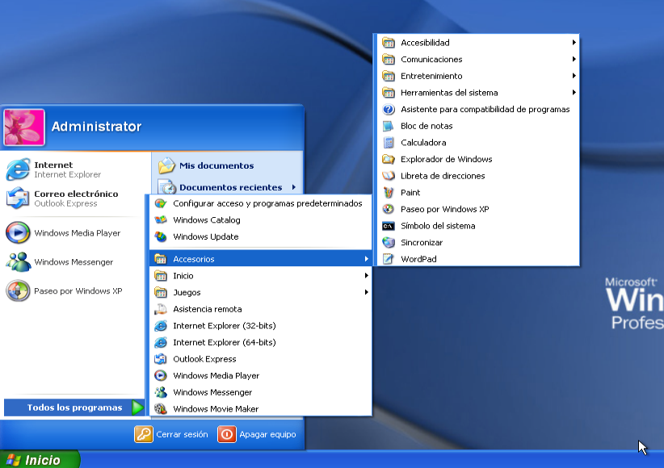
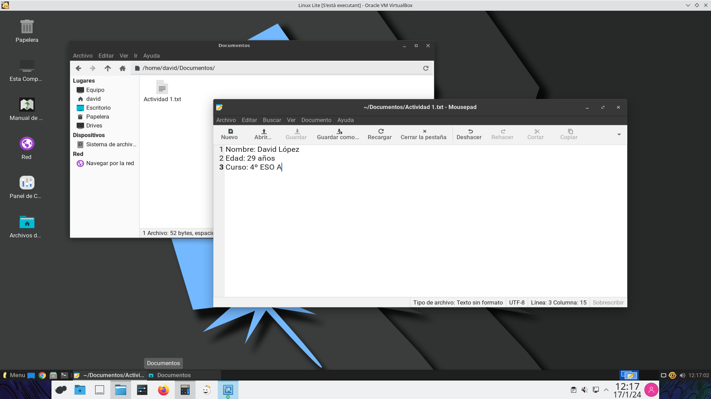
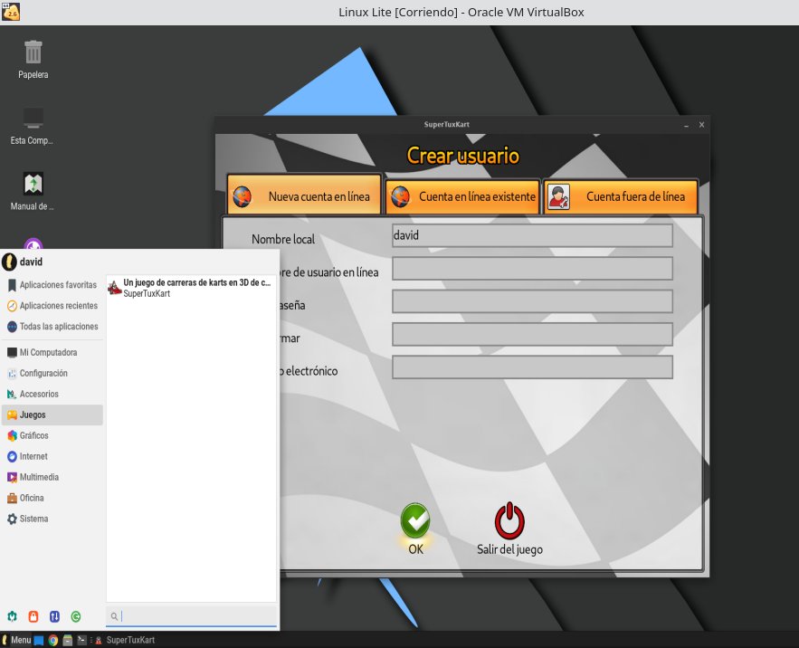

# Actividad 1 – Máquinas virtuales en VirtualBox

## Contexto
Un sistema operativo no tiene por qué estar instalado directamente en un ordenador físico.  
Podemos crear **máquinas virtuales** dentro de un programa llamado **VirtualBox** y allí instalar cualquier sistema operativo que queramos.  


{: .img .img-300}

Esto nos permite probar y utilizar distintos sistemas operativos **sin necesidad de tener varios ordenadores**.  

En los equipos del aula ya est√° instalado **VirtualBox**, pero si lo quieres en casa puedes descargarlo desde la p√°gina oficial:  
👉 [VirtualBox – Descarga](https://www.virtualbox.org/wiki/Downloads)

Para instalar un sistema operativo en VirtualBox se utiliza un archivo en formato **.iso**.  
Aquí tienes una recopilación de distribuciones Linux que también puedes investigar:  
üëâ [Mejores distros Linux](https://www.adslzone.net/reportajes/software/mejores-distros-linux/)

---

## Recursos necesarios
- VirtualBox instalado (ya lo tienes en clase).
- Archivos **.iso** de los sistemas operativos indicados. 👉 **Cópialos de la carpeta compartida** que tienes en el ordenador de clase (pregunta al profesor cómo acceder).
- Conexión a Internet para descargar software adicional.

> **IMPORTANTE**: Deber√°s copiar los archivos **.iso** de la carpeta compartida a tu carpeta de **Inici** del ordenador de clase (**NO a la carpeta **Documents**)
{: .alert-error}

---

## Cómo crear una máquina virtual en Lliurex

> Una vez has copiado los archivos, lee atentamente la siguiente página y después vuelve a la página de la actividad para completar los pasos.
{: .alert-warning}

[üëâ Crear una m√°quina virtual en Lliurex](/{{ site.github.repository_name }}/asignaturas/apuntes/crear-mv-vbox-lliurex)

## Parte 1 – Máquina virtual con Windows XP

1. Crea una nueva máquina virtual en VirtualBox con las siguientes características:
   - **Nombre:** Windows XP  
   - **Imagen ISO**: el archivo **.iso** descargado de Windows XP
   - **Tipo:** Microsoft Windows
   - **Versión:** Windows XP (64-bit)
   - **Skip Unattended Installation**: ‚úÖ Marcar
   - **Memoria RAM (Hardware):** 2048 MB (2 GB)
   - **Disco duro virtual (Hard Disk):** 10 GB

   - ‼️**IMPORTANTE**‼️: **Deshabilitar paginación imbrincada** y **controlador USB**


{: .img .img-300}


{: .img .img-300}

2. Instala Windows XP en la m√°quina virtual.
{:start="2"}

3. Dentro de Windows XP realiza las siguientes acciones. **Pista** muchas se pueden hacer desde el Panel de Control:
   - Cambia la **resolución de la pantalla** para que se vea más grande y con más espacio.
   - Cambia el idioma del sistema a **español**.  
   - Crea un **usuario** con tu nombre.  
   - Cambia la **imagen de perfil** de ese usuario.  
   - Dentro de la carpeta **Mis documentos**, crea un archivo llamado **Actividad 1.txt** con tu información personal (Nombre, Edad y Curso).  
{:start="3"}

4. Haz una **captura de pantalla** en la que se vea:
   - El men√∫ Inicio con tu foto de perfil y tu nombre de usuario.  
   - El archivo **Actividad 1.txt** dentro de Mis documentos.
{:start="4"}


{: .img .img-500}

üëâ Prueba juegos cl√°sicos como **Pinball**, **Solitario**, **Buscaminas** o programas como las primeras versiones de Paint.


{: .img .img-400}


{: .img .img-400}

---

## Parte 2 – Máquina virtual con Linux Lite

1. Crea una nueva máquina virtual en VirtualBox con las siguientes características:
   - **Nombre:** Linux Lite
   - **Imagen ISO**: el archivo **.iso** descargado de Linux Lite
   - **Tipo:** Linux
   - **Versión:** Ubuntu (64-bit)
   - **Skip Unattended Installation**: ‚úÖ Marcar
   - **Memoria RAM (Hardware):** 3072 MB (3 GB)
   - **Disco duro virtual (Hard Disk):** 25 GB

2. Instala Linux Lite en la m√°quina virtual.

3. Durante la instalación:
   - Selecciona **idioma español**.  
   - El **usuario** debe ser tu nombre + apellidos (ejemplo: juanperez).  

4. Dentro de Linux Lite realiza las siguientes acciones:
   - En la carpeta **Documentos**, crea un archivo llamado **Actividad 1.txt** con tu información personal (Nombre, Edad y Curso).  
   - Haz una **captura de pantalla** en la que se vea:
     - Tu nombre de usuario.  
     - El archivo **Actividad 1.txt** dentro de Documentos.  


{: .img .img-500}


5. Instala el juego **Super Tux Kart**:
   - Abre la aplicación **Emulador de terminal**.  
   - Escribe y ejecuta los siguientes comandos (uno por uno):  
     ```bash
     sudo apt install snapd
     sudo snap install supertuxkart
     ```
   - Cierra la sesión y vuelve a entrar en el sistema.  
{:start="5"}


{: .img .img-400}

---

## Parte 3 – Máquina virtual con Windows 11

1. Crea una nueva máquina virtual en VirtualBox con las siguientes características:
   - **Nombre:** Windows 11
   - **Imagen ISO**: el archivo **.iso** descargado de Windows 11
   - **Tipo:** Microsoft Windows
   - **Versión:** Windows 11 (64-bit)
   - **Skip Unattended Installation**: ‚úÖ Marcar
   - **Memoria RAM (Hardware):** 8192 MB (8 GB)
   - **Disco duro virtual (Hard Disk):** 80 GB

2. Instala Windows 11 en la m√°quina virtual.
   - Durante la instalación, selecciona **idioma español (España)**.  
   - Crea un **usuario** con tu nombre y apellidos.  
   - Configura una contraseña sencilla para no olvidarla (opcional).  

3. Una vez instalado, realiza las siguientes acciones dentro de Windows 11:
   - Cambia la **imagen de perfil** del usuario.
   - Crea dentro de la carpeta **Documentos** un archivo llamado **Actividad 1.txt** con tu información personal (Nombre, Edad y Curso).  
   - Personaliza brevemente el escritorio (por ejemplo, cambiando el fondo de pantalla). 

4. Haz una **captura de pantalla** en la que se vea:
   - El men√∫ Inicio con tu usuario.  
   - El archivo **Actividad 1.txt** dentro de Documentos.  
   - El escritorio con tu personalización.

üëâ Explora las nuevas aplicaciones que incluye Windows 11 (Bloc de notas, Fotos, Microsoft Store, etc.).

---

## Entrega
Deber√°s subir en Aules:
- **Captura/s de pantalla de Windows XP** (usuario, foto y archivo Actividad 1.txt).  
- **Captura/s de pantalla de Linux Lite** (usuario y archivo Actividad 1.txt).  
- **Captura/s de pantalla de Windows 11** (usuario, personalización y archivo Actividad 1.txt).

# Rúbrica – Actividad 1: Máquinas virtuales en VirtualBox

| Criterio | Excelente | Bien | Suficiente | Insuficiente |
|----------|-----------|------|------------|--------------|
| **Configuración de las máquinas virtuales** (2 pts) | Configura correctamente las 3 máquinas virtuales con las características indicadas. | Configura correctamente 2 máquinas. | Configura solo 1 máquina de forma correcta. | No configura ninguna correctamente. |
| **Instalación de sistemas operativos** (2 pts) | Instala y arranca sin problemas los 3 sistemas operativos (XP, Linux Lite y Windows 11). | Instala y arranca 2 sistemas de forma correcta. | Instala y arranca 1 sistema de forma correcta. | No consigue instalar ninguno correctamente. |
| **Personalización de usuario e idioma** (2 pts) | Cambia idioma, crea usuario y cambia imagen de perfil en los 3 sistemas. | Realiza estos cambios en 2 sistemas. | Realiza estos cambios en 1 sistema. | No realiza cambios. |
| **Archivo Actividad 1.txt** (2 pts) | Crea correctamente el archivo en los 3 sistemas, con todos los datos completos. | Crea el archivo en 2 sistemas con la información pedida. | Crea el archivo en 1 sistema o con datos incompletos. | No crea el archivo en ningún sistema. |
| **Entrega** (2 pts) | Entrega la actividad dentro del plazo establecido. | Entrega con un ligero retraso (máx. 2 días). | Entrega con retraso moderado (hasta 1 semana). | Entrega muy tarde (más de 1 semana) o no entrega. |

**Puntuación total: /10**
