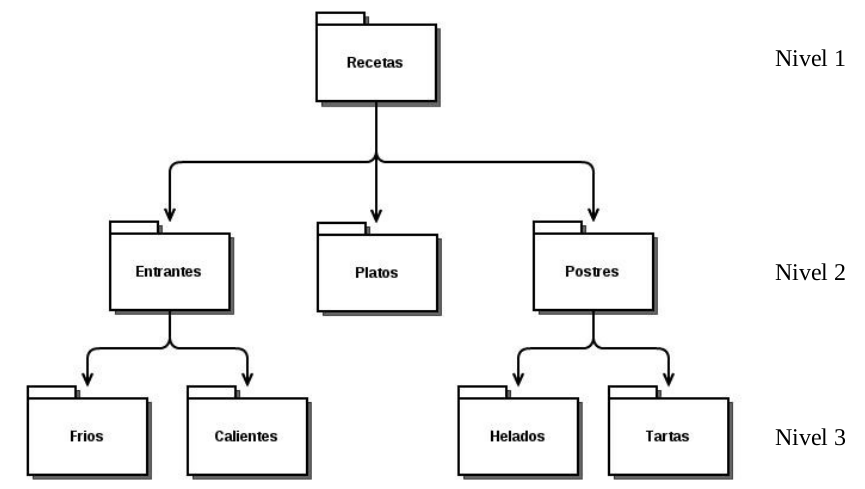

# Actividad 2 – Uso básico de la terminal en Linux (bash)

Antes de realizar las tareas, **lee atentamente**:

> [**APUNTES DE COMANDOS LINUX**](../apuntes_comandos)

---

## Tareas

Realiza las siguientes tareas **HACIENDO USO EXCLUSIVO DE LA TERMINAL**{: .rojo}:

- Dentro de tu **carpeta personal**, y dentro de **Documents/Tema 1**, crea una carpeta llamada **Actividad-2**.
- Dentro de **Actividad-2** descarga el archivo comprimido del siguiente enlace:  
  **dlopezcastellote.dev/informatica-eso-bat/asignaturas/digitalizacion/sistemas-operativos/actividad2/fotos_comida.zip**{: .verde}
- Descomprime el archivo para extraer todas las fotos que contiene.  
- Partiendo desde **Actividad-2**, **crea toda la estructura de carpetas**{: .rojo} que se aprecia en la **imagen de abajo**.
- **HAZ CAPTURA DE PANTALLA DE LOS COMANDOS QUE VAS EJECUTANDO**{: .rojo}.  
- **Organiza las fotos** en las carpetas correspondientes (muévelas a su carpeta adecuada).  
- Comprime la carpeta **Recetas** en un archivo llamado **recetas.zip** →  
  **ASEGÚRATE DE QUE el archivo `recetas.zip` CONTIENE TODAS LAS CARPETAS, SUBCARPETAS Y FOTOS ORGANIZADAS**.  
- **Borra** el archivo descargado de Internet (**fotos_comida.zip**).  

{: .img .img-300}

**Estructura de carpetas**
{: .centrado}

---

## Entrega

Sube en esta tarea de **Aules**:

- El archivo comprimido resultante (**recetas.zip**).  
- **Las capturas de pantalla de los comandos que has ido ejecutando en la terminal.**  
  Se deben ver todos los comandos utilizados para hacer la actividad y, también, tu nombre de usuario.

## Rúbrica – Actividad: Uso básico de la terminal en Linux (versión simplificada)

| Criterio | 0 pts | 0.5 pts | 1 pt | 2 pts | 4 pts |
|----------|-------|---------|------|-------|-------|
| **Ejecución en terminal** (4 pts) | No se usan comandos de terminal para la actividad. || Algunos pasos se hacen en terminal, otros con GUI. | La mayoría de pasos se hacen en terminal, con algún error menor. | Todos los pasos se realizan correctamente con comandos de terminal, sin errores. |
| **Resultado final** (4 pts) | No entrega un resultado válido. || El resultado es incompleto (faltan varias partes). | El resultado final tiene pequeños fallos (falta algún archivo o carpeta). | La estructura de carpetas está bien hecha, las fotos bien organizadas y el archivo `recetas.zip` es correcto y completo. |
| **Entrega** (2 pts) | Entrega muy tarde, incompleta o no entrega. | Entrega con retraso moderado (hasta 1 semana). | Entrega con un ligero retraso (máx. 2 días). | Entrega en plazo `recetas.zip` y las capturas de pantalla son claras y completas (se ven comandos y usuario). | – |