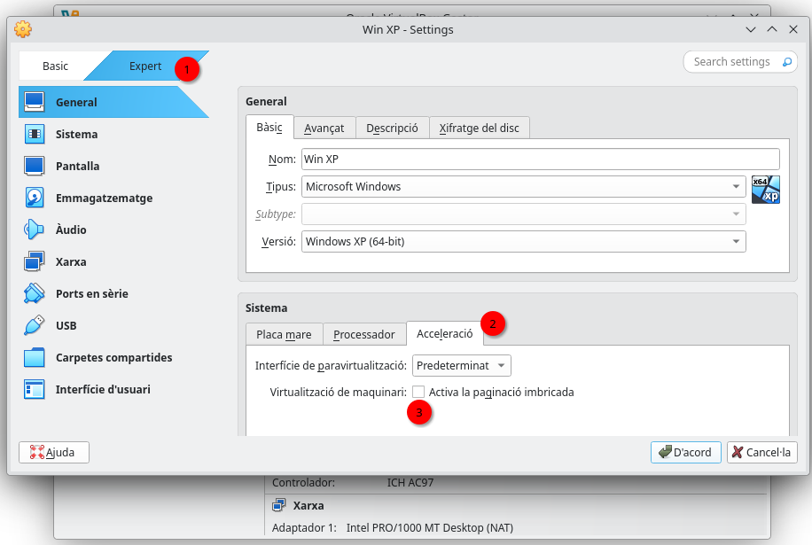
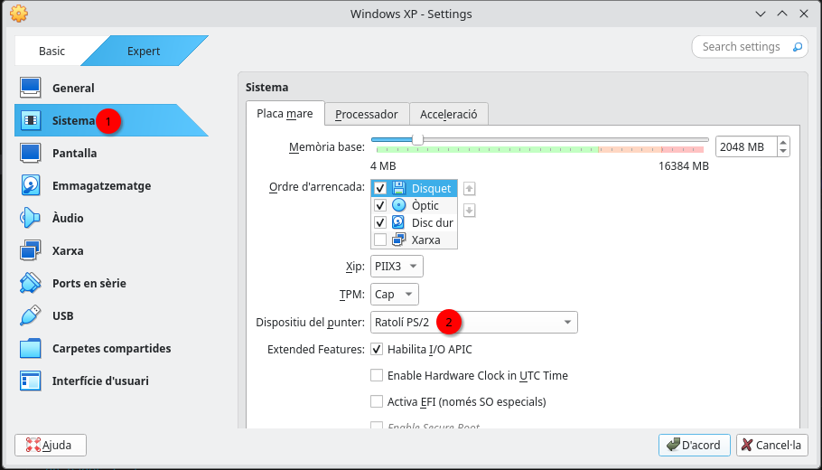
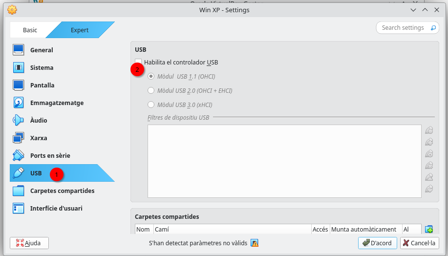
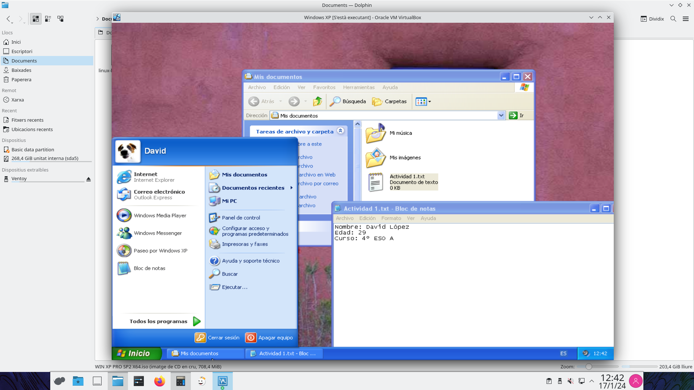
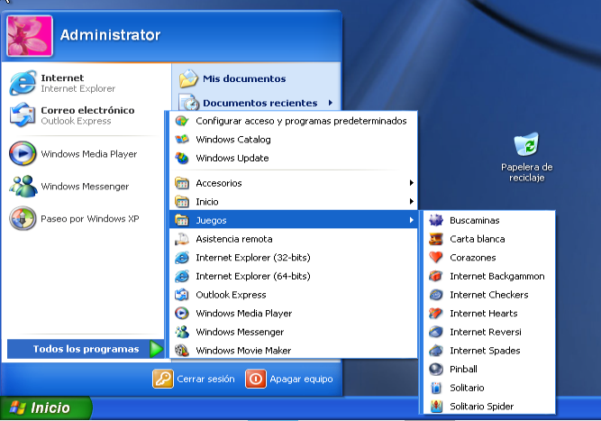
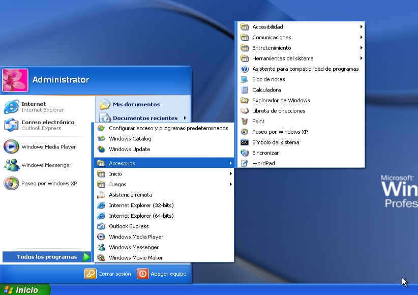
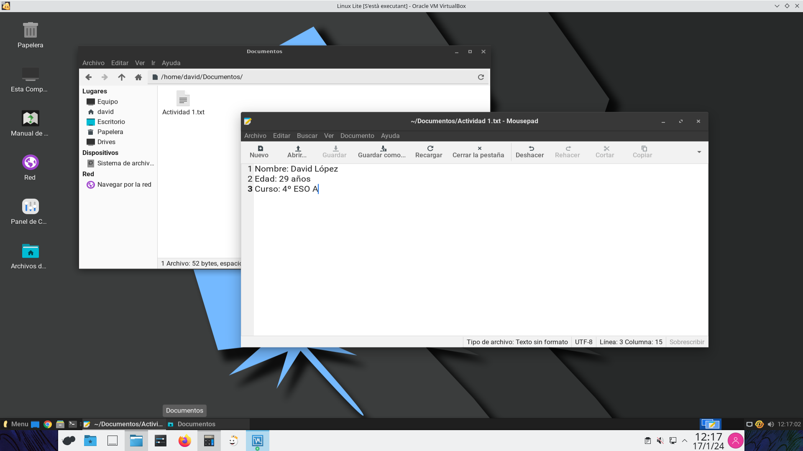
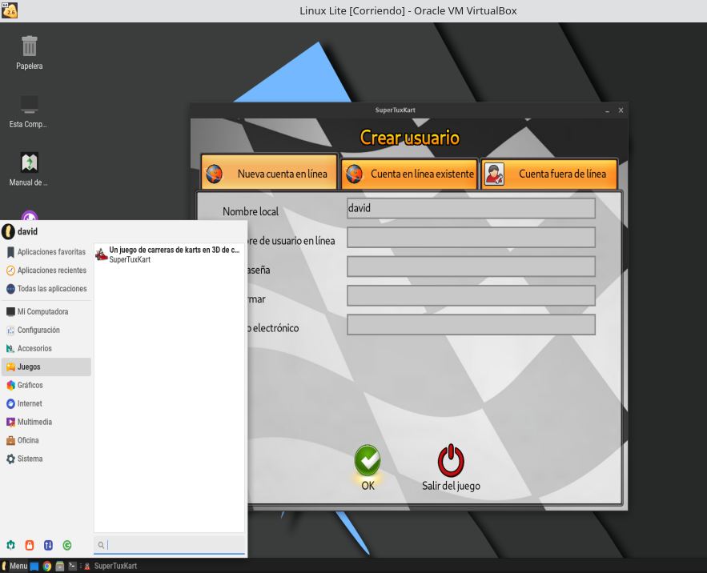
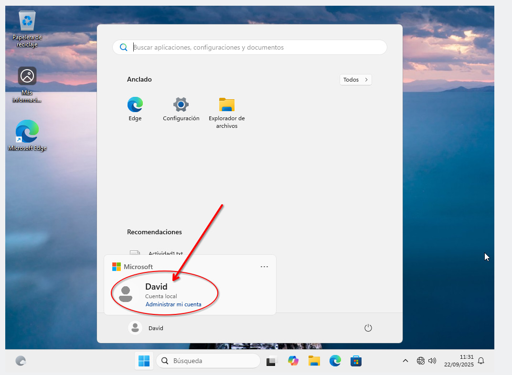
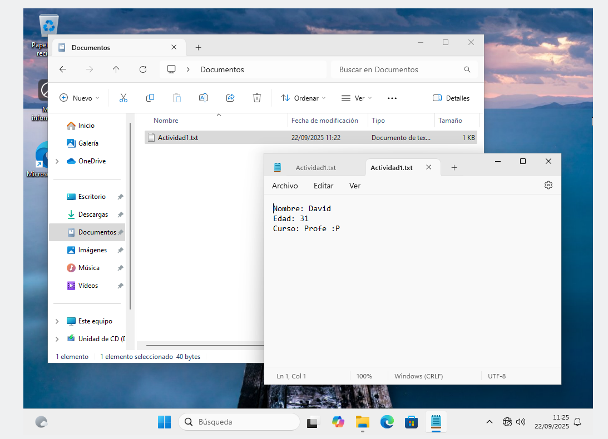

# Actividad 2 – Máquinas virtuales en VirtualBox

## Contexto
Un sistema operativo no tiene por qué estar instalado directamente en un ordenador físico.  
Podemos crear **máquinas virtuales** dentro de un programa llamado **VirtualBox** y allí instalar cualquier sistema operativo que queramos.  


{: .img .img-300}

Esto nos permite probar y utilizar distintos sistemas operativos **sin necesidad de tener varios ordenadores**.  

---

## Recursos necesarios
- VirtualBox instalado (ya lo tienes en clase).
- Archivos **.iso** de los sistemas operativos indicados. 👉 **Cópialos de la carpeta compartida** que tienes en el ordenador de clase (pregunta al profesor cómo acceder).
- Conexión a Internet para descargar software adicional.

> **IMPORTANTE**: Deberás copiar los archivos **.iso** de la carpeta compartida a tu carpeta de **Inici** del ordenador de clase (**NO** a la carpeta **Documents**)
{: .alert-error}

---

## Cómo crear una máquina virtual en Lliurex

> Una vez has copiado los archivos, lee atentamente la siguiente página y después vuelve a la página de la actividad para completar los pasos.
{: .alert-warning}

[👉 Crear una máquina virtual en Lliurex](/{{ site.github.repository_name }}/asignaturas/apuntes/crear-mv-vbox-lliurex)

## Parte 1 – Máquina virtual con Windows XP

1. Crea una nueva máquina virtual en VirtualBox con las siguientes características:
   - **Nombre:** Windows XP  
   - **Imagen ISO**: el archivo **.iso** descargado de Windows XP
   - **Tipo:** Microsoft Windows
   - **Versión:** Windows XP (64-bit)
   - **Proceed with Unattended Installation**: ❌ No Marcar *o bien* **Skip Unattended Installation**: ✅ Marcar
   - **Memoria RAM (Hardware):** 2048 MB (2 GB)
   - **Disco duro virtual (Hard Disk):** 10 GB

   - ‼️**IMPORTANTE**‼️: Debes entrar en la **Configuración** y Deshabilitar paginación imbrincada, cambiar *Dispositiu del punter* de la Placa mare y deshabilitar controlador USB

**1. Deshabilitar paginació imbrincada (en inglés: *Nested Paging*)**
{: .centrado}


{: .img .img-350}

**2. Cambiar Dispositiu del punter (en inglés: *Pointing Device*) de la Placa Mare a Ratolí PS/2**
{: .centrado}


{: .img .img-350}

**3. Deshabilitar controlador USB**
{: .centrado}


{: .img .img-350}

2. **Inicia la máquina virtual** e **instala Windows XP** siguiendo los pasos que se van indicando (Idioma, Zona horaria, Usuario, etc.).
{:start="2"}

> **IMPORTANTE**: Pon una **contraseña** fácil de recordar y apúntala. Si se te olvida, tendrás que **volver a empezar**.
{: .alert .alert-error}

3. Dentro de Windows XP realiza las siguientes acciones. **Pista** muchas se pueden hacer desde el Panel de Control:
   - Cambia la **resolución de la pantalla** para que se vea más grande y con más espacio.
   - Cambia el idioma del sistema a **español**.  
   - Crea un **usuario** con tu nombre.  
   - Cambia la **imagen de perfil** de ese usuario.  
   - Dentro de la carpeta **Mis documentos**, crea un archivo llamado **Actividad 1.txt** con tu información personal (Nombre, Edad y Curso).  
{:start="3"}

4. Haz una **captura de pantalla** en la que se vea:
   - El menú Inicio con tu foto de perfil y tu nombre de usuario.  
   - El archivo **Actividad 1.txt** dentro de Mis documentos.
{:start="4"}


{: .img .img-500}

👉 Prueba juegos clásicos como **Pinball**, **Solitario**, **Buscaminas** o programas como las primeras versiones de Paint.


{: .img .img-400}


{: .img .img-400}

---

## Parte 2 – Máquina virtual con Linux Lite

1. Crea una nueva máquina virtual en VirtualBox con las siguientes características:
   - **Nombre:** Linux Lite
   - **Imagen ISO**: el archivo **.iso** descargado de Linux Lite
   - **Tipo:** Linux
   - **Versión:** Ubuntu (64-bit)
   - **Proceed with Unattended Installation**: ❌ No Marcar *o bien* **Skip Unattended Installation**: ✅ Marcar
   - **Memoria RAM (Hardware):** 3072 MB (3 GB)
   - **Disco duro virtual (Hard Disk):** 25 GB

2. Instala Linux Lite en la máquina virtual.
{:start="2"}

3. Durante la instalación:
   - Selecciona **idioma español**.  
   - El **usuario** debe ser tu nombre + apellidos (ejemplo: juanperez).
{:start="3"}

> **IMPORTANTE**: Pon una **contraseña** fácil de recordar y apúntala. Si se te olvida, tendrás que **volver a empezar**.
{: .alert .alert-error}

4. Dentro de Linux Lite realiza las siguientes acciones:
   - En la carpeta **Documentos**, crea un archivo llamado **Actividad 1.txt** con tu información personal (Nombre, Edad y Curso).  
   - Haz una **captura de pantalla** en la que se vea:
     - Tu nombre de usuario.  
     - El archivo **Actividad 1.txt** dentro de Documentos.  
{:start="4"}


{: .img .img-500}


5. Instala el juego **Super Tux Kart**:
   - Abre la aplicación **Emulador de terminal**.  
   - Escribe y ejecuta los siguientes comandos (uno por uno):  
     ```bash
     sudo apt install snapd
     sudo snap install supertuxkart
     ```
   - Cierra la sesión y vuelve a entrar en el sistema.  
{:start="5"}


{: .img .img-400}

   - Haz una **captura de pantalla** donde se vea el **juego instalado**.

---

## Parte 3 – Máquina virtual con Windows 11

1. Crea una nueva máquina virtual en VirtualBox con las siguientes características:
   - **Nombre:** Windows 11
   - **Imagen ISO**: el archivo **.iso** descargado de Windows 11
   - **Tipo:** Microsoft Windows
   - **Versión:** Windows 11 (64-bit)
   - **Proceed with Unattended Installation**: ❌ No Marcar *o bien* **Skip Unattended Installation**: ✅ Marcar
   - **Memoria RAM (Hardware):** 8192 MB (8 GB)
   - **Disco duro virtual (Hard Disk):** 80 GB

2. **Instala Windows 11 en la máquina virtual**. Sigue los pasos de la instalación. Deberás tener en cuenta lo siguiente:

> Llegará un punto de la instalación donde **se te pedirá que inicies sesión** con una cuenta de Microsoft/Outlook o bien que crees una nueva cuenta (NOTA: la cuenta de Outlook del instituto no te servirá). **IMPORTANTE**: NO debes iniciar sesión con una cuenta de Microsoft/Outlook ni crear una nueva cuenta.
{: .alert-error}

> **¿Qué hacer entonces?** Queremos que durante la instalación Windows 11 nos deje crear un usuario local sin necesidad de tener que iniciar sesión con una cuenta de correo, pero (_sin utilizar ningún truco_) no podemos hacerlo. **Utiliza ChatGPT** para que te ayude a crear un usuario local durante la instalación de Windows 11. Deberás indicarle que quieres hacer esto mismo, y que no quieres que te pida de forma obligatoria iniciar sesión con una cuenta de correo. Si la ayuda que te da ChatGPT no te funciona, insístele en que no te funciona para que te de otras alternativas.
{: .alert-success}

3. Una vez instalado, realiza las siguientes acciones dentro de Windows 11:
   - Crea dentro de la carpeta **Documentos** un archivo llamado **Actividad 1.txt** con tu información personal (Nombre, Edad y Curso).
{:start="3"}

> **NOTA**: Debe verse la extensión del archivo. Por defecto no aparece, así que deberás buscar en las opciones del sistema de archivos cómo **mostrar las Extensiones de nombre de archivo**
{: .alert-warning}

   - **Instala LibreOffice** descargándolo desde el navegador web:
     1. Abre el navegador (**Microsoft Edge**).
     2. Accede a la página web oficial: [es.libreoffice.org](https://es.libreoffice.org/) y dirígete a la sección **Descargar** > **Descargar LibreOffice**.
     3. Descarga la versión para Windows (archivo instalador con extensión `.msi`).
     4. Abre el archivo descargado y sigue los pasos del asistente de instalación (puedes dejar marcada la opción *Típica*).
     5. Una vez finalizada la instalación, abre **LibreOffice Writer** (o el acceso general a LibreOffice) para comprobar que funciona correctamente.

4. Haz una **captura de pantalla** en la que se vea:
{:start="4"}
   - El menú Inicio con tu usuario.


{: .img .img-500}

   - El archivo **Actividad 1.txt** dentro de Documentos.  


{: .img .img-500}

   - El programa **LibreOffice** abierto o visible en el sistema.

👉 Explora las nuevas aplicaciones que incluye Windows 11 (Bloc de notas, Fotos, etc.).

---

## Entrega
Deberás subir en Aules:
- **Captura/s de pantalla de Windows XP** (usuario, foto, archivo Actividad 1.txt y juegos Pinball, Buscaminas, Solitario...)
- **Captura/s de pantalla de Linux Lite** (usuario y archivo Actividad 1.txt y juego SuperTuxKart).  
- **Captura/s de pantalla de Windows 11** (usuario, archivo Actividad 1.txt y LibreOffice instalado o abierto).
- **Crear un documento** con LibreOffice Writer en Lliurex y **responde a las siguientes preguntas**:
   1. ¿Qué diferencias aprecias entre los 3 sistemas operativos?
   2. A nivel de hardware y recursos, ¿cuál de todos consume menos recursos? ¿Y cuál más?
   3. Explica por qué crees que un sistema operativo consume más recursos y otro sistema consume menos recursos del ordenador.


## Rúbrica de Evaluación

| Criterio | 0 pts | 0.25 pts | 0.5 pts | 1 pt | 2 pts | 3 pts |
|----------|-------|----------|---------|------|-------|-------|
| **1. Windows XP** (máx. 2 pts) | No consigue instalar ni configurar Windows XP correctamente, ni entregar las capturas solicitadas. | | Instala la máquina virtual pero no completa la configuración del sistema o faltan la mayoría de las capturas solicitadas. | Instala y configura Windows XP, pero falta el archivo `Actividad 1.txt`, las capturas de los juegos clásicos o la foto de perfil. | Configura correctamente la máquina virtual, instala Windows XP, cambia idioma, crea usuario con foto de perfil, crea el archivo `Actividad 1.txt` completo y muestra las capturas de usuario, archivo y juegos clásicos (Pinball, Buscaminas, Solitario). | |
| **2. Linux Lite** (máx. 2 pts) | No consigue instalar ni configurar Linux Lite correctamente, ni entregar las capturas solicitadas. | | Instala la máquina virtual pero no completa la configuración del sistema o faltan la mayoría de las capturas solicitadas. | Instala y configura Linux Lite en español y crea el usuario, pero falta el archivo `Actividad 1.txt` o la captura del juego **SuperTuxKart** en funcionamiento. | Configura correctamente la máquina virtual, instala Linux Lite en español, crea usuario, crea el archivo `Actividad 1.txt` completo y muestra capturas de usuario, archivo y juego **SuperTuxKart** funcionando. | |
| **3. Windows 11** (máx. 3 pts) | No consigue instalar ni configurar Windows 11 correctamente, ni entregar las capturas solicitadas. | | | Instala el sistema y realiza solo una parte básica de lo solicitado, con errores o carencias en la configuración y capturas. | Realiza la instalación y configuraciones principales, pero falta algún elemento (ej. archivo incompleto, foto de perfil o sin LibreOffice instalado). | Configura correctamente la máquina virtual, instala Windows 11, cambia idioma, crea usuario con foto de perfil, crea el archivo `Actividad 1.txt` completo y muestra capturas de usuario, archivo y LibreOffice instalado tras descargarlo desde el navegador. |
| **4. Documento en LibreOffice** (máx. 1 pt) | No entrega el documento, está en blanco, es copia o se genera con una IA (ChatGPT, etc.). | Entrega el documento pero las respuestas son muy breves, incorrectas o solo responde a una de las tres preguntas. | Entrega el documento respondiendo a las preguntas pero con argumentaciones incompletas o falta alguna de las tres cuestiones. | Entrega el documento en LibreOffice con respuestas completas, bien argumentadas y razonadas a las 3 preguntas planteadas. | | |
| **5. Entrega en plazo** (máx. 2 pts) | No entrega o entrega con retraso de más de una semana. | | Entrega con un retraso importante de hasta una semana. | Entrega con un pequeño retraso de máximo 2 días. | Entrega la actividad a tiempo dentro del plazo establecido. | |

> ⚠️ **Nota importante sobre la puntuación de entrega:** Los 2 puntos asignados al criterio de entrega en plazo solo se contabilizarán si el alumno/a ha realizado un esfuerzo real y significativo por completar la actividad. En ningún caso se otorgará esta puntuación por entregas simbólicas, archivos vacíos, o contenidos sin sentido o sin intencionalidad de resolver la tarea.
{: .alert-error}

**Criterios de evaluación de la programación:**
* **CE1 – 1.4.** Instalar, utilizar y mantener sistemas operativos y aplicaciones, configurando sus características en función de las necesidades personales (creación de máquinas virtuales, instalación de múltiples SO y gestión de software).
* **CE5 – 5.1.** Gestionar situaciones de incertidumbre en entornos digitales con una actitud positiva, y afrontarlas utilizando el conocimiento adquirido y sintiéndose competente (adaptación a diferentes entornos e interfaces).
* **CE5 – 5.4.** Resolver problemas técnicos sencillos analizando componentes y funciones de los dispositivos digitales, evaluando las soluciones de manera crítica y reformulando el procedimiento utilizado en caso necesario (ajustes de compatibilidad en VirtualBox y análisis comparativo de recursos hardware).
