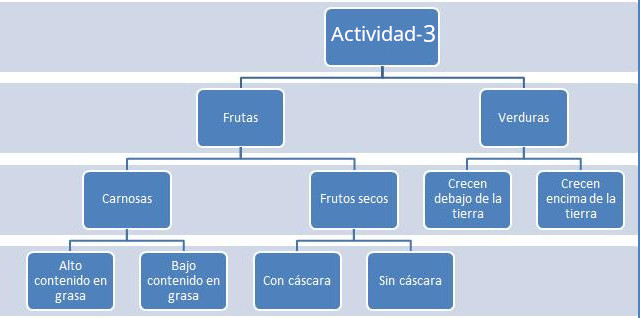

# Actividad 3 – Uso de SSH y SCP en Linux

Antes de realizar las tareas, **lee atentamente**:

> [**APUNTES DE COMANDOS LINUX**](../apuntes_comandos)   [**APUNTES DE SSH Y SCP**](../apuntes_ssh_scp)

---

## Tareas

Realiza las siguientes tareas **HACIENDO USO EXCLUSIVO DE LA TERMINAL**{: .rojo}:

1. **Conéctate por SSH** al servidor de la clase (revisa los apuntes de SSH y SCP):  
   - **IP del servidor**: `10.2.5.50`
   - **Usuario**: tu usuario de inicio de sesión en la clase  
   - **Contraseña**: tu contraseña de inicio de sesión en la clase

2. Dentro del servidor, realiza lo siguiente:  
   - En tu carpeta personal, crea una carpeta llamada **Actividad-3**.  
   - Descarga el archivo comprimido:  
     **dlopezcastellote.dev/informatica-eso-bat/asignaturas/digitalizacion/sistemas-operativos/actividad3/frutas_y_verduras.zip**{: .verde}
   - Descomprime el archivo para extraer todas las fotos que contiene.  
   - Partiendo desde **Actividad-3**, crea toda la estructura de carpetas que aparece en la imagen.

{: .img}

   - **HAZ CAPTURA DE PANTALLA DE LOS COMANDOS QUE VAS EJECUTANDO**{: .rojo}.

   - Organiza las fotos en las carpetas correspondientes, siguiendo esta clasificación:  
     - **Aguacate** → Fruta – Carnosas – Alto contenido en grasas  
     - **Almendra** → Fruta – Frutos secos – Con cáscara  
     - **Calabacín** → Verduras – Crecen encima de la tierra  
     - **Cebolla** → Verduras – Crecen debajo de la tierra  
     - **Ciruela** → Fruta – Carnosas – Bajo contenido en grasas  
     - **Coco** → Fruta – Carnosas – Alto contenido en grasas  
     - **Col** → Verduras – Crecen encima de la tierra  
     - **Dátiles** → Fruta – Frutos secos – Sin cáscara  
     - **Melón** → Fruta – Carnosas – Bajo contenido en grasas  
     - **Nuez** → Fruta – Frutos secos – Con cáscara  
     - **Olivas** → Fruta – Carnosas – Alto contenido en grasas  
     - **Pasas** → Fruta – Frutos secos – Sin cáscara  
     - **Patata** → Verduras – Crecen debajo de la tierra  
     - **Piña** → Fruta – Carnosas – Bajo contenido en grasas  
     - **Pipa** → Fruta – Frutos secos – Con cáscara  
     - **Pistacho** → Fruta – Frutos secos – Con cáscara  
     - **Zanahoria** → Verduras – Crecen debajo de la tierra

3. **Modifica la estructura de Frutos secos**:  
   - Elimina los archivos dentro de **Frutas → Frutos secos → Sin cáscara**, pero no borres aún la carpeta.  
   - Elimina la carpeta **Sin cáscara**.  
   - Copia las imágenes de **Con cáscara** a la carpeta **Frutos secos**.
   - Elimina la carpeta **Con cáscara**.
   - 👉 Si lo haces bien, todas las imágenes de frutos secos con cáscara quedarán en una sola carpeta (**Frutos secos**).
{:start="3"}

- **HAZ CAPTURA DE PANTALLA DE LOS COMANDOS QUE VAS EJECUTANDO**{: .rojo}.

4. **Crea archivos de texto en cada carpeta final**:  
   - Para cada carpeta final (`alto_contenido_en_grasa`, `bajo_contenido_en_grasa`, `frutos_secos`, `crecen_debajo_de_la_tierra`, `crecen_encima_de_la_tierra`), crea un archivo de texto con el mismo nombre (usando guiones bajos).
   - Dentro escribe los nombres de las frutas o verduras que contiene.  
   - Ejemplo: en `alto_contenido_en_grasa.txt` deben aparecer *Aguacate*, *Coco* y *Olivas*.
{:start="4"}

5. **Comprime** la carpeta **Actividad-3** en un archivo llamado **actividad-3.zip**.
{:start="5"}

6. **Borra** el archivo descargado de Internet (`frutas_y_verduras.zip`).
{:start="6"}

7. Ejecuta el comando `history` y **haz una captura de pantalla** con todos los comandos utilizados (debe verse tu usuario).
{:start="7"}

8. **Sal de la sesión SSH** con el comando `exit`.
{:start="8"}

9. **Descarga el archivo al ordenador local con SCP**:  
   - Copia `actividad-3.zip` desde el servidor a tu ordenador.  
   - **Recuerda**: en el comando `scp` deberás modificar tu **usuario real**, la **IP** del servidor y la **ruta local**.  
   - Ejemplo orientativo de sintaxis: `scp usuario@10.2.5.50:/home/usuario/Actividad-3/actividad-3.zip /ruta/local/que/elijas/`
{:start="9"}

---

## Entrega

En esta tarea de **Aules** debes subir:  
- **Captura de pantalla** del comando `history` mostrando todos los comandos y tu usuario.  
- El archivo **actividad-3.zip** que hayas descargado con SCP desde el servidor. *(El profesor comprobará que dicho archivo existe y está creado en el servidor).*
