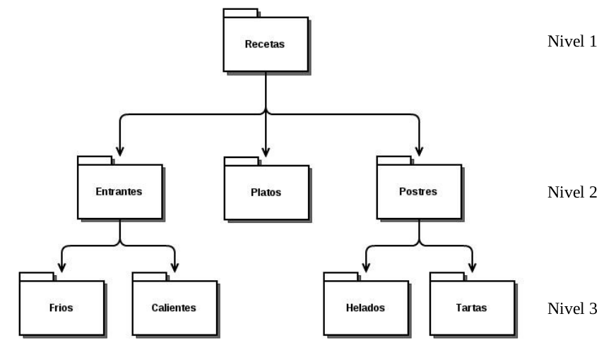

# Actividad 3 – Uso básico de la terminal en Linux (bash)

Antes de realizar las tareas, **lee atentamente**:

> [**APUNTES DE COMANDOS LINUX**](../apuntes_comandos)

---

## Tareas

Realiza las siguientes tareas **HACIENDO USO EXCLUSIVO DE LA TERMINAL**{: .rojo}:

- Dentro de tu **carpeta personal**, y dentro de **Documents/Tema 1**, crea una carpeta llamada **Actividad-3**.
- Dentro de **Actividad-3** descarga el archivo comprimido del siguiente enlace:  
  **dlopezcastellote.dev/informatica-eso-bat/asignaturas/digitalizacion/sistemas-operativos/actividad3/fotos_comida.zip**{: .verde}
- Descomprime el archivo para extraer todas las fotos que contiene.  
- Partiendo desde **Actividad-3**, **crea toda la estructura de carpetas**{: .rojo} que se aprecia en la **imagen de abajo**.
- **HAZ CAPTURA DE PANTALLA DE LOS COMANDOS QUE VAS EJECUTANDO**{: .rojo}.  
- **Organiza las fotos** en las carpetas correspondientes (muévelas a su carpeta adecuada).  
- Comprime la carpeta **Recetas** en un archivo llamado **recetas.zip** →  
  **ASEGÚRATE DE QUE el archivo `recetas.zip` CONTIENE TODAS LAS CARPETAS, SUBCARPETAS Y FOTOS ORGANIZADAS**.  
- **Borra** el archivo descargado de Internet (**fotos_comida.zip**).  

{: .img .img-300}

**Estructura de carpetas**
{: .centrado}

---

## Entrega

Sube en esta tarea de **Aules**:

- El archivo comprimido resultante (**recetas.zip**).  
- **Las capturas de pantalla de los comandos que has ido ejecutando en la terminal.**  
  Se deben ver todos los comandos utilizados para hacer la actividad y, también, tu nombre de usuario.

## Rúbrica – Actividad: Uso básico de la terminal en Linux (máx. 10 puntos)

| Criterio | 0 pts | Nivel intermedio bajo | Nivel intermedio alto | Nivel excelente |
|----------|-------|-----------------------|-----------------------|-----------------|
| **1. Ejecución en terminal** (máx. 5 pts) | No se usan comandos de terminal para la actividad o no se han entregado las capturas de pantalla. | Solo algunos pasos se hacen en terminal, o bien la mayoría de comandos son erróneos (1,5 pts). | La mayoría de pasos se hacen en terminal, pero hay algún error menor o faltan comandos en las capturas (3 pts). | Todos los pasos se realizan correctamente con comandos de terminal, sin errores (5 pts). |
| **2. Resultado final** (máx. 5 pts) | No entrega un resultado válido. | El resultado es incompleto (faltan bastantes partes o archivos) (1,5 pts). | El resultado final tiene fallos menores (alguna carpeta mal ubicada o falta algún archivo) (3 pts). | La estructura de carpetas está bien hecha, las fotos bien organizadas y el archivo `recetas.zip` es correcto y completo (5 pts). |
| **3. Entrega en plazo** (máx. 0 pts) | **-2 pts:** No entrega o entrega con retraso de más de una semana. | **-1.5 pts:** Entrega con un retraso importante (hasta 1 semana). | **-1 pt:** Entrega con un ligero retraso (máx. 2 días). | **0 pts:** Entrega en plazo `recetas.zip` y las capturas de pantalla son claras y completas (se ven comandos y usuario). |

> ⚠️ **Nota sobre la entrega en plazo:** La entrega dentro del plazo establecido no resta puntuación (0 pts). Las entregas con retraso supondrán una penalización de hasta 2 puntos sobre la calificación de la actividad.
{: .alert-error}

**Criterios de evaluación de la programación:**
* **CE1 – 1.4.** Instalar, utilizar y mantener sistemas operativos y aplicaciones, configurando sus características en función de las necesidades personales (administración y operaciones del sistema mediante terminal bash).
* **CE2 – 2.2.** Organizar y gestionar el entorno personal de aprendizaje mediante la integración de recursos digitales de manera autónoma (gestión y organización avanzada del sistema de archivos y directorios).
* **CE5 – 5.1.** Gestionar situaciones de incertidumbre en entornos digitales con una actitud positiva, y afrontarlas utilizando el conocimiento adquirido y sintiéndose competente (resolución y ejecución en entorno de consola).