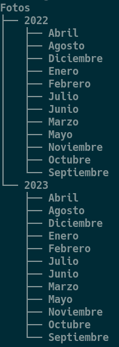

# 💻 Actividad 4 – Creación de scripts en Bash

👉 **Antes de empezar**, revisa los [**Apuntes de Scripts**](../apuntes_scripts) (apartados [**¿Qué es y para qué sirve un script?**](../apuntes_scripts#-1-qué-es-y-para-qué-sirve-un-script) y [**Ejecutar un script**](../apuntes_scripts#%EF%B8%8F-2-ejecutar-un-script))

Cada tarea que hagas debe estar dentro de la carpeta **Actividad-4**.

---

## 🧩 Tarea 1 – Crear estructura básica

Lee los apartados [**¿Qué es y para qué sirve un script?**](../apuntes_scripts#-1-qué-es-y-para-qué-sirve-un-script) y [**Ejecutar un script**](../apuntes_scripts#%EF%B8%8F-2-ejecutar-un-script) de los apuntes.

1. Crea en tu ordenador la carpeta **Actividad-4**, y dentro otra llamada **Tarea-1**.  
2. Dentro de **Tarea-1**, crea un script llamado **`tarea1.sh`** (con el programa **Kate**) que genere la siguiente estructura de carpetas.

> **Solo puedes utilizar** para esta tarea los métodos explicados en los apartados 1 y 2 de los apuntes.
{: .alert-error}



3. Añade al principio del script tu nombre y apellidos y NIA en una variable, por ejemplo:  
   ```bash
   NOMBRE="..."
   NIA="..."
   echo "Script ejecutado por $NOMBRE ($NIA) en el usuario $USER"
   ```
{:start="3"}

4. Ejecuta el script en tu ordenador y verifica que se ha creado la estructura de carpetas correspondiente. **Haz captura de pantalla de la ejecución y de la estructura de carpetas**{: .rojo}.
{:start="4"}

5. Copia el script de tu ordenador al servidor a través del comando `scp` (**revisa y pon bien los datos**). **Haz captura de pantalla de la ejecución y de la estructura de carpetas**{: .rojo}:
{:start="5"}

```bash
scp "/home/davcas/Documents/Actividad-4/Tarea-1/tarea1.sh" davcas@10.2.5.50:/home/davcas
```

6. Conéctate al servidor con SSH y ejecuta el script. **Haz captura de pantalla**{: .rojo}
{:start="6"}

> **Entrega:** el script **tarea1.sh** y las **capturas de pantalla** solicitadas.
{: .alert-warning}

---

## 🧹 Tarea 2 – Borrar la estructura anterior

> **Solo puedes utilizar** para esta tarea los métodos explicados en los apartados 1 y 2 de los apuntes.
{: .alert-error}

1. Dentro de **Actividad-4**, crea la carpeta **Tarea-2**.  
2. Crea un script llamado **`tarea2.sh`** que **borre las carpetas creadas en la Tarea 1**.  
3. El script debe:
   - Mostrar un mensaje con `echo` antes y después de cada acción.
   - Incluir tu nombre, NIA y usuario en un mensaje inicial.
4. Ejecuta el script en tu ordenador y verifica que se ha borrado la estructura de carpetas correspondiente. **Haz captura de pantalla**{: .rojo}.
5. Copia el script de tu ordenador al servidor a través del comando `scp`.
6. Conéctate al servidor con SSH y ejecuta el script. **Haz captura de pantalla**{: .rojo}

> **Entrega:** el script **tarea2.sh** y las **capturas de pantalla** solicitadas.
{: .alert-warning}

---

## 📊 Rúbrica – Actividad 4: Creación de scripts en Bash (máx. 10 puntos)

| Criterio                                               | 0 puntos                            | 1 punto                                                                   | 2 puntos                                                                        | 3 puntos                                                                            | 4 puntos                                                                                                                                                                         |
| ------------------------------------------------------ | ----------------------------------- | ------------------------------------------------------------------------- | ------------------------------------------------------------------------------- | ----------------------------------------------------------------------------------- | -------------------------------------------------------------------------------------------------------------------------------------------------------------------------------- |
| **Tarea 1 – Creación de la estructura básica (4 pts)** | No entrega el script o no funciona. | Entrega el script pero no genera correctamente la estructura de carpetas. | El script funciona parcialmente o no está personalizado con nombre/NIA/usuario, o bien faltan capturas de pantalla por entregar. | El script está completo y personalizado, pero no se copia o ejecuta en el servidor; o bien falta alguna captura de pantalla. | Entrega el script completo, personalizado (nombre, NIA, usuario, fecha, equipo), lo ejecuta correctamente en su ordenador y también en el servidor con las capturas solicitadas. |
| **Tarea 2 – Borrado de la estructura (4 pts)**         | No entrega el script o no funciona. | Entrega el script pero no borra correctamente las carpetas.               | El script borra parcialmente o no está personalizado con nombre/NIA/usuario, o bien faltan capturas de pantalla por entregar.    | El script está correcto y personalizado, pero no se copia o ejecuta en el servidor; o bien falta alguna captura de pantalla. | Entrega el script completo, personalizado (nombre, NIA, usuario, fecha, equipo), lo ejecuta correctamente en su ordenador y también en el servidor con las capturas solicitadas. |
| **Entrega en plazo (2 pts)**                           | No entrega o lo hace muy tarde.     | Entrega con pequeño retraso.                                              | Entrega en plazo.                                                               |                                                                                     |                                                                                                                                                                                  |
