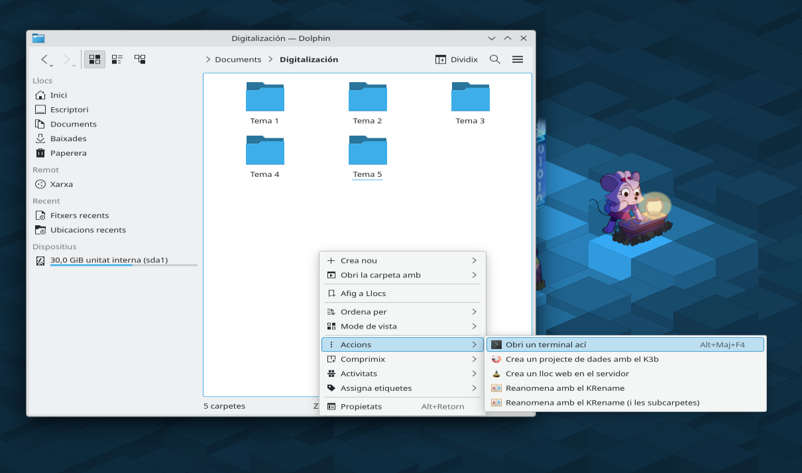
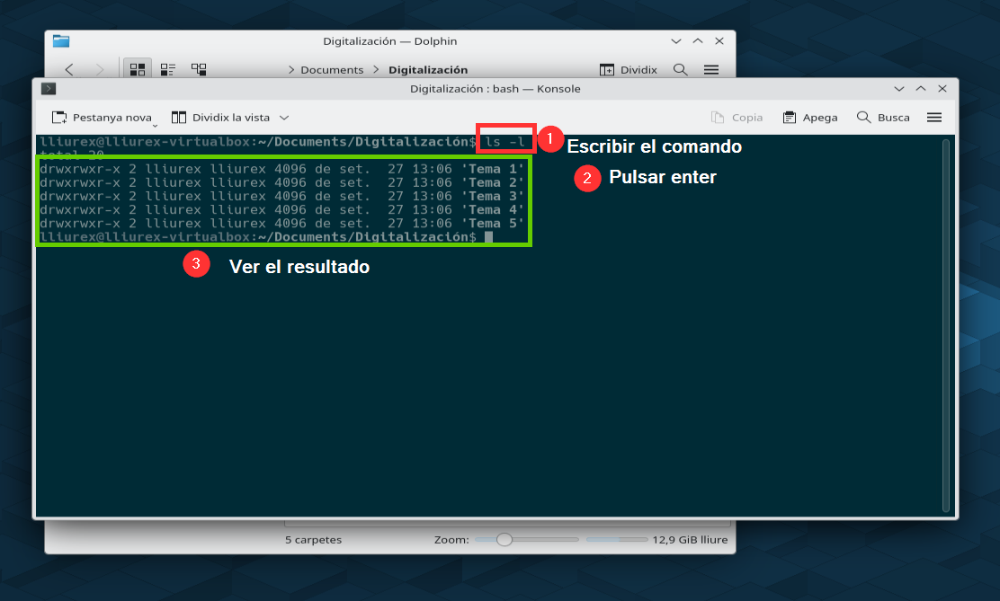
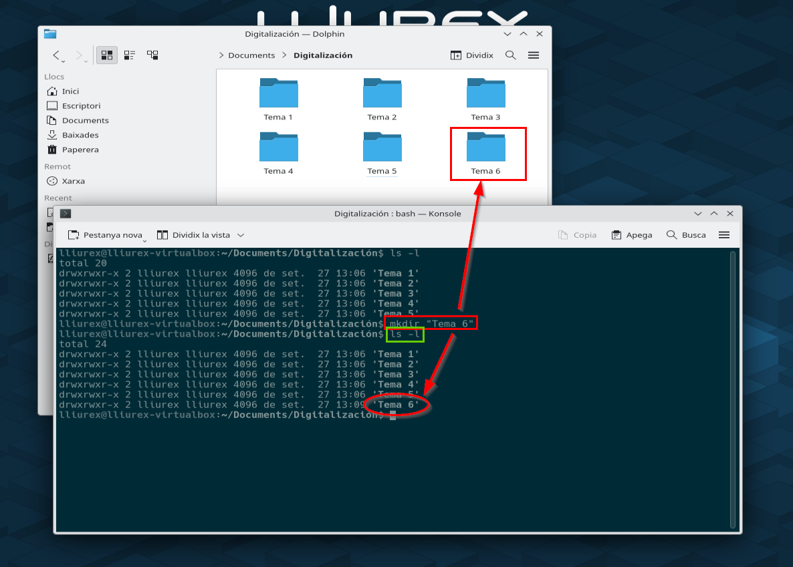
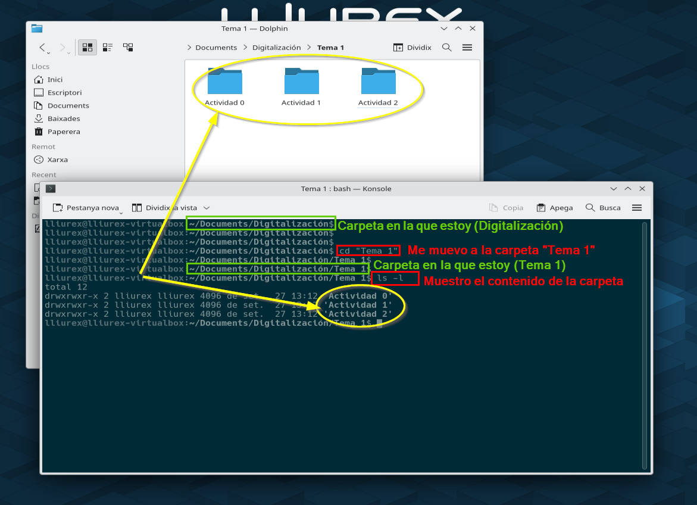

# Tabla de contenidos
{: .no_toc }

* TOC
{:toc}

# Funcionamiento básico de la terminal de comandos

> La terminal de comandos de Linux es un programa llamado `Konsole` que permite ejecutar comandos en el sistema operativo. Cada **comando** es una instrucción que se le da al sistema para que realice una acción determinada, como por ejemplo: crear una carpeta, crear un archivo, entrar dentro de una carpeta, mostrar el contenido de una carpeta, etc.
{: .alert-info}

Generalmente **abriremos la terminal de comandos** desde dentro de una carpeta, haciendo clic derecho en la zona blanca de la carpeta y yendo a `Accions -> Obre un terminal ací`

{: .img .img-500}

**Abrir la terminal de comandos**
{: .centrado}

Para **ejecutar un comando** basta con escribirlo en la terminal y pulsar en la tecla `Enter`

{: .img .img-500}

**Ejecutar un comando**
{: .centrado}

Por ejemplo, podemos **crear una carpeta** utilizando el comando `mkdir "nombre_carpeta"` y se creará la carpeta con ese nombre dentro de la carpeta en la que nos hayamos situado.

{: .img .img-500}

**Ejemplo: crear una carpeta con un comando**
{: .centrado}

También podemos **movernos por el sistema de archivos**, entrar en una carpeta, salir de ella, etc. 

{: .img .img-500}

**Ejemplo: entrar en una carpeta y mostrar su contenido**
{: .centrado}

# Lista de comandos básicos con ejemplos

| **Comando** | **Descripción** | **Ejemplo de uso** |
|-------------|-----------------|--------------------|
| `pwd` | Indica el directorio actual en el que nos encontramos. | `pwd` |
| `ls` | Lista las carpetas y archivos existentes en el directorio actual. | `ls` |
| `ls -l` | Lista las carpetas y archivos en forma de tabla mostrando propiedades. | `ls -l` |
| `cd` | Cambia del directorio actual a otro. | `cd Documentos/UD1` |
| `cd ..` | Vuelve al directorio anterior | `cd ..` |
| `mkdir` | Crea una carpeta dentro del directorio actual. | `mkdir UD2` |
| `touch` | Crea un archivo de texto dentro del directorio actual. | `touch datos.txt` |
| `nano` | Abre un archivo de texto en el editor Nano para modificarlo desde terminal. | `nano datos.txt` |
| `history` | Muestra el historial de los comandos ejecutados en la terminal. | `history` |
| `date` | Muestra la fecha y hora actual del sistema. | `date` |
| `cp` | Copia un archivo a otra localización. | `cp datos.txt Documentos/UD2` |
| `cp -r` | Copia un directorio y su contenido a otra localización. | `cp -r Documentos/UD2 Descargas` |
| `mv` | Mueve un archivo o directorio a otra localización. | `mv datos.txt Documentos/UD1` |
| `rm` | Elimina un archivo. | `rm datos.txt` |
| `rmdir` | Elimina un directorio vacío. | `rmdir Documentos/UD2` |
| `wget` | Descarga un archivo de internet a través de su URL. | `wget https://davidlopezcastellote.com/1eso/que-es-dns.png` |
| `unzip` | Descomprime un archivo `.zip`. | `unzip fotos.zip` |
| `zip` | Comprime varios archivos en un único `.zip`. | `zip fotos.zip foto1.png foto2.jpg foto3.webp` |
| `zip -r` | Comprime una carpeta con todas sus subcarpetas y archivos. | `zip -r fotos.zip Fotos` |
| `ssh` | Permite conectarse a un servidor remoto para gestionarlo. | `ssh usuario@ip` |
| `scp` | Copia archivos entre el ordenador local y un servidor. | `scp usuario@IP_servidor:/home/usuario/archivo /home/local/carpeta` |
