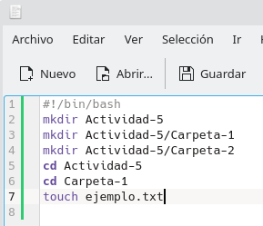
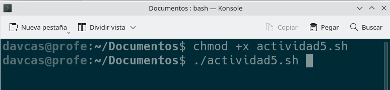
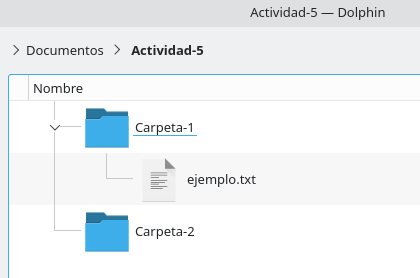
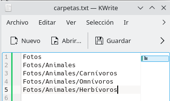
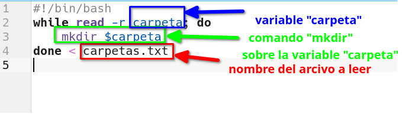
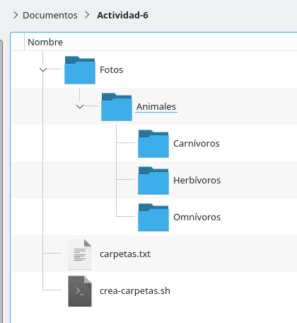
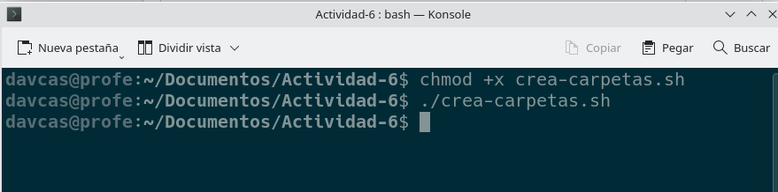
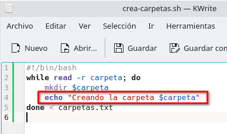
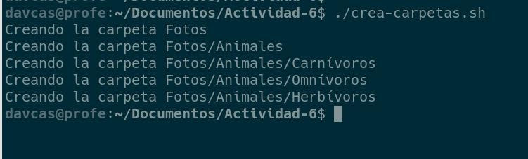

# Apuntes Scripts Linux
{: .no_toc }

## Tabla de contenidos
{: .no_toc }

* TOC
{:toc}

## 🧠 ¿Qué es y para qué sirve un script?

Un **script** es un archivo que podemos ejecutar en Linux.  
Este tipo de archivos **contienen una serie de instrucciones (comandos)** que, al ejecutarse, **se ejecutarán una detrás de otra**.

Los scripts suelen tener la extensión **`.sh`**.

Por ejemplo, si tenemos un archivo llamado **`actividad-5.sh`** con el siguiente contenido (lo podemos crear utilizando un simple editor de texto, como *KWrite*):



> ⚠️ **NOTA IMPORTANTE:** todos los scripts deben tener una línea al principio del archivo que sea:  
> `#!/bin/bash`

---

**¿Qué hace este script?**{: .rojo}

1. Crear una carpeta de nombre **Actividad-5**.  
2. Crear una carpeta llamada **Carpeta-1** dentro de **Actividad-5**.  
3. Crear una carpeta llamada **Carpeta-2** dentro de **Actividad-5**.  
4. Entrar dentro de la carpeta **Actividad-5**.  
5. Entrar dentro de la carpeta **Carpeta-1** (después de haber entrado en **Actividad-5**).  
6. Crear un archivo llamado **ejemplo.txt** dentro de **Carpeta-1**.

Por tanto, el script creará la siguiente estructura de carpetas y archivos:

```
Actividad-5/
├── Carpeta-1
│   └── ejemplo.txt
└── Carpeta-2
```

---

## ⚙️ Ejecutar un script

Para **ejecutar un script**, debemos hacer dos cosas:

1. **Darle permisos de ejecución.**  
   Esto es **necesario**.  
   Ejecutamos el comando:

   ```bash
   chmod +x actividad-5.sh
   ```

2. **Situarnos dentro de la carpeta** donde esté el archivo y lanzar el comando:

   ```bash
   ./actividad-5.sh
   ```

   (es decir, ponemos un punto, una barra `/` y después el nombre del archivo).



Así de simple: el script se ejecutará y realizará **todos los comandos escritos dentro de él**.



---

## 📁 Scripts que leen un fichero

Hacer un script que ejecute comandos uno tras otro es útil, pero todavía más útil es si conseguimos que el script realice **tareas más complejas**, como **leer un fichero de texto y procesar sus datos**.

Imaginemos que tenemos un archivo llamado **`carpetas.txt`** con el siguiente contenido:



Podemos crear un script llamado **`crea_carpetas.sh`** que lea dicho archivo y cree todas esas carpetas.  
El script sería el siguiente:



**Explicación**{: .rojo}

Los **comandos que queremos ejecutar sobre cada una de las carpetas** del archivo se colocan entre las líneas `while` y `done`.

En el ejemplo anterior está el comando `mkdir`, que **crea una carpeta llamada `$carpeta`**.  
En realidad, **`$carpeta` no es el nombre literal**, sino un **comodín (variable)** que se va actualizando con cada línea del archivo **`carpetas.txt`**.

Durante la ejecución, el valor de `$carpeta` va tomando estos valores:

1. `Fotos`  
2. `Fotos/Animales`  
3. `Fotos/Animales/Carnívoros`  
4. `Fotos/Animales/Omnívoros`  
5. `Fotos/Animales/Herbívoros`

Por tanto, cuando el script ejecuta `mkdir $carpeta`, en realidad está haciendo:

```bash
mkdir Fotos
mkdir Fotos/Animales
mkdir Fotos/Animales/Carnívoros
mkdir Fotos/Animales/Omnívoros
mkdir Fotos/Animales/Herbívoros
```

El resultado final será la siguiente estructura de carpetas:

```
Fotos
└── Animales
    ├── Carnívoros
    ├── Herbívoros
    └── Omnívoros
```



---

**Para ejecutarlo:**{: .rojo}

1. Darle permisos de ejecución:

   ```bash
   chmod +x crea-carpetas.sh
   ```

2. Ejecutarlo:

   ```bash
   ./crea-carpetas.sh
   ```




---

## 💬 Mostrando información en Konsole

Si queremos **mostrar un mensaje en la consola** desde el propio script, usamos el comando `echo`.

Podemos escribir:

```bash
echo "mensaje que queremos que se muestre"
```

Por ejemplo, si en el script anterior añadimos un `echo`:



Al ejecutarlo, se mostrará en pantalla algo como:


