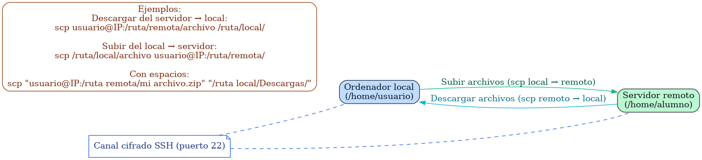

# Apuntes SSH y SCP
{: .no_toc }

## Tabla de contenidos
{: .no_toc }

* TOC
{:toc}

## SSH (Secure Shell)

**SSH** (Secure Shell) es un protocolo y un programa cuya principal función es el **acceso remoto a un servidor** por medio de un canal seguro donde toda la información está cifrada.


Para conectarnos a un servidor por medio de SSH, necesitamos:

- **La IP** (o el dominio) del servidor al cual queremos conectarnos. Ejemplo: `10.2.5.50`
- El **usuario** con el que nos conectaremos.
- La **contraseña** de dicho usuario.

Una vez tenemos esta información, ejecutaremos el comando para conectarnos por SSH al servidor de la forma siguiente:

```bash
ssh usuario@IP
# por ejemplo:
ssh davcas@10.2.5.50
```

Después, el sistema pedirá la contraseña.  
> 👉 **Nota:** cuando introduzcas la contraseña, **no aparecerán asteriscos ni caracteres en pantalla**, pero se está escribiendo igualmente.
{: .alert-warning}

Si el inicio de sesión es correcto, **estarás dentro del servidor** desde tu propia terminal, y todos los comandos que ejecutes se realizarán **en el servidor**.

> 👉 **Nota sobre el primer acceso:** la primera vez que te conectes a un servidor nuevo, SSH mostrará un mensaje para verificar la **huella digital (fingerprint)** del servidor.  
Debes escribir `yes` para continuar, y pulsar en la tecla `Enter`.
{: .alert-warning}

---

## SCP (Secure Copy Protocol)

El **Secure Copy Protocol (SCP)**, también conocido como *Secure Copy*, es un protocolo que se utiliza para la **transferencia de archivos de forma segura**. Permite la transferencia de datos entre un ordenador local y un servidor remoto, o entre dos servidores remotos.



Para **copiar un archivo que se encuentra alojado en el servidor a nuestro ordenador local**, necesitaremos:

- **La IP** (o el dominio) del servidor. Ejemplo: `10.2.5.50`
- El **usuario del servidor** con el que nos conectaremos.
- La **contraseña** de dicho usuario.
- La **ruta (carpeta)** donde se encuentra el archivo que queremos copiar.
- El **nombre del archivo** que queremos copiar.
- La **carpeta de nuestro ordenador local** donde lo queremos copiar.

### Sintaxis genérica de SCP

```bash
scp usuario_servidor@IP_servidor:/carpeta_servidor/archivo_servidor /carpeta_local
```

### Ejemplo SCP

Supongamos los siguientes datos:

- **IP:** `10.2.5.50`
- **Usuario servidor:** `davcas`
- **Ruta del archivo:** `/home/davcas/Documentos`
- **Nombre del archivo:** `actividad4.zip`
- **Carpeta local:** `/home/david/`

El comando quedaría de la siguiente forma (a continuación solicitará la contraseña):

```bash
scp davcas@10.2.5.50:/home/davcas/Documentos/actividad4.zip /home/david/
```

### Ejemplo SCP con rutas que contienen espacios

Si alguna carpeta tiene espacios en su nombre, es necesario usar comillas (`""`):

```bash
scp "davcas@10.2.5.50:/home/davcas/Mis Documentos/actividad 4.zip" "/home/david/Carpeta Local/"
```