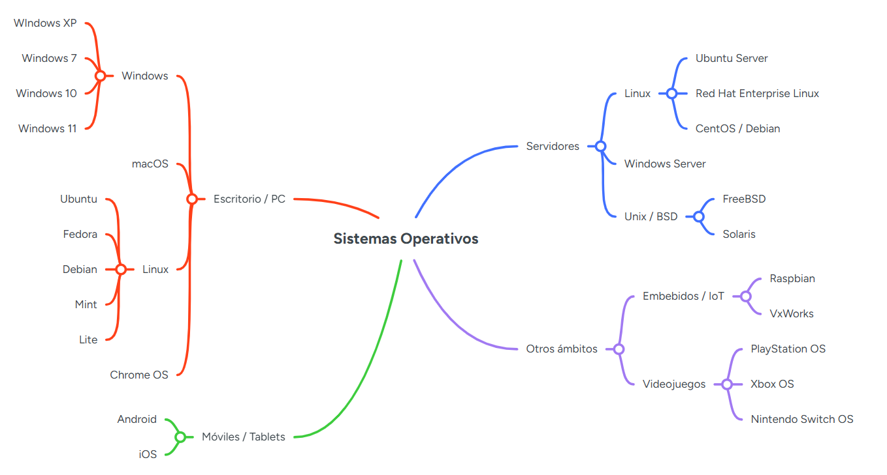

# Tema 1: Sistemas Operativos

**Definición**:
> Un **sistema operativo** es el software principal de un ordenador o dispositivo que gestiona el hardware y permite que se ejecuten los programas, actuando como intermediario entre la máquina y el usuario.

## Actividades

- [Actividad 0](./actividad0/)
- [Actividad 1](./actividad1/)