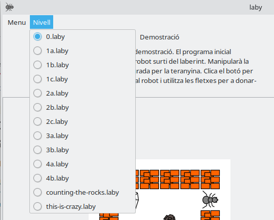

# Actividad 4. Entrenando hormigas. 3 primeros niveles de Laby

En LliureX tenemos un juego que nos permite practicar el pensamiento computacional en cuanto a términos de algoritmia; es decir, las instrucciones que debemos especificar para resolver un problema concreto.

> Este juego se llama **Laby**, y lo puedes encontrar en el menú de aplicaciones de LliureX, en la categoría "Pensamiento Computacional".

## El juego

1. Al abrir Laby, debes **seleccionar el lenguaje de programación** que utilizaremos. En este caso, escoge python

> **NOTA 1**: en caso de que no aparezca `python`, **llama al profesor**. También puedes escoger `C` en su lugar, aunque es más complicado.
{: .alert-warning}

> **NOTA 2**: si el juego está en inglés, deberías cambiar el idioma del sistema a Español, desde la configuración del sistema, y reiniciar el ordenador
{: .alert-warning}

  

2. Puedes seleccionar y cambiar de nivel desde el menú de "Nivell"
{:start="2"}

  

> En esta actividad tienes el reto de **superar los 3 primeros niveles** de este juego **(1a, 1b y 1c)**.
{: .alert-error}

> El nivel 0 es una demostración. Puedes utilizarlo para practicar y revisar el programa que nos dan de ejemplo.
{: .alert-info}

3. La interfaz del juego se compone de 5 áreas:
{:start="3"}

*   **Área 1**: es el juego en sí. La hormiga se moverá en base a las instrucciones que le demos en el programa (área 2).
*   **Área 2**: es el programa. Aquí deberemos introducir las instrucciones que queremos darle a la hormiga (es decir, el algoritmo o programa). Las posibilidades son:
    - _Valenciano_: `dreta()` , `esquerra()` , `endavant()` , `agafar()` , `deixar()` o `escapar()`
    - _Castellano_: `derecha()`, `izquierda()`, `avanzar()`, `tomar()`, `dejar()` o `escapar()`
    - _Inglés_: `right()`, `left()`, `forward()`, `take()`, `drop()` o `escape()`
*   **Área 3**: son una serie de botones que permiten ejecutar el programa; es decir, que las instrucciones se manden al juego, y la hormiga empiece a seguirlas.
*   **Área 4**: aquí veremos mensajes, tanto de éxito como de error en caso de que estemos ejecutando instrucciones que sean incorrectas o inválidas.
*   **Área 5**: tenemos una ayuda donde nos indican las instrucciones aceptadas por el programa

> **En el caso de que uses C** como lenguaje, las instrucciones deberás ponerlas entre los símbolos {   y   }  y, además, cada instrucción deberá tener un   ;   al final. Tampoco debes borrar la parte superior del programa.
{: .alert-error}

## 📝 Tareas

En esta actividad tienes el reto de superar los **3 primeros niveles (1a, 1b y 1c).** 

> 👉 **Para cada nivel debes hacer una captura de pantalla** y escribir en ella tu **nombre y apellidos** con la herramienta de edición.
{: .alert-info}

> Para hacer capturas de pantalla puedes utilizar el programa **Spectacle**.
{: .alert-success}

---

## 📤 Entrega

Debes enviarme **una captura de pantalla de cada nivel**, donde se vea cómo lo has superado y las instrucciones que has especificado para superarlo.

> Cada archivo de imagen de las capturas de pantalla debe llamarse como el nivel (por ejemplo: `1a.png`)
{: .alert-warning}

## 📊 Rúbrica – Actividad 4: Entrenando hormigas (máx. 10 puntos)

| Criterio | 0 puntos | 1 punto | 2 puntos | 3 puntos | 3.5 puntos | 5.5 puntos | 7 puntos |
|----------|----------|----------|----------|----------|----------|
| **Resolución de niveles (1a, 1b, 1c)** | No supera ningún nivel. |  | Supera 1 nivel. | Supera 2 niveles pero sobran instrucciones que no son necesarias. | Supera 2 niveles. | Supera los 3 niveles pero sobran instrucciones que no son necesarias. | Supera los 3 niveles. |
| **Presentación de capturas** | Sin capturas o capturas ilegibles. | Capturas correctas y legibles, con los archivos renombrados **1a.png**, **1b.png**, **1c.png**. |  |  |  | | |
| **Entrega en plazo** | No entrega o lo hace muy tarde. | Entrega con pequeño retraso. | Entrega en plazo. |  |  | | |
