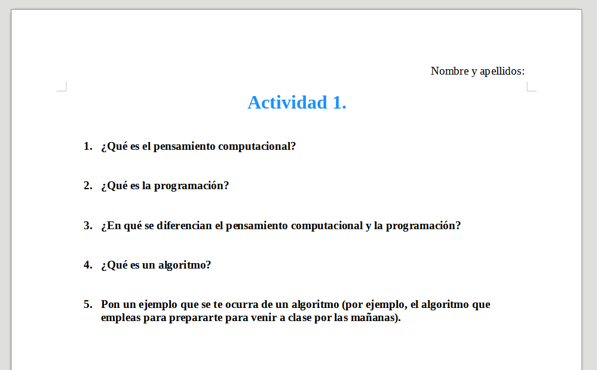

# Actividad 1

1. Antes de nada, en la carpeta **Documentos** del ordenador, crea una carpeta llamada **PIARI**.
2. Dentro, crea otra carpeta llamada **Tema 1**.
3. Dentro de _Tema 1_, crea la carpeta **Actividad 1**

Ahora, en un documento de LibreOffice Writer, **responde con tus propias palabras y de forma breve**, y en base a los vídeos que hemos visto (puedes volverlos a ver si quieres), a las siguientes preguntas. **NO puedes**_ copiar directamente las respuestas y utilizar una IA, como ChatGPT u otros, que las redacte por ti (**se valorará como copia y la nota será un 0)**{: .rojo}.

1. ¿Qué es el **pensamiento computacional**?
2. ¿Qué es la **programación**?
3. ¿En qué se **diferencian** el **pensamiento computacional** y la **programación**?
4. ¿Qué es un **algoritmo**?
5. Pon un **ejemplo** que se te ocurra de un algoritmo (por ejemplo, el algoritmo que empleas para prepararte para venir a clase por las mañanas).

Guarda el documento con nombre **Actividad 1.odt** en la carpeta que has creado al principio.

Asegúrate de que tu documento **se vea más o menos así** (con las respuestas), que **se diferencian las preguntas de las respuestas** y que **no tiene faltas de ortografía**.

> **Entrega:** Deberás entregar el documento en **.odt** y **exportado a .pdf** en Aules.
{: .alert-warning}

## 📊 Rúbrica – Actividad 1: Conceptos básicos (máx. 10 puntos)

| Criterio | Insuficiente | Básico | Adecuado | Excelente |
| :--- | :--- | :--- | :--- | :--- |
| **Respuestas a las preguntas** (máx. 5 puntos) | **0 puntos:** No responde a las preguntas o las respuestas son copiadas literalmente de internet o de una IA (como ChatGPT). | **1,25 puntos:** Responde de forma muy incompleta o con errores conceptuales relevantes en la mayoría de preguntas. | **2,5 puntos:** Responde correctamente a la mayoría de las preguntas, con explicaciones claras y ejemplos adecuados. | **5 puntos:** Responde a todas las preguntas con claridad, corrección y ejemplos pertinentes y bien desarrollados. |
| **Claridad y presentación del documento** (máx. 3 puntos) | **0 puntos:** Documento desordenado o con formato incorrecto. | **1 punto:** Documento con muchos problemas de formato o difícil de leer. | **2 puntos:** Documento aceptable pero con errores de formato o faltas frecuentes. | **3 puntos:** Documento bien estructurado, claro, sin faltas y siguiendo las indicaciones dadas. |
| **Entrega en plazo** (máx. 2 puntos) | **0 puntos:** Entrega tarde sin justificación o no entrega. | **0,5 puntos:** Entrega con retraso importante (más de 2 días). | **1 punto:** Entrega con pequeño retraso (hasta 2 días). | **2 puntos:** Entrega puntual dentro del plazo establecido. |

> ⚠️ **Nota importante sobre la puntuación de entrega:** Los 2 puntos asignados al criterio de entrega en plazo solo se contabilizarán si el alumno/a ha realizado un esfuerzo real y significativo por completar la actividad. En ningún caso se otorgará esta puntuación por entregas simbólicas, archivos vacíos, o contenidos sin sentido o sin intencionalidad de resolver la tarea.
{: .alert-error}

## Criterios de evaluación relacionados

**CE2 - 2.1.** Analizar problemas elementales significativos para el alumnado, mediante la abstracción y modelización de la realidad.

**CE2 - 2.3.** Resolver de forma guiada problemas elementales utilizando los algoritmos y las estructuras de datos necesarias.