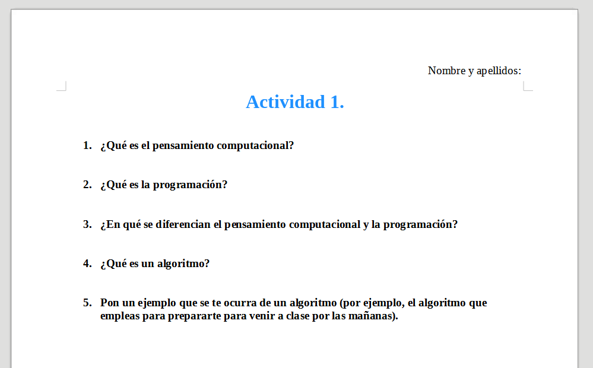

# Actividad 1

1. Antes de nada, en la carpeta **Documentos** del ordenador, crea una carpeta llamada **PIARI**.
2. Dentro, crea otra carpeta llamada **Tema 1**.
3. Dentro de _Tema 1_, crea la carpeta **Actividad 1**

Ahora, en un documento de LibreOffice Writer, **responde con tus propias palabras y de forma breve**, y en base a los vídeos que hemos visto (puedes volverlos a ver si quieres), a las siguientes preguntas. **NO puedes**_ copiar directamente las respuestas y utilizar una IA, como ChatGPT u otros, que las redacte por ti (**se valorará como copia y la nota será un 0)**{: .rojo}.

1. ¿Qué es el **pensamiento computacional**?
2. ¿Qué es la **programación**?
3. ¿En qué se **diferencian** el **pensamiento computacional** y la **programación**?
4. ¿Qué es un **algoritmo**?
5. Pon un **ejemplo** que se te ocurra de un algoritmo (por ejemplo, el algoritmo que empleas para prepararte para venir a clase por las mañanas).

Guarda el documento con nombre **Actividad 1.odt** en la carpeta que has creado al principio.

Asegúrate de que tu documento **se vea más o menos así** (con las respuestas), que **se diferencian las preguntas de las respuestas** y que **no tiene faltas de ortografía**.

> **Entrega:** Deberás entregar el documento en **.odt** y **exportado a .pdf** en Aules.
{: .alert-warning}

## 📊 Rúbrica – Actividad 1: Conceptos básicos (máx. 10 puntos)

| Criterio | Nivel 1 | Nivel 2 | Nivel 3 | Nivel 4 | Nivel 5 | Nivel 6 |
| :--- | :--- | :--- | :--- | :--- | :--- | :--- |
| **Respuestas a las preguntas** (máx. 6 puntos) | **0 puntos:** No responde a las preguntas, el documento está en blanco o las respuestas han sido copiadas literalmente de internet o generadas por una IA (como ChatGPT). | **1 punto:** Responde únicamente a 1 o 2 preguntas de forma incompleta, o la mayoría de respuestas contienen errores conceptuales graves e incoherencias. | **2,5 puntos:** Responde a menos de la mitad de las preguntas correctamente o a varias con explicaciones confusas, definiciones muy pobres o sin aportar el ejemplo de algoritmo solicitado. | **3,5 puntos:** Responde correctamente a la mayoría de las preguntas (al menos 3 o 4) con explicaciones comprensibles y redacción propia, aunque con imprecisiones teóricas o un ejemplo poco detallado. | **5 puntos:** Responde correctamente a todas las preguntas con claridad, redacción propia y buena comprensión conceptual, con fallos mínimos o ejemplos que admiten algo más de desarrollo. | **6 puntos:** Responde a todas las preguntas con redacción propia impecable, excelente claridad y precisión conceptual, diferenciando con exactitud los conceptos e incluyendo un ejemplo de algoritmo pertinente, ordenado y bien estructurado. |
| **Claridad y presentación del documento** (máx. 4 puntos) | **0 puntos:** Documento desordenado, sin aplicar ningún tipo de formato, ilegible o no entregado en el formato solicitado. | **0,5 puntos:** Presentación muy deficiente, sin diferenciar preguntas de respuestas, con problemas graves de maquetación o abundantes faltas de ortografía. | **1,5 puntos:** Presentación descuidada con escasa diferenciación visual entre preguntas y respuestas, estructura desorganizada o frecuentes faltas ortográficas. | **2,5 puntos:** Documento aceptable y legible donde se diferencian preguntas de respuestas (mediante negrita, color, etc.), aunque presenta fallos menores de formato, márgenes o algunas faltas de ortografía. | **3,5 puntos:** Documento bien estructurado, limpio y visualmente ordenado, con clara distinción entre preguntas y respuestas y apenas sin faltas de ortografía. | **4 puntos:** Documento impecable en LibreOffice Writer, estructura clara y cuidada, preguntas y respuestas perfectamente diferenciadas, sin ninguna falta de ortografía y cumpliendo todas las indicaciones (incluyendo entrega en .odt y .pdf). |
| **Entrega en plazo** (máx. 0 puntos) | **-2 puntos:** Entrega tarde sin justificación o no entrega. | **-1,5 puntos:** Entrega con retraso importante (más de 2 días). | **-1 punto:** Entrega con pequeño retraso (hasta 2 días). | **0 puntos:** Entrega puntual dentro del plazo establecido. | – | – |

> ⚠️ **Nota sobre la entrega en plazo:** La entrega dentro del plazo establecido no resta puntuación (0 pts). Las entregas con retraso supondrán una penalización de hasta 2 puntos sobre la calificación de la actividad.
{: .alert-error}

## Criterios de evaluación relacionados

**CE2 - 2.1.** Analizar problemas elementales significativos para el alumnado, mediante la abstracción y modelización de la realidad.

**CE2 - 2.3.** Resolver de forma guiada problemas elementales utilizando los algoritmos y las estructuras de datos necesarias.