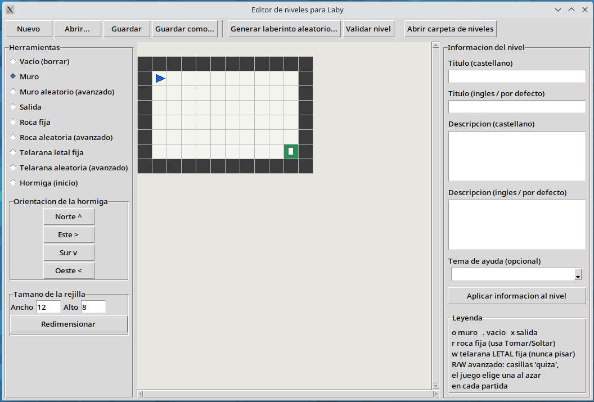

# Actividad 7. Diseña tu propio nivel con Laby Level Editor

> 🚀 **ANTES DE HACER LA ACTIVIDAD DEBES LEER**: 👉 [Funcionamiento de Laby](../funcionamiento-de-laby) y [Bucles y condicionales en Laby](../bucles-y-condicionales-en-laby) 👈
{: .alert-warning}

Una vez que has aprendido a resolver problemas utilizando bucles y condicionales en Laby, ahora te convertirás en diseñador/a de niveles.

Para ello utilizaremos la aplicación [**Laby Level Editor**](https://github.com/Dellos7/laby-levels/releases/download/v1.1.0/laby-level-editor-x86_64.AppImage)

## 🛠️ ¿Cómo funciona el editor?

El editor te permite crear tableros personalizados para Laby de forma visual:

{: .img}

- **Rejilla interactiva**: haz clic en las casillas para pintar los elementos del laberinto.
- **Herramientas de casillas**:
  - `.` Suelo libre por el que puede caminar la hormiga.
  - `o` Muro fijo intransitable.
  - `x` Puerta de salida del laberinto.
  - `r` Roca fija (bloquea el paso hasta que la hormiga la recoge con `tomar()`).
  - `w` Telaraña (letal si se pisa sin antes haber soltado una roca sobre ella).
  - `R` / `W` Rocas y telarañas aleatorias (para retos avanzados).
  - **Hormiga (`↑`, `→`, `↓`, `←`)**: define la posición y dirección en la que comenzará la hormiga.

## ⚠️ Requisitos obligatorios de tu nivel:

1. **Obligatoriedad de `while` e `if`**: Diseña un nivel y resuélvelo utilizando **al menos un bucle (`while`) y un condicional (`if`) con una función justificada**. Explica qué repetición y qué decisión resuelven; no basta con añadir bloques que no influyan en el resultado.
2. **Solucionable**: El nivel debe tener una solución clara y sin errores.
3. **Guardado del archivo**: Guarda tu nivel desde la aplicación con el formato `.laby` y nómbralo con tus apellidos y nombre: `apellido_nombre_nivel.laby`.
4. **Código de solución**: Debes programar y comprobar en Laby la solución completa en Python que resuelve tu nivel.

---

## 📤 Entrega en Aules

Debes entregar en la tarea correspondiente de Aules los siguientes elementos:

1. El archivo del nivel creado: `apellido_nombre_nivel.laby`.
2. Una **captura de pantalla de tu nivel abierto en el editor** `laby-levels` (`captura_editor.png`) con tu nombre rotulado.
3. Un archivo de texto o script Python `solucion_nivel.py` con el **código que resuelve con éxito tu propio nivel**, demostrando el uso obligatorio de `while` e `if`.

---

## 📊 Rúbrica – Actividad 7: Diseña tu propio nivel con Laby Level Editor (máx. 10 puntos)

| Criterio | Insuficiente | Básico | Adecuado | Excelente |
|---|---|---|---|---|
| **Diseño del nivel en laby-levels** (máx. 3 puntos) | **0 puntos:** No entrega nivel o el archivo `.laby` no es válido. | **1 punto:** Nivel muy simple que no cumple las pautas de diseño o no es solucionable. | **2 puntos:** Nivel funcional y solucionable, pero con diseño básico o poco retador. | **3 puntos:** Nivel funcional, original, sin errores y bien estructurado en la rejilla. |
| **Requisito algorítmico (While + If)** (máx. 3 puntos) | **0 puntos:** La solución entregada no utiliza bucle ni condicional. | **1 punto:** La solución utiliza solo una estructura, o alguna no cumple una función útil. | **2 puntos:** Utiliza ambas estructuras, pero su justificación o integración en el nivel es parcial o poco clara. | **3 puntos:** La solución combina `while` e `if` de manera útil, justificada y relevante para resolver el nivel. |
| **Código de solución del nivel propio** (máx. 2 puntos) | **0 puntos:** Sin código o no resuelve el reto. | **0,5 puntos:** Código muy incompleto, con errores graves o que no llega a la salida. | **1 punto:** Código funcional pero desordenado o con instrucciones redundantes. | **2 puntos:** Código en Python correcto, limpio, funcional y que resuelve el nivel con éxito. |
| **Presentación y formato de entrega** (máx. 2 puntos) | **0 puntos:** Nombres incorrectos, capturas ilegibles o entrega vacía. | **0,5 puntos:** Aporta solo parte de los archivos solicitados o con fallos de nomenclatura. | **1 punto:** Archivos legibles y funcionales pero falta rotular el nombre en la captura o algún formato es incorrecto. | **2 puntos:** Entrega completa y bien organizada con todos los archivos requeridos (`.laby`, captura rotulada y `solucion_nivel.py`). |
| **Entrega en plazo** (máx. 0 puntos) | **-2 puntos:** No entrega o realiza una entrega vacía o fuera de plazo sin justificación. | **-1,5 puntos:** Entrega con retraso importante de más de dos días. | **-1 punto:** Entrega con pequeño retraso (hasta 2 días). | **0 puntos:** Entrega puntual dentro del plazo establecido. |

> ⚠️ **Nota sobre la entrega en plazo:** La entrega dentro del plazo establecido no resta puntuación (0 pts). Las entregas con retraso supondrán una penalización de hasta 2 puntos sobre la calificación de la actividad.
{: .alert-error}

---

## 📌 Criterios de evaluación asociados

- **CE2.1**: Analizar problemas elementales significativos para el alumnado, mediante la abstracción y modelización de la realidad.
- **CE2.3**: Resolver de forma guiada problemas elementales utilizando los algoritmos y las estructuras de datos necesarias.
- **CE2.4**: Programar aplicaciones sencillas de forma guiada para resolver problemas elementales.
- **CE4.1**: Participar activamente en el diseño y desarrollo de soluciones digitales colaborativas y creativas.
- **CE4.3**: Describir y valorar la adecuación de las tecnologías, entornos de desarrollo, dispositivos y componentes para resolver los retos planteados.