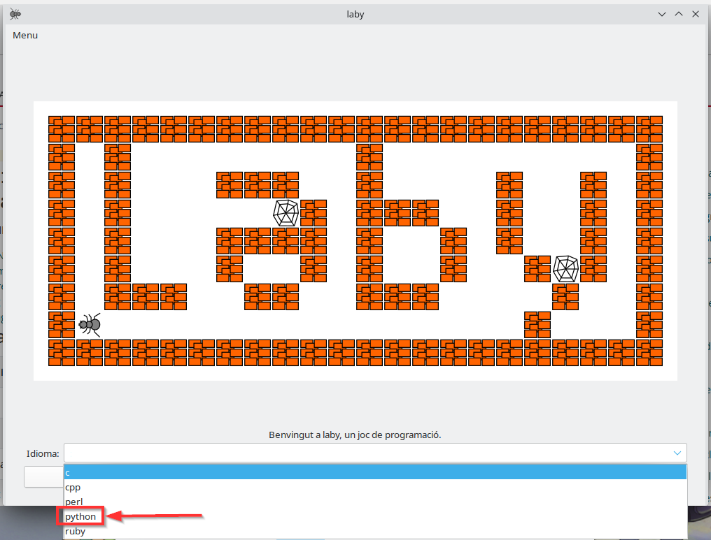
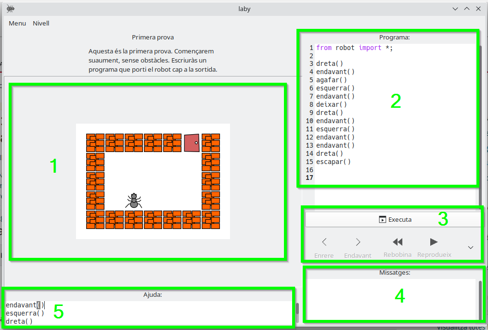

# Funcionamiento de Laby
{: .no_toc }

* TOC
{:toc}

## ¿Qué es Laby y cómo abrirlo?

En LliureX disponemos de un juego que nos permite practicar el pensamiento computacional en términos de algoritmia; es decir, las instrucciones que debemos especificar para resolver un problema concreto.

> Este juego se llama **Laby**, y lo puedes encontrar en el menú de aplicaciones de LliureX, en la categoría **"Pensamiento Computacional"**.
{: .alert-info}

---

## Configuración inicial

### 1. Selección del lenguaje de programación

Al abrir Laby, debes **seleccionar el lenguaje de programación** que utilizaremos. En este caso, escoge **python**.

> **NOTA 1**: en caso de que no aparezca `python`, **llama al profesor**. También puedes escoger `C` en su lugar, aunque es más complicado.
{: .alert-warning}

> **NOTA 2**: si el juego está en inglés, deberías cambiar el idioma del sistema a Español, desde la configuración del sistema, y reiniciar el ordenador.
{: .alert-warning}

---

### 2. Selección de nivel

Puedes seleccionar y cambiar de nivel desde el menú de **"Nivell"** (o "Nivel").

> El nivel 0 es una demostración. Puedes utilizarlo para practicar y revisar el programa que nos dan de ejemplo.
{: .alert-info}

---

## Interfaz del juego

La interfaz del juego se compone de 5 áreas:

* **Área 1**: es el juego en sí. La hormiga se moverá en base a las instrucciones que le demos en el programa (área 2).
* **Área 2**: es el programa. Aquí deberemos introducir las instrucciones que queremos darle a la hormiga (es decir, el algoritmo o programa).
* **Área 3**: son una serie de botones que permiten ejecutar el programa; es decir, que las instrucciones se manden al juego, y la hormiga empiece a seguirlas.
* **Área 4**: aquí veremos mensajes, tanto de éxito como de error en caso de que estemos ejecutando instrucciones que sean incorrectas o inválidas.
* **Área 5**: tenemos una ayuda donde nos indican las instrucciones aceptadas por el programa.

---

## Instrucciones del juego

Las instrucciones posibles varían según el idioma configurado:

- **Valenciano**: `dreta()`, `esquerra()`, `endavant()`, `agafar()`, `deixar()` o `escapar()`
- **Castellano**: `derecha()`, `izquierda()`, `avanzar()`, `tomar()`, `dejar()` o `escapar()`
- **Inglés**: `right()`, `left()`, `forward()`, `take()`, `drop()` o `escape()`

### Resumen de acciones

| Instrucción (Castellano) | Instrucción (Valenciano) | Instrucción (Inglés) | Acción |
|---|---|---|---|
| `avanzar()` | `endavant()` | `forward()` | La hormiga avanza una casilla hacia adelante. |
| `derecha()` | `dreta()` | `right()` | La hormiga gira 90º a la derecha. |
| `izquierda()` | `esquerra()` | `left()` | La hormiga gira 90º a la izquierda. |
| `tomar()` | `agafar()` | `take()` | La hormiga recoge el objeto situado en su casilla. |
| `dejar()` | `deixar()` | `drop()` | La hormiga suelta el objeto en su casilla. |
| `escapar()` | `escapar()` | `escape()` | La hormiga sale por la puerta cuando ha llegado a la meta. |

> **En el caso de que uses C** como lenguaje, las instrucciones deberás ponerlas entre los símbolos `{` y `}` y, además, cada instrucción deberá tener un `;` al final. Tampoco debes borrar la parte superior del programa.
{: .alert-error}
