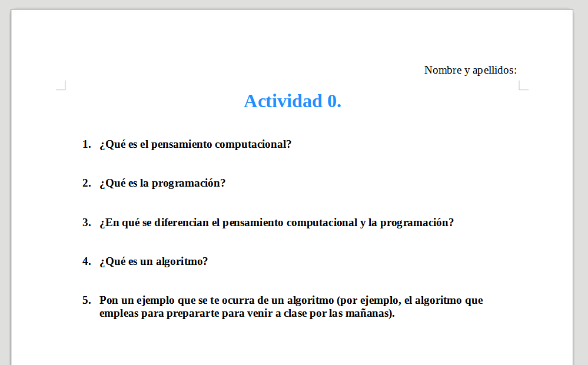

# Actividad 0

1. Antes de nada, en la carpeta **Documentos** del ordenador, crea una carpeta llamada **PSIR**.
2. Dentro, crea otra carpeta llamada **Tema 1**.
3. Dentro de _Tema 1_, crea la carpeta **Actividad 0**

Ahora, en un documento de LibreOffice Writer, **responde con tus propias palabras y de forma breve**, y en base a los vídeos que hemos visto (puedes volverlos a ver si quieres), a las siguientes preguntas. También puedes apoyarte de **Google** para responder, pero _**NO puedes**_ copiar directamente las respuestas.

1. ¿Qué es el **pensamiento computacional**?
2. ¿Qué es la **programación**?
3. ¿En qué se **diferencian** el **pensamiento computacional** y la **programación**?
4. ¿Qué es un **algoritmo**?
5. Pon un **ejemplo** que se te ocurra de un algoritmo (por ejemplo, el algoritmo que empleas para prepararte para venir a clase por las mañanas).

Guarda el documento con nombre **Actividad 0.odt** en la carpeta que has creado al principio.

Asegúrate de que tu documento **se vea más o menos así** (con las respuestas), que **se diferencian las preguntas de las respuestas** y que **no tiene faltas de ortografía**.

> **Entrega:** Deberás entregar el documento en **.odt** y **exportado a .pdf** en Aules.
{: .alert-warning}

## Criterios de evaluación relacionados

**CE2 - 2.1.** Analizar problemas elementales significativos para el alumnado, mediante la abstracción y modelización de la realidad.

**CE2 - 2.3.** Resolver de forma guiada problemas elementales utilizando los algoritmos y las estructuras de datos necesarias.