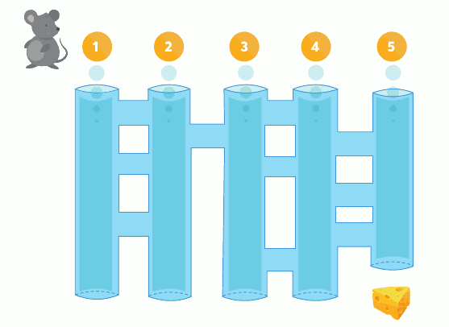

# Actividad 1. Entrenando Ratones

Un ratón de laboratorio, llamado **XC4**, ha sido entrenado por científicos. En un experimento, está situado en la entrada de un sistema de tuberías y **el objetivo** es que **llegue al queso** que se encuentra al final de la quinta tubería. Estas son las instrucciones que siempre sigue XC4:

1. **Baja** por el tubo hasta que aparezca un túnel nuevo. 
2. Cada vez que te encuentras con un túnel nuevo, debes **atravesarlo**.
3. **Vuelve** a la instrucción 1.

## Tarea 1

1. Crea la carpeta **Actividad 1** dentro de la carpeta del **Tema 1**
2. **Descarga la imagen** del ratón que tienes más arriba. Guárdala en la carpeta **Actividad 1**
3. **Abre la imagen** con el programa **GIMP** (GNU Manipulation Program).
4. ¿En qué tubo debería entrar el ratón para llegar al queso? Dibuja en la imagen el camino que seguirá el ratón por el laberinto hasta llegar al queso.
5. **Guarda** la imagen editada en la carpeta **Actividad 1**

> Deberás entregar en Aules **la imagen** del camino seguido por el ratón para llegar al queso.
{: .alert-warning}

## Tarea 2

### Entendiendo los algoritmos

En la tarea anterior, el ratón fue entrenado por los científicos para seguir siempre un **algoritmo**, el cual, de forma simplificada, es una **secuencia de instrucciones ordenadas** para hacer algo. En este caso, indica cómo debe moverse el ratón en un sistema de tubos interconectados.

Si prestamos atención al algoritmo, vemos que tiene 3 **instrucciones que presentan una a continuación de otra** y se expresan por medio de un lenguaje imperativo (es decir, como órdenes).

El **siguiente ejemplo** es un algoritmo de más instrucciones, que puede ser utilizado para **cambiar una bombilla fundida**:

1. Buscar una escalera y situarla en posición de alcanzar la bombilla rota.
2. Buscar una bombilla nueva.
3. Cortar la energía eléctrica.
4. Subir la escalera con la bombilla nueva.
5. Desatornillar la bombilla rota.
6. Enroscar la bombilla nueva.
7. Bajar la escalera.
8. Volver a conectar la energía eléctrica.
9. Comprobar que la bombilla nueva funcione.
10. Si funciona, fin del proceso; sino,volver al paso 2.

  
Como puede observarse en el algoritmo anterior:
- las instrucciones son claras y precisas
- están ordenadas por una secuencia lógica de instrucciones que debe respetarse
- tiene un inicio y un fin

> **En resumen**: Un algoritmo es una secuencia finita y ordenada de pasos para llegar a realizar una tarea determinada.
{: .alert-info}

**Ejemplos de algoritmos en la vida cotidiana** pueden ser: una receta de cocina, un manual de un artefacto que indica cómo parecerlo (por ejemplo: un mueble) o un listado de acciones a realizar en caso de que se produzca una emergencia
en un edificio.

### Reto

Los científicos están buscando la manera de **entrenar de nuevo al ratón** para que, entrando por cualquier tubo, **salga siempre por el número cinco**. Haz lo siguiente:

- **Escribe el algoritmo** haciendo uso del programa **LibreOffice Writer** e indica todos los pasos que debería seguir el ratón para **salir siempre por el tubo 5**.
- **Dibuja sobre la imagen original el camino** seguido por el ratón entrando por los **tubos 1 y 3**, utilizando dos colores diferentes para cada camino. Inserta la imagen en el documento de LibreOffice Writer.

> Deberás entregar en Aules **el documento** de LibreOffice Writer con el algoritmo y la imagen insertada.
{: .alert-warning}

# 📊 Rúbrica – Actividad 1: Entrenando Ratones (máx. 10 puntos)

| Criterio | 0 puntos | 1 punto | 2 puntos | 3 puntos | 4 puntos |
|----------|----------|----------|----------|----------|----------|
| **Representación del recorrido (Tarea 1)** | No representa el recorrido o es incoherente. | Representación incompleta o con errores relevantes. | Representación clara y correcta del recorrido del ratón. | – | – |
| **Aplicación del pensamiento computacional (Tarea 2 – Reto)** | No aplica pensamiento computacional o el algoritmo es incoherente. | Aplica pensamiento computacional de forma muy básica, con errores relevantes. | Aplica pensamiento computacional con un algoritmo comprensible aunque mejorable. | Aplica pensamiento computacional de forma clara y eficaz, resolviendo el reto con corrección. | Aplica pensamiento computacional de forma clara, eficaz y optimizada, resolviendo el reto sin errores. |
| **Entrega de documentos y formato adecuado** | No entrega los documentos o están en un formato incorrecto. | Entrega los documentos incompletos o con formato poco adecuado. | Entrega los documentos completos y en el formato indicado. | – | – |
| **Entrega en plazo** | Entrega tarde sin justificación. | Entrega con pequeño retraso. | Entrega puntual. | – | – |

## 📌 Criterios de evaluación asociados a la Actividad 1

- **CE2.1**: Analizar problemas elementales significativos para el alumnado, mediante la abstracción y modelización de la realidad.  
- **CE2.3**: Resolver de forma guiada problemas elementales utilizando los algoritmos y las estructuras de datos necesarias.  
- **CE2.4**: Programar aplicaciones sencillas de forma guiada para resolver problemas elementales.  
