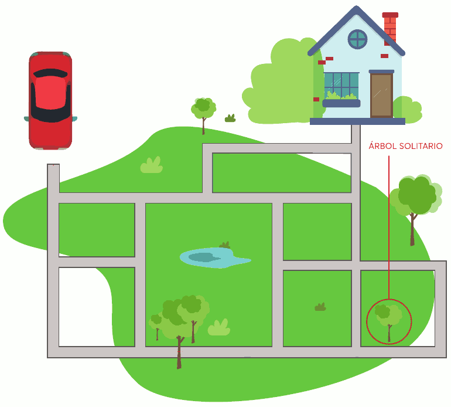
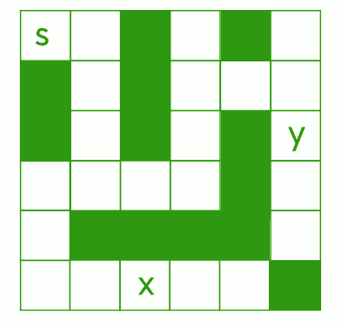

# Actividad 2. Camino a casa

## Tarea 1

Heriberto necesita llegar a su casa y usa un automóvil autónomo (que está en un estado rudimentario de desarrollo, muy lejos de la inteligencia artificial deseada por sus realizadores). El automóvil está programado con sólo tres instrucciones:

> **I**: girar 90° a la izquierda.   **D**: girar 90° a la derecha.   **A**: avanzar hasta el próximo cruce.

Utilizando las tres instrucciones anteriores, ¿puedes escribir un **algoritmo que guíe al coche a su casa** por el **camino más corto** (en cantidad de instrucciones)?

- Abre el programa **LibreOffice Writer** y ve escribiendo las respuestas a todas las preguntas y retos planteados.
- **Descarga la imagen**, ábrela con **GIMP**, dibuja el camino y luego pégala en el documento de LibreOffice Writer.

> **Pista**: Como ejemplo, compartimos un algoritmo que lleva al automóvil desde el origen hasta el pino solitario: A, A, A, I, A, A, A
{: .alert-info}

---

## Para saber más

Las computadoras sirven para realizar **tareas bien definidas**, y para ello es necesario **programarlas**. La programación se realiza mediante un **lenguaje computacional** que las máquinas son capaces de interpretar y ejecutar. Este lenguaje es diferente al que utilizan las personas puesto que está compuesto de instrucciones claras, concisas e inequívocas.

Un **algoritmo** se convierte en **programa** cuando un programador lo traduce en instrucciones que **el ordenador puede interpretar y ejecutar** (_en este caso, el automóvil autónomo_).

Los ordenadores siempre ejecutan las instrucciones de un programa al pie de la letra desconociendo las intenciones del programador y el problema por resolver.

En la tarea anterior, si el programa es correcto (_no contiene errores_), el automóvil hará lo que se le ha indicado y así resolverá el problema (_en este caso, conducir a Heriberto a su hogar_). Ahora bien, si el programa guía el automóvil a otro sitio, aunque sigue siendo un programa válido, no resuelve el problema. Por último, si el programa tiene instrucciones no reconocibles (recordar que sólo acepta I, D y A), el ordenador no sabrá qué hacer y entonces dará un mensaje de error.

Los ordenadores, independientemente de su forma y propósito (de escritorio, teléfonos inteligentes, robots de entretenimiento o industriales, etc.), siguen las instrucciones que les indican los programas que se les cargan. Los programas de ordenador son **deterministas**, es decir, si siempre se ingresan los mismos datos, el programa realizará los mismos cálculos y entregará los mismos resultados.

Uno de los trabajos de los científicos de las ciencias de la computación es encontrar los **algoritmos más eficientes**. Es decir, aquéllos que resuelven un problema en el menor tiempo, usando la menor cantidad de recursos (_por ejemplo: memoria, acceso a disco rígido, uso de red, etc_.).

---

## Tarea 2

El siguiente laberinto contiene **dos tesoros** marcados como **X** e **Y**.
- Los **bloques negros** muestran dónde están situadas las **paredes**.
- Los **bloques blancos** indican los caminos por los que podría **caminar un robot**.

Las instrucciones que puedes dar al robot son las siguientes:

> **Ax**: avanzar x bloques (   A3 ➡️ avanzar 3 bloques;   A5 ➡️ avanzar 5 bloques).   **D**: girar a la derecha 90°.   **I**: girar a la izquierda 90°.   **T**: recoger tesoro.

> **Inicialmente**, el robot está en la posición **S** y está **mirando hacia la derecha** del mapa. El robot **sólo puede recoger el tesoro si está en la misma casilla** del mapa que el tesoro.
{: .alert-warning}

- ¿Cuál es el **algoritmo** necesario para programar al robot ( _saliendo de la casilla S_ ) con el objetivo de **recoger el tesoro marcado con X**? **Escribe las instrucciones** en el documento de LibreOffice Writer tal y cómo hiciste en la Tarea 1.

- ¿Cuál es el **algoritmo** necesario para programar al robot ( _saliendo de la casilla S_ ) con el objetivo de **recoger el tesoro marcado con Y**? **Escribe las instrucciones** en el documento de LibreOffice Writer tal y cómo hiciste en la Tarea 1.

## Tarea 3

- **Edita la imagen** del laberinto del robot (utilizando, por ejemplo, GIMP) y **borra las letras** S, X e Y.
- A continuación, **define una nueva posición de salida (S)** y **dos nuevas posiciones X e Y** para los tesoros, dibujando estas letras en la propia imagen.
- Finalmente, **indica los algoritmos** necesarios para que, saliendo de la nueva posición S, el robot sea capaz de llegar a las nuevas posiciones X e Y.

# 📊 Rúbrica – Actividad 2: Camino a casa (máx. 10 puntos)

| Criterio | 0 puntos | 1 punto | 2 puntos | 3 puntos | 4 puntos |
|----------|----------|----------|----------|----------|----------|
| **Precisión del algoritmo (Tarea 1 y 2)** | Algoritmo incorrecto o incoherente. | Algoritmo muy incompleto, apenas avanza. | Algoritmo incompleto o con varios errores. | Algoritmo casi correcto, con 1 error menor. | Algoritmo correcto en todas las tareas. |
| **Claridad y orden en la presentación** | Instrucciones poco comprensibles o mal planteadas. | Instrucciones comprensibles pero con desorden/confusión. | Instrucciones claras, bien secuenciadas y fáciles de seguir. | – | – |
| **Creatividad y eficiencia (Tarea 3)** | Laberinto incorrecto o sin solución. | Laberinto funcional pero sencillo/poco optimizado. | Laberinto original y algoritmo eficiente. | – | – |
| **Entrega en plazo** | Entrega tarde sin justificación. | Entrega con pequeño retraso. | Entrega puntual. | – | – |

## 📌 Criterios de evaluación asociados a la Actividad 2

- **CE2.1**: Analizar problemas elementales significativos para el alumnado, mediante la abstracción y modelización de la realidad.  
- **CE2.3**: Resolver de forma guiada problemas elementales utilizando los algoritmos y las estructuras de datos necesarias.  
- **CE2.4**: Programar aplicaciones sencillas de forma guiada para resolver problemas elementales.  
- **CE4.1**: Participar activamente en equipos de trabajo para desarrollar soluciones digitales y tecnológicas, demostrando empatía y respetando los roles asignados y las aportaciones del resto de personas integrantes.  
- **CE4.3**: Describir y valorar la adecuación de las tecnologías, entornos de desarrollo, dispositivos y componentes para resolver los retos planteados, analizando sus características y especificaciones.  