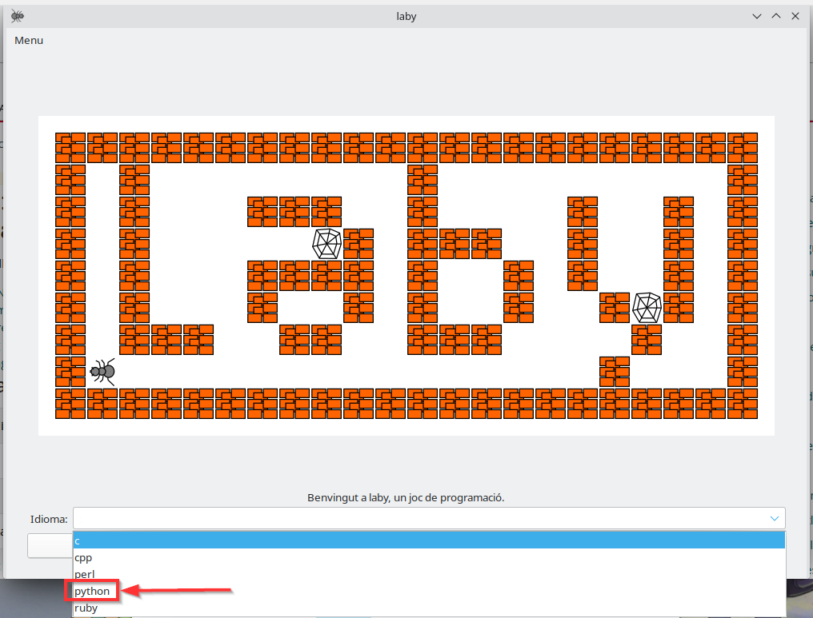
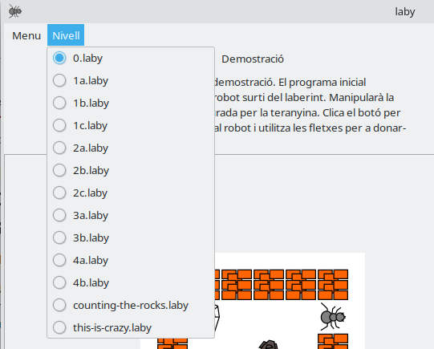
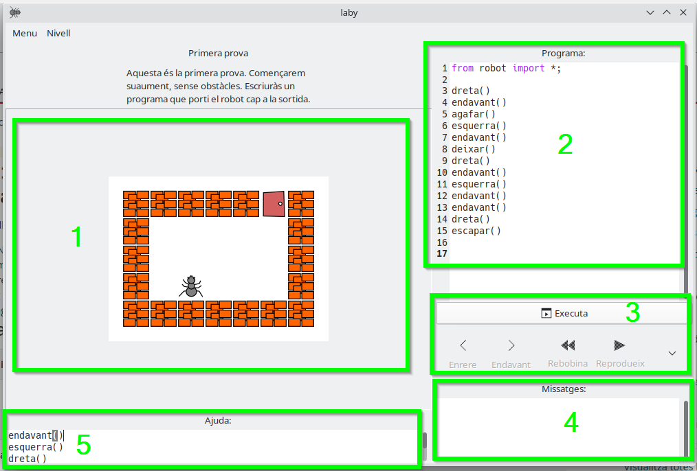

# Actividad 3. Entrenando hormigas. 3 primeros niveles de Laby

En LliureX tenemos un juego que nos permite practicar el pensamiento computacional en cuanto a términos de algoritmia; es decir, las instrucciones que debemos especificar para resolver un problema concreto.

Este juego se llama **Laby**, y lo puedes encontrar en el menú de aplicaciones de LliureX, en la categoría "Pensamiento Computacional".

#### **Información importante**

1\. Al abrir Laby, debes **seleccionar el lenguaje de programación** que utilizaremos. En este caso, escoge python

**NOTA 1**: en caso de que no aparezca `python`, escoge `perl` en su lugar

**NOTA 2**: si el juego está en inglés, deberías cambiar el idioma del sistema a Español, desde la configuración del sistema

  

2\. Puedes seleccionar y cambiar de nivel desde el menú de "Nivell"

  

**En esta actividad tienes el reto de superar los 3 primeros niveles de este juego (1a, 1b y 1c).**  

\-> El nivel 0 es una demostración. Puedes utilizarlo para practicar y revisar el programa que nos dan de ejemplo.

3\. La interfaz del juego se compone de 5 áreas:

*   **Área 1**: es el juego en sí. La hormiga se moverá en base a las instrucciones que le demos en el programa (área 2).
*   **Área 2**: es el programa. Aquí deberemos introducir las instrucciones que queremos darle a la hormiga (es decir, el algoritmo o programa). Las posibilidades son:
    - _Valenciano_: `dreta()` , `esquerra()` , `endavant()` , `agafar()` , `deixar()` o `escapar()`
    - _Castellano_: `derecha()`, `izquierda()`, `avanzar()`, `tomar()`, `dejar()` o `escapar()`
*   **Área 3**: son una serie de botones que permiten ejecutar el programa; es decir, que las instrucciones se manden al juego, y la hormiga empiece a seguirlas.
*   **Área 4**: aquí veremos mensajes, tanto de éxito como de error en caso de que estemos ejecutando instrucciones que sean incorrectas o inválidas.
*   **Área 5**: tenemos una ayuda donde nos indican las instrucciones aceptadas por el programa

  

#### **Tareas**

En esta actividad tienes el reto de **superar los 3 primeros niveles** de este juego (1a, 1b y 1c).

#### **Entrega**

Debes enviarme una **captura de pantalla de cada nivel**, donde se vea cómo lo has superado y las instrucciones que has especificado para superarlo.

EN LA CAPTURA DE PANTALLA TAMBIÉN DEBE **VERSE EL NOMBRE DE USUARIO** DEL ORDENADOR UTILIZADO.

Para hacer capturas de pantalla puedes utilizar el programa **Shutter**.