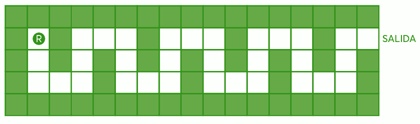
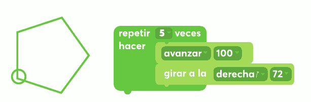
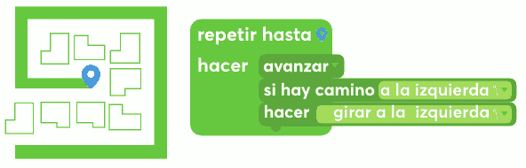
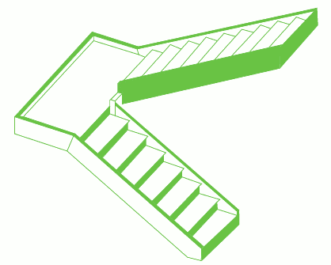

# Actividad 4. La escapada

Es necesario ayudar a que el robot BAUN3 se escape del laberinto.

Las instrucciones básicas que entiende el robot son las siguientes:

que podrían escribirse como: D (derecha), B (bajo), I (izquierda), A (arriba).

El robot está preparado para repetir cuatro veces una secuencia de ocho instrucciones (_la decidas crear_).

**PREGUNTA**

¿cuál es la secuencia de 8 instrucciones, que se repetirá cuatro veces, necesaria para que el robot escape?

\------------------------------------------------- -------------------------------------------------- -------------------

**PARA SABER MÁS**

En la tarea anterior («Camino en casa»), trabajamos con un algoritmo del tipo secuencial, que se caracteriza por una lista de instrucciones que sólo se ejecutan una vez. En esta tarea, el algoritmo incluye una **estructura de ciclo** o **bucle**, que se caracteriza porque **un subconjunto de instrucciones se repiten** cierta cantidad de veces.

En el ciclo planteado en el algoritmo de esta labor, el robot repite cuatro veces las mismas instrucciones. Pero puede haber otros casos de ciclos en los que la cantidad de repeticiones no esté determinada por un número fijo, sino por una condición. Por ejemplo, repetir hasta que no queden bolitas en la caja o repetir mientras no se llegue a una pared.

Curiosidad: la palabra **algoritmo** deriva del nombre de un matemático árabe, **AlJuarismi**, quien vivió en la ciudad de Bagdad alrededor del año 800 d. C. Se dedicó a estudiar álgebra y astronomía. Es reconocido por sus procedimientos para resolución de ecuaciones y un tratado sobre números -_Algoritmi de numere indorum_, título de su trabajo traducido al latín.

\------------------------------------------------- ------------------------

**DESAFÍO 3. Escribir el algoritmo I**

En el cuento «Instrucciones para subir una escalera» de Julio Cortázar, se puede detectar un patrón de repetición de instrucciones. ¿Cuáles son las instrucciones que se repiten?

Las escaleras se suben de frente, [...\] los brazos colgando sin esfuerzo, la cabeza erguida, aunque no tanto que los ojos dejan de ver los escalones inmediatamente superiores a lo que se pisa, y respirando lenta y regularmente. Para subir una escalera se empieza por levantar esa parte del cuerpo situada a la derecha abajo, envuelta casi siempre en cuero o rebeco, y que salvo excepciones ninguna exactamente en el escalón. Puesta en el primer escalón esta parte, que para abreviar diremos pie, se recoge la parte equivalente de la izquierda (también dicha pie, pero que no debe confundirse con el pie antes
citado), y llevándola a la altura del pie, se le hace seguir hasta colocarla en el segundo escalón, con lo que en éste descansará el pie, y en el primero descansará el pie. \[...\]

Llegando en esta forma al segundo escalón, basta repetir alternadamente los movimientos hasta encontrarse con el final de la escalera [...\].

(_Cortázar, 1962_)

**DESAFÍO 3 . Escribir el algoritmo II**

**PREGUNTA**

¿Puedes escribir un algoritmo que permita que un robot suba la siguiente escala?

Si necesitas más instrucciones que las propuestas en la tarea "La escapada", puedes definirlas: por ejemplo, alguna del tipo "mientras no haya llegado [...\]".

Recuerda que las instrucciones se escriben en modo imperativo.