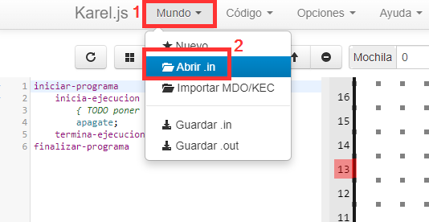
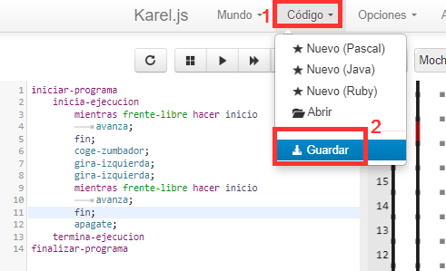

# Actividad 5. El mundo de Karel. Retos básicos

> 🚀 **ANTES DE HACER LA ACTIVIDAD DEBES LEER**: 👉 [Funcionamiento básico de Karel](../funcionamiento-basico-karel) 👈
{: .alert-warning}

## ❓ ¿Qué debes hacer?
En esta actividad debes resolver los mundos <a href="Karel_1.in" download>Karel_1.in</a>, <a href="Karel_2.in" download>Karel_2.in</a> y <a href="Karel_3.in" download>Karel_3.in</a>.

---

## 📥 ¿Cómo importar los mundos?
1. Abre la página de Karel: [https://omegaup.com/karel.js/](https://omegaup.com/karel.js/)  
2. Haz clic en **Mundo → Abrir .in**.  
3. Abre el archivo con extensión `.in` descargado de Aules.  

---

## 💾 Guarda el código (sobre todo si no has acabado)
Asegúrate de guardar el código de un ejercicio en el ordenador (sobre todo si no lo has acabado y lo quieres terminar en la próxima sesión).  

---

## 🆘 Ayuda para los mundos 

> Cada vez que superes uno de los mundos debes:  
- **Hacer una captura de pantalla**.  
- **Anotar tu nombre en la misma**. 
- **Guardar el código del mundo desde el menú Código --> Guardar**
{: .alert-warning}

### 🔴 Karel_1
Debes recoger el zumbador situado en la **columna 9 y fila 3** y volver a la posición inicial.  

### 🔴 Karel_2
Debes recoger los **5 zumbadores** del mundo y volver a la posición inicial.  

### 🔴 Karel_3
Debes recoger los **7 zumbadores** del mundo, **teniendo en cuenta que hay paredes que no puedes atravesar**.  
No es necesario volver a la posición inicial.  

---

## 📸 Entrega 

> Debes subir a Aules las **capturas de cada mundo resuelto** y el **archivo .txt** (código) de cada mundo. Debes llamar a los archivos como el mundo, por ejemplo: **karel_1.png** y **karel_1.txt**
{: .alert-info}

## 📊 Rúbrica – Actividad 5: El mundo de Karel. Retos básicos (máx. 10 puntos)

| Criterio                          | 0 puntos                                                               | 1 punto                                                                                                        | 2 puntos                                                                                                                                                                           | 3 puntos                                                                                                                                            |
| --------------------------------- | ---------------------------------------------------------------------- | -------------------------------------------------------------------------------------------------------------- | ---------------------------------------------------------------------------------------------------------------------------------------------------------------------------------- | --------------------------------------------------------------------------------------------------------------------------------------------------- |
| **Mundo 1 (máx. 2 pts)**          | No supera el mundo, no entrega las capturas o falta el archivo `.txt`. | Karel recoge el zumbador pero no vuelve a la posición inicial o no nombra correctamente los archivos.          | Karel recoge el zumbador, vuelve correctamente a la posición inicial y entrega la captura y el archivo `.txt` con el nombre adecuado utilizando solo las instrucciones necesarias. |                                                                                                                                                     |
| **Mundo 2 (máx. 3 pts)**          | No supera el mundo o no entrega los archivos requeridos.               | Recoge solo algunos zumbadores o no vuelve a la posición inicial o entrega incompleta.                         | Recoge todos los zumbadores y vuelve a la posición inicial aunque con instrucciones de más o errores menores y entrega la captura y archivo `.txt` con el nombre adecuado.         | Recoge todos los zumbadores, vuelve correctamente, usa solo las instrucciones necesarias y entrega ambos archivos con nombre correcto.              |
| **Mundo 3 (máx. 3 pts)**          | No supera el mundo o no entrega los archivos requeridos.               | Recoge algunos zumbadores pero se queda bloqueado o atraviesa paredes o no entrega correctamente los archivos. | Recoge todos los zumbadores respetando los muros pero con pasos o giros innecesarios y entrega la captura y archivo `.txt` con el nombre adecuado.                                 | Recoge todos los zumbadores respetando los muros con el número justo de instrucciones sin errores y entrega ambos archivos correctamente nombrados. |
| **Entrega en plazo (máx. 2 pts)** | No entrega o lo hace con mucho retraso.                                | Entrega con pequeño retraso.                                                                                   | Entrega en plazo.                                                                                                                                                                  |                                                                                                                                                     |
