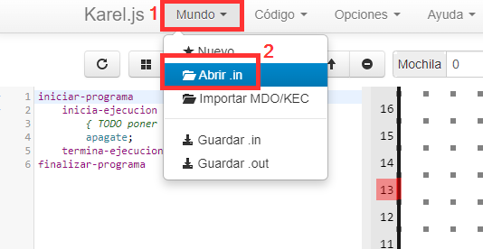
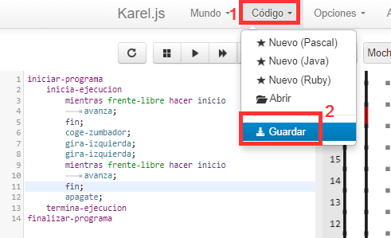
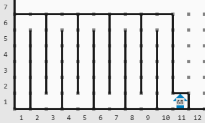

# Actividad 6. El mundo de Karel. Bucles y condicionales

> 🚀 **ANTES DE HACER LA ACTIVIDAD DEBES LEER**: 👉 [Bucles y condicionales en Karel](../bucles-y-condicionales-en-karel) 👈
{: .alert-warning}

---

## ❓ ¿Qué debes hacer?
En esta actividad debes resolver los mundos <a href="Karel_4.in" download>Karel_4.in</a>, <a href="Karel_5.in" download>Karel_5.in</a>, <a href="Karel_6.in" download>Karel_6.in</a>, <a href="Karel_7.in" download>Karel_7.in</a> y <a href="Karel_8.in" download>Karel_8.in</a>.  

> 🟡 **NOTA:** Debes utilizar **bucles** y/o **condicionales** para resolver los mundos.
{: .alert-error}

---

## 📥 ¿Cómo importar los mundos?
1. Abre la página de Karel: [https://omegaup.com/karel.js/](https://omegaup.com/karel.js/)
2. Haz clic en **Mundo → Abrir .in**
3. Abre el archivo con extensión `.in` descargado de Aules.  

---

## 💾 Guarda el código (si no has acabado)
Asegúrate de guardar el código de un ejercicio en el ordenador (sobre todo si no lo has acabado y lo quieres continuar en la próxima sesión).  

---

## 🆘 Ayuda para los mundos

> 🟡 **NOTA:** Si no utilizas **bucles** y/o **condicionales**, no se contará como válido.
{: .alert-error}

### 🔴 Karel_4
Debes recoger el zumbador situado en la **columna 1 y fila 23** y volver a la posición inicial.  
➡️ **Utiliza bucles.**

---

### 🔴 Karel_5
Debes recoger los **2 zumbadores** y volver a la posición inicial.  
➡️ Puedes utilizar **solo bucles** o **también condicionales.**

---

### 🔴 Karel_6
Debes recoger los **5 zumbadores** del mundo teniendo en cuenta que hay **paredes** que no puedes atravesar.  
➡️ **Debes utilizar bucles y condicionales.**

---

### 🔴 Karel_7
Recoge todos los zumbadores del **laberinto (68 zumbadores)** y déjalos en la **columna 11, fila 1**.  
➡️ **Utiliza bucles.**  

> El código **no puede superar las 35 líneas.**
{: .alert-error}

**Situación final:**  

---

### 🔴 Karel_8
Recoge todos los zumbadores del **laberinto (186 zumbadores)** y déjalos en la **columna 8, fila 7**.  
➡️ **Utiliza bucles.**  
> El código **no puede superar las 20 líneas.**
{: .alert-error}

Aquí tienes un vídeo de cómo tiene que quedar resuelto:  

<video controls width="400">
  <source src="{{ '/archivos/karel_8.mp4' | relative_url }}" type="video/mp4">
  Tu navegador no soporta video.
</video>

---

## 📸 Entrega

> Debes subir a Aules las **capturas de cada mundo resuelto** y el **archivo .txt** (código) de cada mundo. Debes llamar a los archivos como el mundo, por ejemplo: **karel_4.png** y **karel_4.txt**
{: .alert-info}

## 📊 Rúbrica – Actividad 6: El mundo de Karel. Bucles y condicionales (máx. 10 puntos)

| Criterio                          | 0 puntos                                                                    | 1 punto                                                                                                                            | 1.5 puntos                                                                                                               | 2 puntos                                                                                                                                            | 2.5 puntos                                                                                                                                       |
| --------------------------------- | --------------------------------------------------------------------------- | ---------------------------------------------------------------------------------------------------------------------------------- | ------------------------------------------------------------------------------------------------------------------------ | --------------------------------------------------------------------------------------------------------------------------------------------------- | ------------------------------------------------------------------------------------------------------------------------------------------------ |
| **Karel_4 (máx. 1 pt)**           | No supera el mundo o no entrega captura y archivo .txt con nombre correcto. | Recoge el zumbador, vuelve a la posición inicial y entrega captura y archivo .txt correctamente nombrados usando bucles.           |                                                                                                                          |                                                                                                                                                     |                                                                                                                                                  |
| **Karel_5 (máx. 1 pt)**           | No supera el mundo o no entrega correctamente los archivos.                 | Recoge los zumbadores y vuelve a la posición inicial usando bucles y o condicionales y entrega captura y .txt con nombre correcto. |                                                                                                                          |                                                                                                                                                     |                                                                                                                                                  |
| **Karel_6 (máx. 1.5 pts)**        | No supera el mundo o ignora paredes o no entrega los archivos requeridos.   | Recoge algunos zumbadores pero no todos o hay errores relevantes.                                                                  | Recoge todos los zumbadores respetando muros usando bucles y condicionales y entrega captura y .txt con nombre correcto. |                                                                                                                                                     |                                                                                                                                                  |
| **Karel_7 (máx. 2 pts)**          | No supera el mundo o excede el límite de líneas o no entrega archivos.      | Recoge y o deposita solo parte de los zumbadores.                                                                                  |                                                                                                                          | Recoge y deposita todos los zumbadores respetando el límite de líneas usando instrucciones necesarias y entrega captura y .txt con nombre correcto. |                                                                                                                                                  |
| **Karel_8 (máx. 2.5 pts)**        | No supera el mundo o excede el límite de líneas o no entrega archivos.      | Recoge y o deposita solo parte de los zumbadores.                                                                                  | Recoge y deposita todos correctamente pero con uso poco eficiente de bucles o condicionales.                             | Recoge y deposita todos respetando el límite de líneas con algún detalle mejorable.                                                                 | Recoge y deposita todos respetando el límite de líneas con uso eficiente de bucles y condicionales y entrega captura y .txt con nombre correcto. |
| **Entrega en plazo (máx. 2 pts)** | No entrega o lo hace con mucho retraso.                                     | Entrega con pequeño retraso.                                                                                                       | Entrega en plazo.                                                                                                        |                                                                                                                                                     |                                                                                                                                                  |
