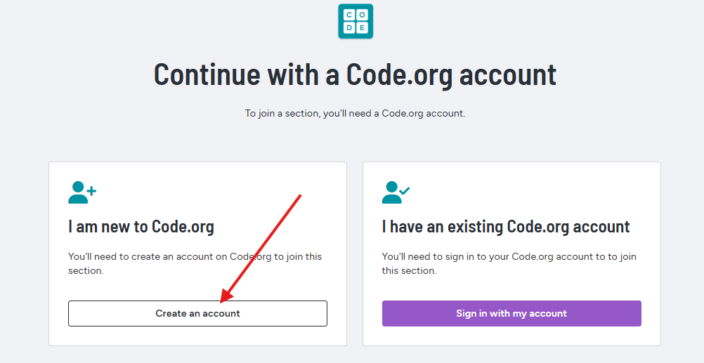
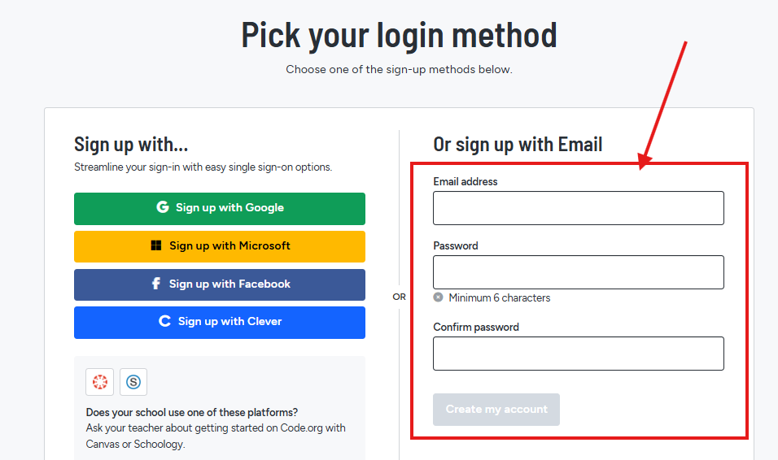

# Actividad 7. Code.org - Aventurero de Minecraft.

## Tarea

1. Accede a [https://studio.code.org/join/LTRCYC](https://studio.code.org/join/LTRCYC)
2. Debes **registrarte utilizando tu correo electrónico** de **@alu.edu.gva.es**

> 👉 **¡¡RECUERDA APUNTARTE LA CONTRASEÑA DE REGISTRO!!** 👈
{: .alert .alert-error}

3. Rellena los datos que se te soliciten.
{:start="3"}
4. Pásate las **14 lecciones** de Minecraft.
{:start="4"}

> **NOTA:** si no te pasas todas las lecciones utilizando el número de bloques adecuado se te restará nota de la actividad 
{: .alert .alert-warning}

## Entrega

Sube una **captura de pantalla** donde se vea cómo te has pasado todos los niveles.