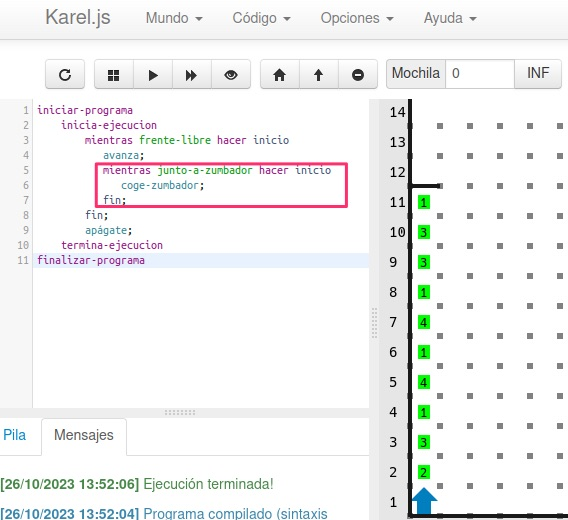

# Bucles y condicionales en Karel
{: .no_toc }

* TOC
{:toc}

## Bucles {#karel-bucles}

El mundo de Karel puede ser muy extenso y amplio, y a veces es necesario indicarle a Karel que debe hacer una acción de forma repetida para facilitarle la tarea.

Para ello, se utilizan los **bucles**.  
Sirven para **ejecutar una o varias instrucciones de forma repetida mientras se cumpla una condición**.

Por ejemplo, **si queremos que Karel avance mientras tenga el frente libre** (es decir, hasta que encuentra una pared), podemos hacerlo con la siguiente instrucción:

```plaintext
mientras frente-libre hacer inicio
   avanza;
fin;
```

Debemos indicar las palabras **inicio** y **fin** justo al empezar y terminar el bucle.  
Todo lo que vaya entre **inicio** y **fin** se hará de forma repetida mientras se cumpla que el frente está libre.

**NOTA:** después de `fin`, debemos poner un punto y coma.


En el siguiente ejemplo, **queremos coger todos los zumbadores mientras avanzamos hasta la pared**.

Para ello, **dentro del bucle debemos avanzar y coger un zumbador**, de forma repetida, hasta llegar a la pared.


---

## Condicionales {#karel-condicionales}

Ahora imaginemos un caso en el que **no sabemos dónde tenemos los zumbadores**.  
Puede que en la casilla que avancemos haya zumbador o puede que no lo haya.

En este caso, **el programa anterior no nos sirve**, porque **daría error al intentar coger un zumbador sin que el zumbador exista en dicha casilla**.


Por tanto, en este caso **debemos utilizar una instrucción condicional (`si`)**.  
Es decir, **si estamos junto a un zumbador, entonces lo cogemos**.  
De esta manera, si no estamos junto al zumbador, Karel no intentará cogerlo.

```plaintext
si junto-a-zumbador entonces inicio
   coge-zumbador;
fin;
```

Si nos fijamos, esto lo hacemos **dentro del bucle `mientras frente-libre` y después de avanzar**, lo que quiere decir que Karel comprobará siempre, justo después de avanzar, si hay zumbador, y en caso de que lo haya, lo cogerá.


---

## Varios bucles {#karel-varios-bucles}

En el caso de que tengamos varios zumbadores en una misma casilla, podemos utilizar **otro bucle (dentro del primero)** para recogerlos todos.



---

## Comprobaciones que puede hacer Karel {#karel-comprobaciones}

**Karel puede hacer todas las siguientes comprobaciones**, tanto dentro de un **bucle `mientras`** como dentro de un **condicional `si`**:

```plaintext
frente-libre
frente-bloqueado
izquierda-libre
izquierda-bloqueada
derecha-libre
derecha-bloqueada
junto-a-zumbador
no-junto-a-zumbador
algun-zumbador-en-la-mochila
ningun-zumbador-en-la-mochila
orientado-al-norte
orientado-al-sur
orientado-al-este
orientado-al-oeste
no-orientado-al-norte
no-orientado-al-sur
no-orientado-al-este
no-orientado-al-oeste
```
