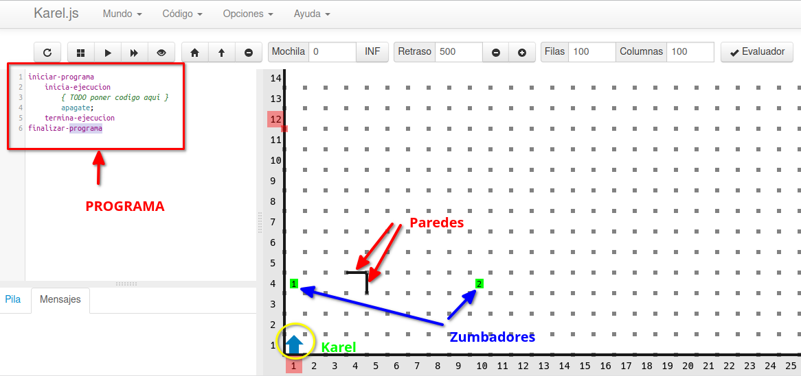
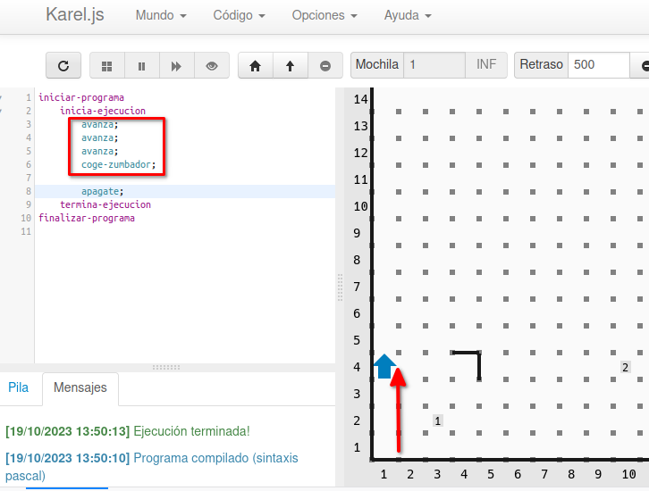
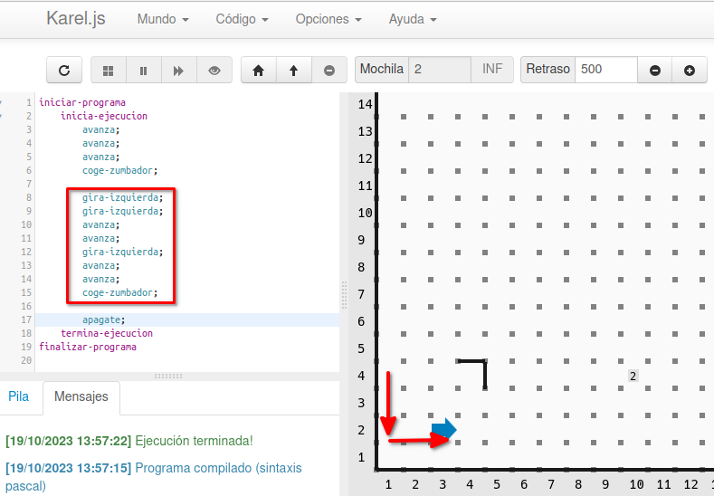

# Funcionamiento básico de Karel
{: .no_toc }

* TOC
{:toc}

## Acceder a Karel
👉 [https://omegaup.com/karel.js/](https://omegaup.com/karel.js/)

Karel es un robot que vive en su mundo y al cual nosotros debemos programar para que sea capaz de moverse por su mundo y vaya resolviendo las tareas que le vamos proponiendo.  

Sin embargo, su mundo va cambiando para cada reto y debemos programar cada uno de ellos de forma distinta.  

## ¿Cómo funciona Karel?  

En el mundo de Karel tenemos varios elementos.  

1. Karel. Es el robot que manejaremos con nuestro programa.  
2. Paredes que Karel no puede atravesar.  
3. Zumbadores que Karel debe recoger. Cada zumbador que recogemos se guarda en la mochila.  
4. El programa (izquierda) que nosotros deberemos modificar y escribir para darle instrucciones a Karel.  

---

## ¿Qué sabe hacer Karel?  

Las instrucciones básicas que Karel sabe hacer son:  

- **avanza;** → sirve para que Karel avance un paso en la dirección a la que apunta  
- **coge-zumbador;** → sirve para que Karel recoja el zumbador que tiene debajo y lo coloque en la mochila  
- **deja-zumbador;** → sirve para que Karel coloque un zumbador justo debajo  
- **gira-izquierda;** → sirve para que Karel cambie su orientación 90º a la izquierda  
- **apagate;** → Karel se apaga y ya no puede seguir haciendo nada  

---

## Ejemplos  

Ejemplo en vídeo del funcionamiento de Karel:

<video controls width="400">
  <source src="{{ '/archivos/Funcionamiento_Karel.mp4' | relative_url }}" type="video/mp4">
  Tu navegador no soporta video.
</video>

Por ejemplo, si **queremos que Karel llegue al zumbador que está colocado en la columna 1 y la fila 4 y lo recoja**, escribiríamos el siguiente programa y le daríamos a ejecutar (**FALTA ENLACE IMAGEN**, flecha de reproducción de arriba):  

Si ahora **queremos que Karel llegue al zumbador situado en la columna 3 y la fila 2**, deberemos hacer que Karel gire a la izquierda 2 veces para apuntar hacia abajo (ya que Karel no sabe ir a la derecha) e ir en busca del zumbador con el resto de instrucciones correspondientes:

