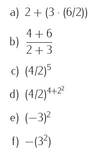

# Ejercicios 1. Operadores Aritméticos (No Evaluable)

**1 ) Escribe un programa que muestre el resultado de las siguientes operaciones:**

*    1  -  2  +  3
*    1  -  ( 2 + 3)                                         ¿por qué el resultado es diferente al del punto anterior?  
    
*   \- 3
*   \+ -  3
*   \- - 3                                                     ¿por qué el resultado es negativo?              
    
*   \- + - + - + - 3
*    4 / 2
*    4  //  2                                               ¿por qué el resultado es diferente al caso anterior?
*    5  //  2  
    
*   -  5  //  2                                             ¿por qué -3 y no -2?
*   2  *  3  +  4
*   2  +  3  *  4                                        ¿por qué el resultado es 14 y no 20? ¿qué tendrías que hacer para que antes de multiplicar   *  4  se realice la suma de 2  +  3?
*   27  %  5
*   -  27  %  5                                         ¿por qué no da el mismo resultado que el ejemplo anterior?  
    

**2 ) Cuál será la primera operación que realizará python en la siguiente expresión:**

               - 3  *  2   +   5  - 1

**3)  Traduce las siguientes expresiones matemáticas a Python utilizando el menor número de paréntesis posible.**

                                                  

Soluciones:  

                                                  a) 11.0

b) 2.0

c) 32.0

d) 256.0  

e) 9

f) -9