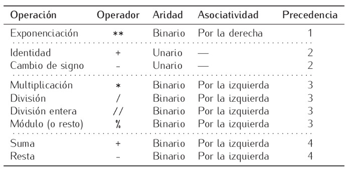

# Operadores Aritméticos

[**👉 NÚMEROS ENTEROS Y OPERACIONES (aprendepython.es)**](https://aprendepython.es/core/datatypes/numbers/#enteros)

#### **Ampliación:**

##### **Precedencia**

La precedencia indica el orden en el que se resolverán los diferentes operadores en una expresión. Los operadores con mayor precedencia se resuelven antes. En el siguiente ejemplo:

    print( 2 +  3 * 5 )

la mayor precedencia la tienen los paréntesis, por lo que el ordenador resolverrá el contenido de los mismos antes de hacer nada. Dentro de los paréntesis, el operador   *   tiene mayor precedencia que el operador    +  por lo que el ordenador lo realiza antes pasando la expresión a quedar de la siguiente manera:

    print( 2 + 15 )

A continuación  resuelve la suma:

    print ( 17 )

Como ya ha resuelto el contenido de los paréntesis a continuación ejecuta el comando print y muestra el   17 en pantalla.

##### **Asociatividad**

La asociatividad tiene lugar cuando dentro de una expresión se encuentra el mismo operador varias veces o operadores con la misma precedencia. En ese caso la asociatividad nos indica el orden en el que se van a resolver los operadores y puede ser de izq a der o de der. a izq. En el siguiente ejemplo:

    print ( 8 * 32 / 2  ** 2 ** 3  )

El operador  ** tiene mayor precedencia y se asocia de derecha a izquierda por lo que se resuelve primero.

    print ( 8 * 32  / 2 **  8 )

El primer elemento a resolver ha sido el operador **  más a la derecha ( 2 ** 3). A continuación continúa resolviendo operadores ** hacia la izquierda.

    print ( 8 * 32 / 256 )

Ya solo quedan operadores   *  y  /  que tienen asociatividad de izq a der.

    print (256 / 256)

Finalmente resuelve la división:

    print(1)     

Y acabará ejecutando la sentencia print para mostrar un 1 en pantalla.

--------------------------------------------------------------------------------------------------  

Saber más:

*   [División entera y resto de números negativos en Python](https://www.mclibre.org/consultar/python/lecciones/python-detalles.html#division-enteros).