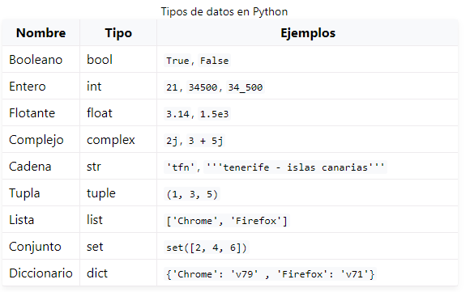
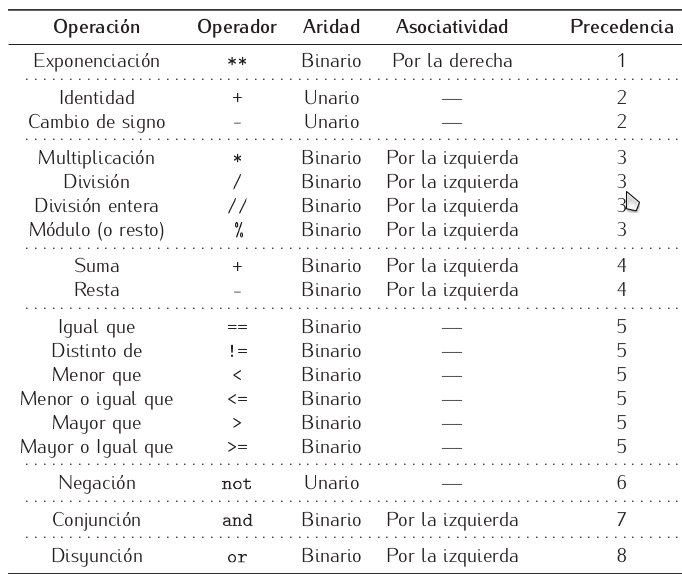
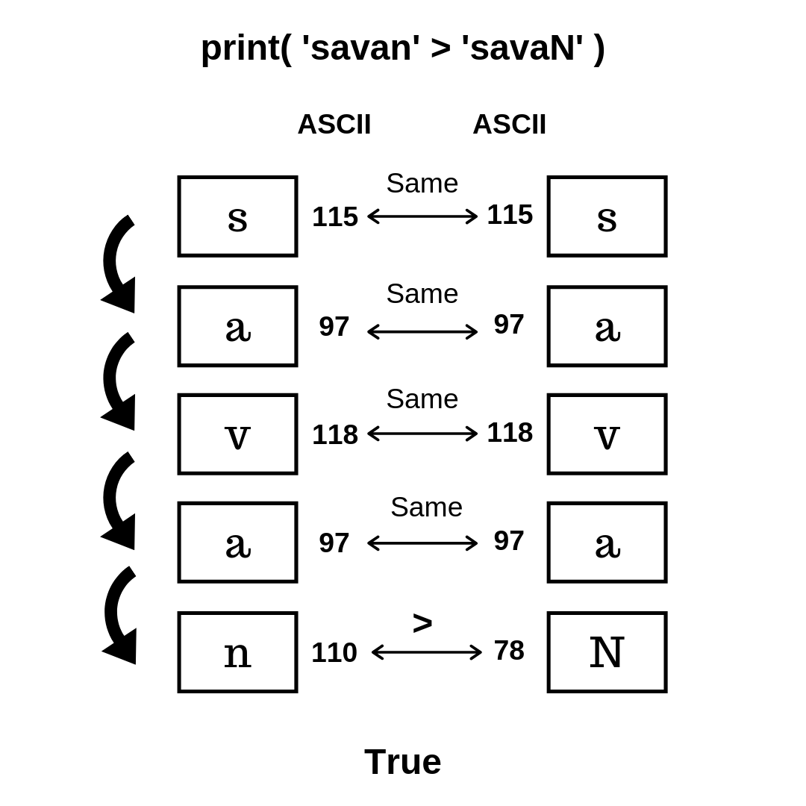

# Tipos de datos básicos

  
  

[👉 NÚMEROS ENTEROS (aprendepython.es)](https://aprendepython.es/core/datatypes/numbers/#integers)

[👉 NÚMEROS FLOTANTES (DECIMALES) (aprendepython.es)](https://aprendepython.es/core/datatypes/numbers/#floats)

[👉 BOOLEANOS (aprendepython.es)](https://aprendepython.es/core/datatypes/numbers/#booleans)

[👉 CADENAS DE TEXTO (aprendepython.es)](https://aprendepython.es/core/datatypes/strings/) --> *solo hasta "Operaciones con strings" (combinar y repetir)*

[💡 COMENTARIOS EN PYTHON (aprendepython.es)](https://aprendepython.es/core/controlflow/conditionals/#comments)

### **Ampliación:**

### **Tipo de dato Booleano (y sus operadores)**

Los tipos de datos Booleanos solo pueden tener dos valores: **True**,  o  **False**. Cualquier cosa es considerada como verdadera excepto: None;  False;  el valor 0 en cualquiera de sus formas; secuencias y colecciones vacías: "", (), {}, \[\], set(), range{0}

**Existen tres operadores lógicos en Python:   and,   or   y   not. Sus tablas de verdad son:**

  

  

También existen un conjunto de operadores que devuelven valores booleanos. Entre ellos tenemos a los operadores de comparación:  

Y la tabla de precedencia es:

En la tabla se ha omitido la asociatividad de los comparadores pese a que son binarios.  Imaginemos la siguiente instrucción:

2  <  3  <  4

Si la asociatividad fuera por la izquierda analizaría     2   <  3    y devolvería   TRUE. A continuación analizaría     TRUE    <   4    y  estaríamos ante una comparación sin sentido. Cuando aparecen una sucesión de comparadores como    2  <  3  <  4, Python la evalúa igual que       ( 2   <  3 )  and   ( 3   <  4 ).

#### **Cadenas de texto**

**Comparación de cadenas**

En Python (y en cualquier lenguaje de programación) las cadenas de texto también se pueden comparar. Lo que se hace es:

1.  Se ponen las cadenas "una al lado de la otra"
2.  Se compara cada carácter con el carácter de la misma posición de la otra cadena.
3.  En realidad, se compara el [código Unicode](https://www.tamasoft.co.jp/en/general-info/unicode-decimal.html) de dicho carácter.
4.  Si ambos coinciden, se considera que son iguales.  
    
5.  En el momento en que cualquiera de los caracteres de la cadena no coincida, se considera que las cadenas **NO** son iguales.
6.  Si coinciden todos los caracteres, se considera que ambas cadenas SÍ son iguales.  
    

Ejemplos de comparación de cadenas:

1.  "David" == "David" **\--> True**
2.  "David" == "david" **\--> False**
3.  "a" < "b" **\--> True**
4.  "b" > "c" **\--> False**
5.  "a" <= "a" **\--> True**
6.  "a" >= "b" **\--> False**
7.  "David" != "David" **\--> False**