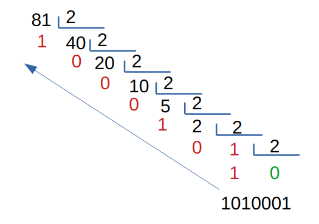

# Ejercicios de Python – Sentencias Condicionales

---

## Ejercicio 1
Diseña un programa, **`negativo.py`**, que lea un número flotante por el teclado y muestre por pantalla el mensaje **"El número es negativo"** solo si el número es menor que cero.

---

## Ejercicio 2
Modifica el programa anterior para que, además, el programa muestre **"El número es positivo"** en caso de que el número sea mayor o igual que cero.

---

## Ejercicio 3
Diseña un programa, **`mas_joven.py`**, que lea la edad de dos personas por el teclado y muestre por pantalla la edad del más joven. En caso de que tengan la misma edad debe indicarlo con un mensaje.

---

## Ejercicio 4
Diseña un programa, **`vocal.py`**, que lea un carácter por el teclado (en minúsculas) y muestre un mensaje indicando si el carácter introducido es una **vocal**.

---

## Ejercicio 5
Modifica el programa anterior para que se indique si el carácter introducido es una **vocal minúscula** o una **vocal mayúscula**.

---

## Ejercicio 6
Diseña un programa, **`letra.py`**, que lea un carácter por teclado e indique si es una **letra minúscula** o una **letra mayúscula**.

---

## Ejercicio 7
Crea un programa con el nombre **`es_par.py`** que solicite al usuario que introduzca un número entero por el teclado y diga si es **par** o **impar**.  
**Piensa**: ¿qué quiere decir que un número sea par?

---

## Ejercicio 8
Crea un programa con el nombre **`doble_de_par.py`** que solicite al usuario que introduzca un número entero por el teclado y diga si es el **doble de un número par** o no lo es.

---

## Ejercicio 9
Haz un programa con el nombre **`division.py`** que solicite al usuario dos números: **dividendo** y **divisor**. El programa debe mostrar el **cociente** y el **resto** de la división y debe funcionar sin errores.  
**Piensa**: ¿qué posibles errores podría tener el programa?

---

## Ejercicio 10
Haz un programa, llamado **`primer_grado.py`**, que resuelva ecuaciones de primer grado, las cuales tienen la forma:

$$
ax + b = 0
$$

El programa debe tener en cuenta que este tipo de ecuaciones **no tienen solución si \(a=0\)**, ya que no se puede dividir ningún número por cero, y además se considera que tienen **infinitas soluciones si tanto \(a\) como \(b\) son cero**. Deberá mostrarse un mensaje adecuado en cada caso.

---

## Ejercicio 11
Haz un programa con el nombre **`raiz_cuadrada.py`** que solicite al usuario un número entero y muestre su **raíz cuadrada**. Asegúrate de que no tiene errores.  
**Piensa**: ¿qué posibles errores podría tener el programa?

---

## Ejercicio 12
Haz un programa, **`segundo_grado.py`**, que calcule ecuaciones de **segundo grado**.

Las ecuaciones de 2.º grado son del tipo:

$$
ax^2 + bx + c = 0
$$

y se resuelven con la fórmula:

$$
\frac{-b \pm \sqrt{b^2 - 4ac}}{2a}
$$

Ten en cuenta que:
- Si el valor **dentro de la raíz** es **mayor que 0**, la ecuación tendrá **2 soluciones** (una con la suma y otra con la resta).
- Si el valor **dentro de la raíz** es **0**, la ecuación tendrá **una única solución**.
- Si el valor **dentro de la raíz** es **menor que 0**, la ecuación **no tendrá solución real**, ya que no podemos hacer una raíz cuadrada de un número negativo.

El programa deberá funcionar para todos los casos y mostrar los mensajes adecuados.

---

## Ejercicio 13
Haz un programa nuevo (**`primero_y_segundo_grado.py`**) combinando los dos anteriores que, además de resolver ecuaciones de 2.º grado, resuelva la ecuación como si fuera de **primer grado cuando \(a = 0\)**.

El programa mostrará un mensaje indicando que, al ser el valor de \(a = 0\), la ecuación es de primer grado y se resuelve por este método.

---

## Ejercicio 14
Haz un programa con el nombre **`aprobar.py`** que solicite la **nota de los tres parciales** que se han realizado en un trimestre y muestre el mensaje **"Has aprobado"** o **"Has suspendido"**.

Para aprobar es necesario que:
- la **media** de los tres controles sea **superior a 5**, y
- **todas** las calificaciones sean **superiores a 3**.

**Ejemplos**  
`3.2, 5.0 y 7.5  ---->  Has aprobado`  
`2.9, 8.5 y 7.5  ---->  Has suspendido`

---

## Ejercicio 15
Crea un programa con el nombre **`estaciones.py`** que solicite el **número del mes** e indique a qué **estación del año** pertenece. Supondremos:

- enero, febrero, marzo → **invierno**  
- abril, mayo, junio → **primavera**  
- julio, agosto, septiembre → **verano**  
- octubre, noviembre, diciembre → **otoño**

En caso de introducir un número diferente, informará que **solo hay 12 meses** al año.

---

## Ejercicio 16
Haz un programa con el nombre **`calificacion.py`** que solicite un **número real entre 0 y 10** e indique la **calificación** correspondiente: insuficiente, suficiente, bien, notable o sobresaliente.

---

## Ejercicio 17
Haz un programa en Python (**`piedra_papel_tijera.py`**) que simule el juego de **piedra, papel o tijera**. El programa recibirá dos datos: la elección de la persona 1 y la elección de la persona 2; a continuación, mostrará el **ganador**.

**Ejemplo**  
_Elección persona 1: piedra_  
_Elección persona 2: tijera_  

_Gana persona 1 (piedra gana a tijera)._

---

## Ejercicio 18
Escribe un programa en Python que pida (por separado) **dos valores numéricos** y un **operador** (suma, resta, multiplicación, división) y calcule el resultado de la operación.

Se debe **controlar** que la operación sea **una de las cuatro predefinidas**; en otro caso se debe mostrar un **mensaje de error** y **no** mostrar resultado final.

**Ejemplo**
```
Dime un número: 7
Dime otro número: 4
Dime un operador: +
Resultado: 7 + 4 = 11
```

---

## Ejercicio 19
Crea un programa con el nombre **`maximo_de_5.py`** que solicite al usuario que introduzca **cinco números enteros** y que muestre el **mayor**.

Para este caso no interesa anidar muchos `if`, sino crear una variable, `valor_mayor`, que almacenará el valor más grande y que **comenzará siendo el primer valor**. Compara `valor_mayor` con cada uno de los otros datos introducidos y, si alguno es más grande, cambia el valor de `valor_mayor`.

---

## Ejercicio 20
Realiza un programa que calcule el **desglose en billetes y monedas** de una cantidad exacta de euros. Hay billetes de **500, 200, 100, 50, 20, 10 y 5 €** y monedas de **2 y 1 €**.

**Ejemplo 1 (434 €)**  
- 2 billetes de 200 €  
- 1 billete de 20 €  
- 1 billete de 10 €  
- 2 monedas de 2 €

**Ejemplo 2 (283 €)**  
- 1 billete de 200 €  
- 1 billete de 50 €  
- 1 billete de 20 €  
- 1 billete de 10 €  
- 1 moneda de 2 €  
- 1 moneda de 1 €

**Ayudas**

1. Para efectuar el desglose, empieza con la **división entera** entre la cantidad y **500** (el billete de **mayor** valor). Por ejemplo, 434/500 = 0 → no usamos billetes de 500 €. Después, divide 434 entre **200** (el siguiente más alto). La división entera da **2** y sobran **34** (el **resto**).
   
   

2. Por tanto, necesitamos **2 billetes de 200 €** y continuamos con los **34 €** restantes. Luego 34/100 = 0, 34/50 = 0, 34/20 = 1 (sobran 14), 14/10 = 1 (sobran 4)… y así sucesivamente.

---

## Ejercicio 21
Haz un programa que convierta un **número decimal a binario**.

**Algoritmo**: divide el número decimal (p. ej., 81) entre 2 de forma **entera** hasta que el resultado sea **0**. El número binario se obtiene a partir de los **restos** de las divisiones (**de abajo arriba**).

  

Para 81 → **1010001** (7 bits).

**Pistas adicionales:**
- Límite: el máximo número decimal será **1023** (máximo representable en **10 bits**). El 1023 es **1111111111**.
- Si se introduce un **número fuera de rango** (es decir, >1023 o <0), el programa lo indicará con un mensaje adecuado.
- **Según el rango del número**, tendrá un **número fijo de bits**. Si te fijas, el número de bits **coincide con el número de divisiones** que deberás realizar siguiendo el algoritmo para obtener el binario.
    - 0-1 → 1 bit
    - 2-3 → 2 bits
    - 4-7 → 3 bits
    - 8-15 → 4 bits
    - 16-31 → 5 bits
    - 32-63 → 6 bits
    - 64-127 → 7 bits
    - 128-255 → 8 bits
    - 256-511 → 9 bits
    - 512-1023 → 10 bits

---

## Ejercicio 22
Queremos hacer un programa que **compruebe contraseñas robustas**. Consideraremos una contraseña robusta si cumple **todas** las condiciones:

- Longitud **exacta** de **8 caracteres**.  
- Al menos **una letra mayúscula**.  
- Al menos **una letra minúscula**.  
- Al menos **un número**.  
- Al menos **un símbolo** de entre:  
  **! " # $ % & ' ( ) * + , - . /**

Para poder resolverlo, necesitarás saber cómo **obtener cada carácter de una cadena** (indexación):

```python
cadena = "Python"
primeraLetra = cadena[0]  # "P"
segundaLetra = cadena[1]  # "y"
terceraLetra = cadena[2]  # "t"
```


El programa deberá mostrar **mensajes de error específicos** si la contraseña no cumple las condiciones.

**Ejemplos**

**Ejemplo 1**  
```
Dime una contraseña (8 caracteres de largo): david123
ERROR: No tiene mayúsculas.
ERROR: No tiene símbolos.
```

**Ejemplo 2**  
```
Dime una contraseña (8 caracteres de largo): David123
ERROR: No tiene símbolos.
```

**Ejemplo 3**  
```
Dime una contraseña (8 caracteres de largo): david12*
ERROR: No tiene mayúsculas.
```

**Ejemplo 4**  
```
Dime una contraseña (8 caracteres de largo): 12345678
ERROR: No tiene minúsculas.
ERROR: No tiene mayúsculas.
ERROR: No tiene símbolos.
```

**Ejemplo 5**  
```
Dime una contraseña (8 caracteres de largo): David94*
LA CONTRASEÑA ES ROBUSTA.
```

## Ejercicio 23

Convierte un **número decimal** a **hexadecimal** usando **divisiones sucesivas entre 16**. Se sigue el mismo algoritmo que para convertirlo a binario, solo que la división no es entre 2, si no entre 16 (ya que el 2 y el 16 son las bases a las que queremos convertir dicho número).


Lo que se debe tener aquí en cuenta es que, si el resto da un número superior a 9 (esto puede ser 10, 11, 12, 13, 14 o 15), este número se sustituye por una letra:

- 10 --> A
- 11 --> B
- 12 --> C
- 13 --> D
- 14 --> E
- 15 --> F

Por tanto, el número anterior sería --> 1 11 5 8 --> 1B58

> En este caso, limitaremos el número máximo a 65535 (el cuál sería el número máximo que podemos representar con 4 cifras hexadecimales: `FFFF`).
{: .alert .alert-warning}

> **Piensa**: ¿qué rangos de números necesitarás utilizar ahora para las divisiones?

**Ejemplos**  
```
Dime un número: 150
Hexadecimal: 96

Dime un número: 255
Hexadecimal: FF

Dime un número: 127
Hexadecimal: 7F

Dime un número: 7000
Hexadecimal: 1B58
```