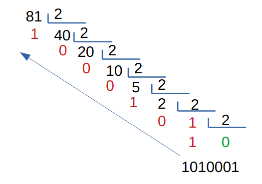
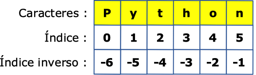

# Ejercicios de sentencias iterativas while

A continuación tienes una serie de ejercicios para practicar el uso de bucles `while` en Python. En los enunciados se indican ejemplos de ejecución cuando procede.

---

## Ejercicio 1 — `secuencias.py`

Escribe un programa que:
- Muestre todos los números enteros del **0 al 100**.
- Muestre todos los números enteros del **100 al 0** (al revés).
- Muestre todos los **números pares** del 0 al 100.
- Muestre todos los **números impares** del 1 al 99.

---

## Ejercicio 2 — `tabla_multiplicar.py`

Crea un programa que solicite al usuario un **número entero** y muestre su **tabla de multiplicar** (del 1 al 10).

**Ejemplo**  
```
Dime un número: 7
7 x 1 = 7
7 x 2 = 14
...
7 x 10 = 70
```

---

## Ejercicio 3 — `pares.py`

Pide al usuario un **número menor que 100** y muestra **todos los números pares** que hay entre ese número y el **1000** (inclusive si corresponde).  
_Recuerda:_ un número es par si es divisible entre 2.

---

## Ejercicio 4 — `divisores.py`

Muestra **todos los divisores** de un número introducido por el usuario.  
Un **divisor** de *n* es todo número que divide a *n* dejando el **resto 0**.

**Ejemplo**  
```
Dime un número: 50
50
25
10
5
2
1
```

---

## Ejercicio 5 — `sumatorio.py`

Calcula la **suma** de todos los números desde **1** hasta un número *n* introducido por teclado.

**Ejemplo**  
```
Dime un número: 10
Sumatorio del 1 al 10: 55
```

---

## Ejercicio 6 — `sumatorio_impares.py`

Calcula la **suma de todos los impares** desde **1** hasta un número *n* introducido por teclado.

**Ejemplo**  
```
Dime un número: 10
Sumatorio de impares del 1 al 10: 25
```

---

## Ejercicio 7 — `sumatorio_impares_detallado.py`

Modifica el programa anterior para que **muestre todos los números** que se han sumado.  
_Pista:_ utiliza una **cadena** y la **concatenación** para construir la expresión.

**Ejemplo**  
```
Dime un número: 20
Sumatorio: 1 + 3 + 5 + 7 + 9 + 11 + 13 + 15 + 17 + 19 = 100
```

---

## Ejercicio 8 — `factorial.py`

Solicita un **número entero** y muestra su **factorial**.  
El **factorial** de *n* (se escribe *n!* ) es el **producto** de los enteros desde 1 hasta *n*.

**Ejemplo**  
```
Dime un número: 10
10! = 10 x 9 x 8 x 7 x 6 x 5 x 4 x 3 x 2 x 1 = 3628800
```

---

## Ejercicio 9 — `contador_pares.py`

Cuenta **cuántos números pares** hay entre **dos números** que introduzca el usuario.

**Ejemplo**  
```
Dime un número: 5
Dime otro número: 50
Entre el 5 y el 50 hay 23 números pares.
```

---

## Ejercicio 10 — `adivina_el_numero.py`

Crea un **juego** que rete al usuario a adivinar un número entre **10 y 30**.  
El programa:
- Genera un **número aleatorio** en ese rango (módulo [random](https://docs.python.org/3/library/random.html)).
- Pide intentos al usuario y muestra pistas: **"¡Te has pasado!"** o **"¡Te has quedado corto!"** hasta acertar.

**Ejemplo**  
```
Dime un número (del 10 al 30): 12
¡Te has quedado corto!
Dime un número (del 10 al 30): 20
¡Te has pasado!
Dime un número (del 10 al 30): 15
¡Muy bien! Era el 15
```

---

## Ejercicio 11 — `adivina_limite.py`

Modifica el programa anterior para adivinar un número **entre 1 y 50** con un **límite de 5 intentos**.  
Al acabar, indica si ha acertado o no dentro del límite.

---

## Ejercicio 12 — `sumatorio_teclado.py`

Suma **todos los números** que vaya introduciendo el usuario. El programa **finaliza** cuando el usuario introduce un número **menor que 0** (por ejemplo, `-1`).

**Ejemplo**  
```
Dime un número: 150
Dime un número: 15
Dime un número: 20
Dime un número: -1
El sumatorio es: 185
```

---

## Ejercicio 13 — `maximo.py`

Pide números al usuario hasta que introduzca un número **menor que 0**.  
Al finalizar, muestra el **máximo** de los números introducidos (si no se introdujo ninguno válido, indícalo).

**Ejemplo**  
```
Dime un número: 1
Dime un número: 5
Dime un número: 20
Dime un número: 4
Dime un número: 19
Dime un número: -1
El máximo es: 20
```

---

## Ejercicio 14 — `primo.py`

Pide un número e indica si es **primo** o no.  
Un **número primo** es un entero mayor que 1 que tiene exactamente **dos divisores positivos**: 1 y él mismo.

---

## Ejercicio 15 — `dame_primos.py`

Pide números al usuario hasta que introduzca un valor **menor o igual que 0**. Para **cada número**, indica si es **primo** o **no**.

**Ejemplo**  
```
Dime un número: 1
NO es primo
Dime un número: 3
Es primo
Dime un número: 10
NO es primo
Dime un número: 19
Es primo
Dime un número: 0
¡Adiós!
```

---

## Ejercicio 16 — `binario.py`

Convierte un **número decimal** a **binario** usando un **bucle** (sin funciones de conversión directas).  
Sigue el algoritmo clásico de **divisiones sucesivas entre 2**, acumulando los restos al revés.



---

## Ejercicio 17 — `binario_repetido.py`

Modifica el programa anterior para que **repita** conversiones hasta que el usuario introduzca un número **negativo** (por ejemplo, `-1`).

---

## Ejercicio 18 — `hexadecimal.py`

Convierte un **número decimal** a **hexadecimal** usando **divisiones sucesivas entre 16**. Se sigue el mismo algoritmo que para convertirlo a binario, solo que la división no es entre 2, si no entre 16 (ya que el 2 y el 16 son las bases a las que queremos convertir dicho número).


Lo que se debe tener aquí en cuenta es que, si el resto da un número superior a 9 (esto puede ser 10, 11, 12, 13, 14 o 15), este número se sustituye por una letra:
10 --> A
11 --> B
12 --> C
13 --> D
14 --> E
15 --> F

Por tanto, el número anterior sería --> 1 11 5 8 --> 1B58

**Ejemplos**  
```
Dime un número: 150
Hexadecimal: 96

Dime un número: 255
Hexadecimal: FF

Dime un número: 127
Hexadecimal: 7F

Dime un número: 7000
Hexadecimal: 1B58
```

---

## Ejercicio 19 — `conversor.py`

Solicita al usuario un **número decimal** y una **base** (hasta **16**) y convierte el número a esa base.  
Para bases superiores a 10, utiliza letras **A–F** para los valores 10–15.

**Ejemplos**  
```
Dime un número: 255
Dime una base: 2
Conversión: 11111111

Dime un número: 255
Dime una base: 8
Conversión: 377

Dime un número: 255
Dime una base: 16
Conversión: FF
```

---

## Ejercicio 20 — `caracteres_cadena.py`

Muestra, **uno por línea**, cada carácter de una **cadena** introducida por el usuario.

Para poder resolver el ejercicio, necesitamos saber cómo comprobar cada uno de los caracteres de una cadena. Las cadenas están compuestas por un cierto número de caracteres. Por ejemplo, la cadena "Python" tiene 6 caracteres. Si queremos "acceder" al primer carácter de esta cadena, tendríamos que hacerlo así:

```python
cadena = "Python"
primeraLetra = cadena[0]
```

De esta manera, en la variable primeraLetra estaremos guardando la letra "P", ya que es la primera letra de la cadena. Si quisiéramos guardar la segunda y la tercera letra, sería así:

```python
segundaLetra = cadena[1]
terceraLetra = cadena[2]
```



**Ejemplos**  
```
Dime una cadena: Python
P
y
t
h
o
n
```
```
Dime una cadena: HOLA
H
O
L
A
```

> **Ayuda:** las cadenas son secuencias de caracteres. El primer carácter está en la posición `0`.

---

## Ejercicio 21 — `contar_espacios.py`

Pide una **frase** y cuenta cuántos **espacios** contiene.

**Ejemplos**  
```
Dime una frase: Hola, ¿qué tal?
Nº espacios: 2
```
```
Dime una frase: Me llamo David López Castellote
Nº espacios: 4
```
```
Dime una frase: Buenas
Nº espacios: 0
```

---

## Ejercicio 22 — `mayusculas.py`

Convierte una **palabra en minúsculas** a **mayúsculas** _sin usar métodos de cadena integrados_.  
Pueden ayudarte estas funciones:
- `ord(c)` → devuelve el **código Unicode** del carácter `c`  
- `chr(n)` → devuelve el **carácter** cuyo código Unicode es `n`

**Ejemplos**  
```
Dime una palabra en minúscula: david
DAVID
```
```
Dime una palabra en minúscula: programacion
PROGRAMACION
```

---

## Ejercicio 23 — `validador_password.py`

Comprueba si una contraseña es **robusta**. Debe cumplir **todas** estas condiciones:
- Mínimo **8 caracteres**.
- Al menos **una letra mayúscula**.
- Al menos **una letra minúscula**.
- Al menos **un número**.
- Al menos **un símbolo** de esta lista: `! " # $ % & ' ( ) * + , - . /`

Si **no** cumple alguna condición, el programa debe **mostrar un error por cada una** de las que no cumpla.  
Si las cumple todas, mostrará que **la contraseña es robusta**.

**Ejemplos**  
```
Dime una contraseña: david1
ERROR: La contraseña debe ser mínimo de 8 caracteres.
```
```
Dime una contraseña: david123
ERROR: No tiene mayúsculas.
ERROR: No tiene símbolos.
```
```
Dime una contraseña: David123
ERROR: No tiene símbolos.
```
```
Dime una contraseña: david12*
ERROR: No tiene mayúsculas.
```
```
Dime una contraseña: 12345678
ERROR: No tiene minúsculas.
ERROR: No tiene mayúsculas.
ERROR: No tiene símbolos.
```
```
Dime una contraseña: David94*
LA CONTRASEÑA ES ROBUSTA.
```