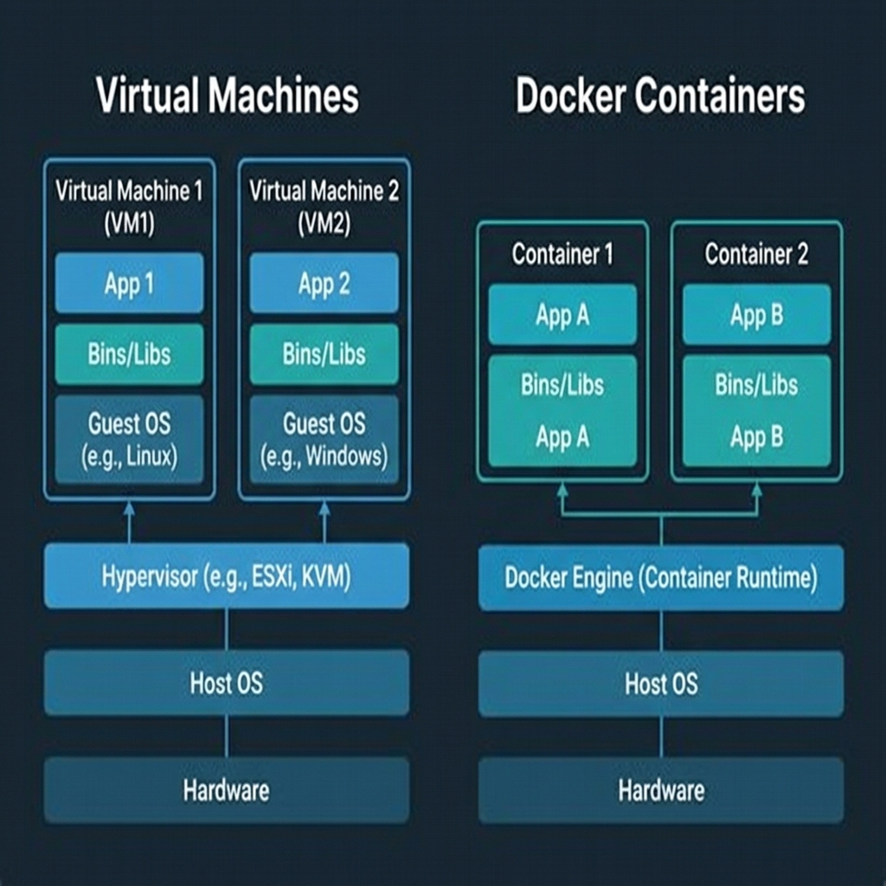
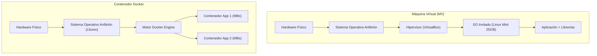

# Tema 2: Contenerización con Docker

## 📖 Apuntes: Introducción a Docker y Contenerización

En este tema daremos un salto fundamental en el diseño y despliegue de infraestructuras informáticas. En el Tema 1 aprendimos a instalar un servidor web instalando un sistema operativo completo en una máquina virtual (VirtualBox + Linux Mint) y sobre él un stack de software (XAMPP). En este tema descubriremos la **contenerización**, la tecnología estándar que utilizan las empresas de desarrollo y administración de sistemas en la actualidad.

---

## 1. ¿Qué es Docker y para qué sirve?

**Docker** es una plataforma de código abierto que permite empaquetar una aplicación y todas sus dependencias (librerías, código, binarios, configuraciones) dentro de una unidad estandarizada llamada **contenedor**.

### El problema histórico: *"En mi ordenador sí funciona"*
Antes de los contenedores, al desplegar software en servidores se producían constantes fallos debido a:
- Diferencias entre las versiones de PHP, Python o bases de datos instaladas en cada equipo.
- Incompatibilidades de librerías del sistema operativo.
- Conflictos de dependencias entre distintas aplicaciones en el mismo servidor.

Docker soluciona esto garantizando que **si una aplicación funciona dentro de un contenedor en tu ordenador de clase, funcionará exactamente igual en cualquier servidor, nube o sistema operativo**.

---

## 2. Comparativa Técnica: Máquina Virtual (MV) vs Contenedores Docker

Ambas tecnologías buscan el aislamiento de entornos, pero lo consiguen de formas completamente diferentes:





### Tabla Comparativa

| Característica | Máquina Virtual (MV) | Contenedor Docker |
| :--- | :--- | :--- |
| **Arquitectura** | Virtualiza el **hardware**. Incluye un Sistema Operativo completo (Guest OS). | Virtualiza el **sistema operativo**. Comparte el Kernel del SO anfitrión. |
| **Tamaño en disco** | **Grande** (varios Gigabytes por MV). | **Muy ligero** (decenas o cientos de Megabytes). |
| **Tiempo de arranque** | **Lento** (de 30 segundos a varios minutos). | **Instantáneo** (milisegundos o pocos segundos). |
| **Uso de RAM y CPU** | **Alto** (reserva recursos fijos aunque esté inactiva). | **Mínimo** (utiliza solo lo que la aplicación necesita en cada instante). |
| **Portabilidad** | Compleja de exportar y mover entre equipos. | **Extrema** (se comparte mediante simples archivos de receta o imágenes). |

---

## 3. Conceptos Clave en Docker

Para dominar Docker es fundamental entender los siguientes términos:

### 📄 1. Imagen (*Docker Image*)
Es una plantilla de solo lectura que contiene el sistema de archivos, el código y las instrucciones necesarias para crear un contenedor. 
- *Analogía:* La imagen es como la **receta de una tarta** o el ejecutable `.installer` de un programa.
- Ejemplos de imágenes oficiales: `nginx`, `mariadb`, `wordpress`, `python`, `ubuntu`.

### 📦 2. Contenedor (*Docker Container*)
Es una instancia ejecutable en tiempo real creada a partir de una imagen. 
- *Analogía:* Si la imagen es la receta, el contenedor es **la tarta ya horneada** y lista para comer.
- Se pueden crear decenas de contenedores idénticos a partir de una sola imagen.

### 🌐 3. Registros e Imágenes de Red (*Docker Hub*)
Es un repositorio o catálogo público en la nube ([hub.docker.com](https://hub.docker.com)) donde desarrolladores y empresas suben y comparten sus imágenes oficiales para que cualquiera pueda descargarlas e usarlas gratis.

### 💾 4. Volúmenes y Persistencia (*Volumes*)
Los contenedores son **efímeros** por defecto (si eliminas un contenedor, los datos generados dentro de él se borran). Los **volúmenes** permiten mapear una carpeta de tu ordenador físico dentro del contenedor para que los datos (como las bases de datos o archivos subidos) no se pierdan nunca.

### 🔌 5. Mapeo de Puertos (*Port Mapping*)
Permite conectar un puerto de tu equipo anfitrión (tu ordenador) con un puerto interno del contenedor.
- Ejemplo: Mapear el puerto `8080` de tu equipo al puerto `80` interno del contenedor de Nginx (`-p 8080:80`).

### 🎼 6. Docker Compose
Herramienta que permite definir y ejecutar aplicaciones compuestas por **múltiples contenedores** (por ejemplo: un contenedor web + un contenedor de base de datos) usando un único archivo YAML estructurado (`docker-compose.yml`).

---

## 🛠️ 4. Guía de Verificación e Instalación en Lliurex (Ubuntu)

En el aula de informática trabajamos sobre **Lliurex** (distribución educativa basada en Ubuntu). Sigue estos pasos para verificar o instalar Docker en tu ordenador de clase.

### Paso A: Comprobar si Docker ya está instalado
Abre una terminal (`Ctrl + Alt + T`) y ejecuta:
```bash
docker --version
docker compose version
```
- Si aparece la versión de Docker (ejemplo: `Docker version 24.x.x` o similar), **¡ya está instalado!** Salta al Paso C.
- Si aparece el mensaje `comando no encontrado` (*command not found*), realiza la instalación.

---

### Paso B: Instalación de Docker en Lliurex (si no está instalado)
Ejecuta los siguientes comandos en la terminal:

1. **Actualizar el gestor de paquetes de Lliurex:**
   ```bash
   sudo apt update
   ```

2. **Instalar el motor de Docker y el plugin de Docker Compose:**
   ```bash
   sudo apt install -y docker.io docker-compose-v2
   ```

---

### Paso C: Iniciar el servicio y configurar permisos de usuario *(¡Muy importante!)*
Por defecto en Linux, el comando `docker` requiere permisos de administrador (`sudo`). Para poder trabajar cómodamente sin escribir `sudo` en cada comando:

1. **Arrancar y habilitar el servicio de Docker:**
   ```bash
   sudo systemctl enable --now docker
   ```

2. **Añadir tu usuario de Lliurex al grupo `docker`:**
   ```bash
   sudo usermod -aG docker $USER
   ```

3. **Aplicar los nuevos permisos de grupo:**
   ```bash
   newgrp docker
   ```
   *(También puedes simplemente cerrar sesión en Lliurex y volver a entrar para que se aplique).*

---

### Paso D: Verificación final (`Hello World`)
Prueba que Docker funciona correctamente ejecutando el contenedor oficial de prueba:

```bash
docker run hello-world
```

Si todo ha ido bien, Docker descargará automáticamente la imagen ligera de prueba y mostrará en la terminal el mensaje:
> `Hello from Docker! This message shows that your installation appears to be working correctly.`

---

## 📜 Cheat Sheet: Comandos Imprescindibles de Docker

| Comando | Descripción |
| :--- | :--- |
| `docker run -d -p 80:80 --name miweb nginx` | Descarga, crea y arranca un contenedor Nginx en segundo plano (`-d`) mapeando puertos. |
| `docker ps` | Muestra los contenedores que están **en ejecución**. |
| `docker ps -a` | Muestra **todos** los contenedores (activos y detenidos). |
| `docker stop <ID_o_Nombre>` | Detiene un contenedor en ejecución. |
| `docker rm <ID_o_Nombre>` | Elimina un contenedor detenido. |
| `docker images` | Lista las imágenes descargadas en tu sistema local. |
| `docker rmi <Nombre_Imagen>` | Elimina una imagen local. |
| `docker compose up -d` | Lee el archivo `docker-compose.yml` y arranca todo el stack multiservicio en segundo plano. |
| `docker compose down` | Detiene y elimina todos los contenedores y redes creados por Docker Compose. |
