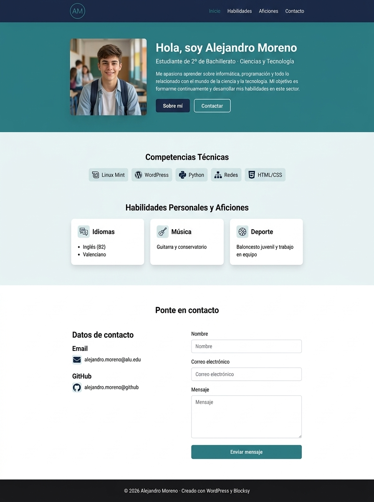

# Actividad 1. Instalación de Linux Mint, XAMPP y WordPress

En esta actividad aprenderás a montar un entorno de servidor web completo partiendo de la virtualización de un sistema operativo Linux hasta la publicación de un sitio web local utilizando un Gestor de Contenidos (CMS).

---

## 🎯 Objetivos de la actividad

1. **Gestión de la seguridad:** Utilizar **Bitwarden** como gestor centralizado de contraseñas para almacenar todas las credenciales generadas en el curso.
2. **Virtualización:** Crear y configurar una máquina virtual con **Linux Mint** en **VirtualBox**.
3. **Servidor Web Local:** Instalar y administrar el stack **XAMPP** (servidor web Apache, base de datos MariaDB/MySQL y PHP) sobre Linux.
4. **Despliegue de CMS:** Instalar y configurar **WordPress** sobre el servidor local XAMPP.
5. **Diseño y Maquetación Web:** Instalar el tema **Blocksy**, seleccionar e importar una plantilla para web personal/currículum y editarla utilizando el editor de bloques **Gutenberg** o el maquetador **Elementor**.

---

## 📌 Paso a paso detallado

### Paso 1: Gestión de contraseñas con Bitwarden
Antes de iniciar la instalación técnica, es fundamental aplicar buenas prácticas de ciberseguridad:
- Crea o accede a tu cuenta en [Bitwarden](https://bitwarden.com/es-la/).
- Guarda en Bitwarden todas las contraseñas que utilices a lo largo de esta actividad:
  - Usuario de acceso al sistema operativo Linux Mint.
  - Usuario `root` / contraseña de la base de datos MySQL en XAMPP.
  - Usuario administrador de WordPress.

> **Consejo de seguridad:** No utilices contraseñas sencillas o repetidas. Genera contraseñas seguras y guárdalas en tu bóveda de Bitwarden.
{: .alert-info}

---

### Paso 2: Virtualización con Linux Mint en VirtualBox

> Si necesitas repasar los conceptos teóricos y la arquitectura de máquinas virtuales, consulta los [Apuntes de Virtualización con VirtualBox](../virtualizacion).
{: .alert-info}

1. **Descargar Linux Mint**: [Descargar Linux Mint](https://linuxmint.com/download.php)
2. Abre **VirtualBox** en tu ordenador del aula.
3. Crea una nueva máquina virtual con las siguientes características recomendadas:
   - **Nombre:** `LinuxMint-PSIR2`
   - **Tipo:** Linux
   - **Versión:** Ubuntu (64-bit)
   - **Memoria RAM:** Mínimo 3072 MB.
   - **Disco duro:** VDI con reserva dinámica de unos 25 GB.
4. Selecciona la imagen ISO de **Linux Mint** como disco de arranque en la unidad óptica virtual.
5. Inicia la máquina virtual y completa la instalación de Linux Mint.
6. Tras el reinicio, comprueba que el sistema está actualizado y con conexión a Internet.

---

### Paso 3: Instalación y puesta en marcha del Stack XAMPP en Linux Mint
1. Abre el navegador web dentro de Linux Mint y descarga el instalador de **XAMPP for Linux** (archivo `.run`).
   - [Descargar XAMPP for Linux](https://www.apachefriends.org/es/download.html)
2. Abre la terminal en la carpeta de descargas y concede permisos de ejecución al instalador:
   ```bash
   sudo chmod +x xampp-linux-x64-*-installer.run
   ```
3. Ejecuta el instalador con permisos de superusuario:
   ```bash
   sudo ./xampp-linux-x64-*-installer.run
   ```
4. Sigue el asistente de instalación (se instalará por defecto en el directorio `/opt/lampp`).
5. Arranca el servicio XAMPP desde la terminal:
   ```bash
   sudo /opt/lampp/lampp start
   ```
6. Abre el navegador y accede a `http://localhost` para verificar que Apache está en funcionamiento, y a `http://localhost/phpmyadmin` para comprobar la gestión de bases de datos.
7. Crear un lanzador en el escritorio para el *Manager* de XAMPP (comando `sudo /opt/lampp/manager-linux-x64.run`)
8. Ajustar los permisos de la carpeta `htdocs`:

```bash
# 1. Añadir al usuario actual al grupo daemon
   sudo usermod -a -G daemon $USER
# 2. Cambiar la propiedad de htdocs al usuario daemon
   sudo chown -R root:daemon /opt/lampp/htdocs/
# 3. Dar permisos de lectura, escritura y ejecución al grupo
   sudo chmod -R g+rwX /opt/lampp/htdocs/
# 4. Hacer que los nuevos archivos hereden el grupo del directorio padre
   sudo find /opt/lampp/htdocs/ -type d -exec chmod g+s {} \;
```

---

### Paso 4: Descarga e instalación de WordPress en local
1. Descarga el paquete de WordPress en español desde [WordPress.org](https://es.wordpress.org/download/).
2. Descomprime el archivo comprimido `.tar.gz` o `.zip`.
```bash
unzip wordpress-*.zip
```
3. Mueve la carpeta `wordpress` al directorio público del servidor XAMPP (carpeta `htdocs`):
   ```bash
   sudo mv wordpress /opt/lampp/htdocs/
   ```
> Revisar los permisos de la carpeta `wordpress` ya que probablemente no tenga los permisos adecuados:
   ```bash
   sudo chown -R $USER:daemon /opt/lampp/htdocs/wordpress
   sudo chmod -R g+rwX /opt/lampp/htdocs/wordpress
   ```
{: .alert-warning}
4. Accede a **phpMyAdmin** (`http://localhost/phpmyadmin`) y crea una nueva base de datos llamada `wordpress_db`.
{:start="4"}
5. Entra en el navegador a `http://localhost/wordpress` para iniciar el asistente de WordPress:
   - **Base de datos:** `wordpress_db`
   - **Usuario MySQL:** `root`
   - **Contraseña:** *(la configurada en XAMPP o en blanco por defecto)*
   - **Servidor:** `localhost`
{:start="5"}
6. Configura el título de tu sitio y crea el usuario Administrador de WordPress (recuerda guardar estas credenciales en Bitwarden).
{:start="6"}
---

### Paso 5: Ajustes generales
1. Cambiar el idioma de WordPress a español.
   - Ve a **Ajustes > Generales**.
   - Cambia el **Idioma del sitio** a **Español**.
   - Guarda los cambios.
> Si no deja cambiar el idioma, deberemos abrir `wp-config.php` y añadir, justo antes de la línea `/* That's all, stop editing! */`:
   ```php
   define('FS_METHOD', 'direct');
   ```
> Después, guardar los cambios y reiniciar el servidor web.
{: .alert-warning}

2. Cambiar la zona horaria de WordPress a la de Madrid.
   - Ve a **Ajustes > Generales**.
   - Cambia la **Zona horaria** a **Madrid**.
   - Guarda los cambios.
{:start="2"}

### Paso 6: Personalización con el tema Blocksy, maquetación web y exportación
1. Accede al panel de administración de WordPress (`http://localhost/wordpress/wp-admin`).
2. Ve a **Apariencia > Temas > Añadir nuevo**, busca e instala el tema **Blocksy**. Actívalo.
3. Instala el plugin **Blocksy Companion** si el sistema lo requiere para acceder al catálogo de plantillas preconfiguradas (*Starter Sites*).
4. Elige e importa una plantilla enfocada a **sitio web personal o Currículum Vitae (CV)**.
   > **Elección del editor:** Al instalar una plantilla, normalmente la interfaz permite elegir qué tipo de editor prefieres utilizar: el editor de bloques **Gutenberg** (nativo de WordPress) o el maquetador visual **Elementor**. Puedes elegir el que prefieras.
{: .alert-info}
5. *(Opcional)* Si decides utilizar Elementor y no se ha instalado automáticamente al importar la plantilla, ve a **Plugins > Añadir nuevo** e instala y activa **Elementor**. Si eliges Gutenberg, no es necesario instalar ningún maquetador adicional.
{:start="5"}
6. Edita y personaliza la página principal utilizando el editor seleccionado (Gutenberg o Elementor):
{:start="6"}
   Accede a **Páginas > Todas las páginas**, localiza la página de inicio (habitualmente llamada *Home* o *Inicio*) y pulsa en **Editar** (o **Editar con Elementor** si optaste por dicho maquetador). Adapta el contenido para que funcione como tu carta de presentación profesional o currículum digital:
   
   - **Cabecera principal (Hero Section):**
     - Sustituye los textos de ejemplo por tu **nombre y apellidos** y un titular de perfil técnico (ej.: *Estudiante de 2º Bachillerato / Entusiasta de Sistemas, Redes y Desarrollo Web*).
     - Redacta una breve presentación o biografía personal (2-3 líneas resumiendo tus intereses formativos y tecnológicos).
     - Sustituye la foto de la plantilla por tu fotografía o un avatar/ilustración profesional representativa.
     - Configura los botones de acción (*Call to Action*), por ejemplo: *"Ver proyectos"* y *"Contactar"*.
   
   - **Competencias técnicas e informáticas (Skills):**
     - Adapta las etiquetas (*badges*), barras de progreso o tarjetas para destacar las tecnologías que trabajamos en la materia o de tu interés: **Linux Mint (terminal y administración)**, **WordPress y diseño web**, **Programación en Python**, **Redes y protocolos**, **Docker**, **HTML/CSS**, etc.
   
   - **Proyectos desarrollados (Portfolio):**
     - Crea o personaliza al menos **2 o 3 tarjetas de proyectos** trabajados en la asignatura o de ámbito personal.
     - *Ejemplos sugeridos:*
       1. *Despliegue de Servidor LAMP en entorno local Linux Mint.*
       2. *Instalación y personalización de CMS WordPress.*
       3. *Simulación de redes locales o contenedores Docker.*
     - Para cada tarjeta, incluye un título descriptivo, las tecnologías utilizadas y una imagen o captura ilustrativa.
   
   - **Sección o datos de contacto:**
     - Adapta los enlaces a redes o repositorios de código (enlace a tu GitHub, LinkedIn o correo electrónico ficticio/educativo).ç
     
<!--

   > 👁️ **Ejemplo visual de referencia:**  
   > A continuación se muestra un ejemplo orientativo de cómo puede quedar la distribución de secciones en la página principal:
   > 
   > 
   {: .alert-info}
   
   -->


7. Ve a **Plugins > Añadir nuevo**, busca e instala el plugin **All-in-One WP Migration**. Actívalo.
{:start="7"}
8. Ve a **All-in-One WP Migration > Exportar**, selecciona **Exportar a > Archivo** y descarga la copia de seguridad de tu sitio web (archivo con extensión `.wpress`).
{:start="8"}

---

## 📽️ Recursos y material de apoyo

👉 [Vídeo WordPress + Elementor](https://youtu.be/A_uNSJ8YucU?si=h8C9JyFxRz_ReCVj)

---

## 📤 Entrega y Evaluación
  
Deberás entregar en **Aules** los siguientes elementos:
1. **Documento con capturas de pantalla** de la web acabada donde se aprecie claramente que se ha instalado e implementado sobre WordPress y XAMPP en Linux Mint (incluyendo la web terminada, el panel de administración y el funcionamiento en `localhost`).
2. **Copia de seguridad de la web**: el archivo exportado con el plugin **All-in-One WP Migration** (archivo con extensión `.wpress`).

Una vez realizada la entrega en Aules, **enseña el trabajo al profesor en clase** para su verificación y evaluación.

---

## 📊 Rúbrica de Evaluación (máx. 10 puntos)

| Criterio | Insuficiente (0 pts) | Básico (0.5 pts) | Adecuado (1 pt) | Excelente (2 pts) |
| :--- | :--- | :--- | :--- | :--- |
| **Gestión de Seguridad (Bitwarden)** | No utiliza gestor de contraseñas ni almacena las credenciales requeridas. | Registra credenciales de forma incompleta o poco organizada. | Utiliza Bitwarden registrando la mayoría de claves del entorno local. | Registra y organiza adecuadamente en Bitwarden todos los usuarios y claves creados. |
| **Virtualización y Sistema Operativo** | No consigue instalar la máquina virtual o presenta errores insalvables. | Instala Linux Mint con ayuda continua y problemas de configuración. | Linux Mint instalado y operativo en VirtualBox con los parámetros adecuados. | Máquina virtual perfectamente configurada, optimizada y fluida en su funcionamiento. |
| **Stack XAMPP y Servidor Web Local** | No consigue instalar XAMPP ni iniciar los servicios web/base de datos. | Instala XAMPP pero requiere asistencia para arrancar Apache o MySQL. | Instala y arranca XAMPP, permitiendo el acceso correcto a localhost y phpMyAdmin. | Stack XAMPP instalado y gestionado autónomamente, creando las BD sin incidencias. |
| **Despliegue y Maquetación WordPress** | WordPress no instalado o inaccesible en el entorno local. | WordPress instalado pero sin adaptar, utilizar plantilla ni editar contenidos. | WordPress instalado con tema Blocksy y personalización básica mediante Gutenberg o Elementor. | Sitio web personal estilo CV maquetado con criterio (Blocksy con Gutenberg/Elementor) y exportado con All-in-One WP Migration (.wpress). |
| **Entrega en plazo y verificación** | No entrega la actividad o presenta un retraso injustificado. | Entrega con retraso importante o faltan entregables en Aules. | Entrega con un pequeño retraso o entrega incompleta (falta documento o .wpress). | Entrega puntual en Aules del documento con capturas de la web en XAMPP y el archivo .wpress, y comprobada en el aula. |

---

## 📌 Criterios de Evaluación vinculados (2º Bachillerato - PSIR II)

- **CE 4.2:** Instalar y configurar un servidor web de forma segura.
- **CE 4.3:** Añadir complementos y gestionar un gestor de contenidos (CMS WordPress).
- **CE 4.4:** Instalar y utilizar servidores de bases de datos para dar soporte a servicios web.
- **CE 5.2.1:** Razonar el diseño de sistemas informáticos y la sostenibilidad.
- **CE 5.2.2:** Instalar y configurar sistemas operativos sobre máquinas virtuales y físicas.
- **CE 5.2.3:** Administrar aplicaciones y servicios en grupos de trabajo.
- **CE 5.5.1:** Integrar recursos digitales de manera autónoma y responsable.
