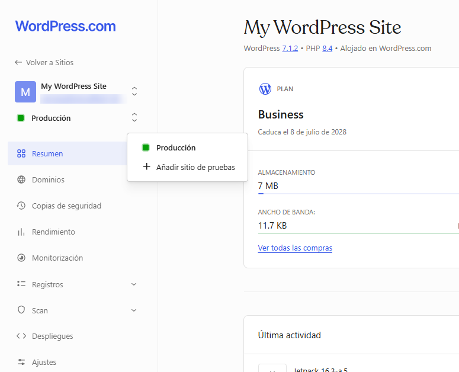
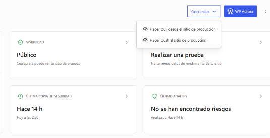
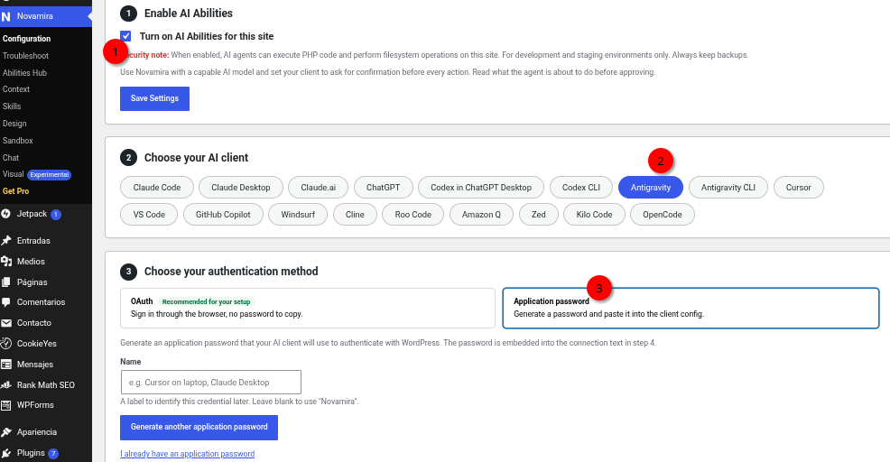
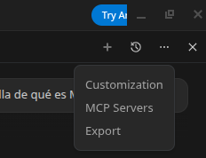

# Actividad 2. Despliegue Cloud en WordPress.com, Entornos Staging y Desarrollo con IA

En esta actividad darás el salto del servidor local (montado en la Actividad 1 con XAMPP en Linux Mint) a una infraestructura **Cloud profesional** gracias a las licencias educativas del **Plan Business de WordPress.com**.

Aprenderás la metodología de trabajo empleada en empresas tecnológicas: **nunca modificar una web directamente en producción**. Implementaremos un flujo estricto donde todo el trabajo de migración, la instalación del plugin de comercio electrónico **WooCommerce**, la configuración de una tienda de **infoproductos técnicos descargables (ebooks y recursos)** y la automatización mediante Inteligencia Artificial con **Novamira MCP y Antigravity IDE** se realizarán **íntegramente en un entorno de pruebas aislado (Staging)**. Solo cuando el sistema y el proceso de compra estén plenamente verificados, publicaremos los cambios al sitio público mediante un despliegue controlado (*Push* a Producción).

> ⚠️ **Regla de oro profesional:** Todo el trabajo técnico, instalación de plugins, configuración de la tienda, integración con la IA y pruebas de compra se realiza **EXCLUSIVAMENTE en el entorno de Staging (Pruebas)**. La web de Producción no se edita directamente; únicamente recibirá el proyecto final terminado mediante la herramienta de sincronización (*Push*).
{: .alert-warning}

---

## 🎯 Objetivos de la actividad

1. **Gestión de Hosting Cloud Profesional:** Configurar la cuenta bajo el plan **WordPress.com Business**, adaptando el panel a la interfaz clásica de administración (`WP-Admin`) y desbloqueando las funciones avanzadas de desarrollador y alojamiento.
2. **Ciclo de Desarrollo Profesional con Staging:** Comprender y aplicar el ciclo de vida de un servicio web (*Desarrollo local ➔ Staging / Pruebas ➔ Producción pública*), aprovisionando copias aisladas en la nube.
3. **Migración de Servicios Web a la Nube:** Restaurar la copia de seguridad `.wpress` generada en la Actividad 1 en el entorno de pruebas utilizando **All-in-One WP Migration**.
4. **Comercio Electrónico de Infoproductos (WooCommerce):** Desplegar una tienda online en la web personal orientada a la venta de **infoproductos digitales descargables** (ebooks técnicos, guías y recursos de informática), integrando el catálogo y el carrito con el tema **Blocksy** sin necesidad de gestionar envíos físicos.
5. **Desarrollo Web Asistido por Agentes IA (MCP):** Conectar el entorno de Staging con **Antigravity IDE** mediante el protocolo estándar **MCP (Model Context Protocol)** y el plugin **Novamira**, empleando contraseñas de aplicación seguras.
6. **Generación Automatizada del Catálogo con IA:** Guiar al agente de IA mediante prompts en lenguaje natural para estructurar categorías de tienda, redactar fichas de producto persuasivas y generar contenidos técnicos descargables de forma automatizada.
7. **Despliegue y Sincronización a Producción:** Publicar de forma controlada el sitio completo validado en Staging hacia el sitio en vivo mediante operaciones de sincronización (**Push**).
8. **Ciberseguridad y Buenas Prácticas:** Gestionar contraseñas seguras y credenciales de aplicación en **Bitwarden**, auditando registros de actividad y copias de seguridad automáticas en la nube.

## 📌 Paso a paso detallado

### Paso 1: Registro en Wordpress.com con la licencia educativa gratuita

El plan **WordPress.com Business** ofrece un entorno gestionado de alto rendimiento con servidores optimizados, copias de seguridad automáticas y herramientas de desarrollo avanzadas. No obstante, por defecto la plataforma utiliza una interfaz simplificada pensada para usuarios no técnicos. Como administradores de sistemas y servicios web, configuraremos el entorno en modo profesional:

1. **Acceso con licencia educativa y registro en Bitwarden:**
   - Utiliza el enlace [https://wordpress.com/setup/education/es?code=EDUINVIMODlPSI26](https://wordpress.com/setup/education/es?code=EDUINVIMODlPSI26) para registrarte en **Wordpress.com**. 

> Este enlace permite obtener un plan **Business** gratuito durante un año a través de una licencia educativa. Solo podrás gastarlo una vez.
{: .alert-info}

2. Registra de inmediato en tu bóveda de **Bitwarden** la URL del panel, el usuario/correo y la contraseña asignada.
{:start="2"}

### Paso 2: Ajustes básicos de WordPress.com

1. **Cambiar la interfaz de administración a "Estilo clásico":**
   - En la esquina superior derecha del panel de WordPress.com, haz clic en tu avatar/perfil y entra en **Ajustes de la cuenta** (o dentro de tu sitio en **Ajustes > General**).
   - Localiza la opción **Estilo de la interfaz de administración** (*Admin interface style*).
   - Cambia la opción predeterminada a **Estilo clásico** (*Classic view* / WP-Admin nativo).
   - Guarda los cambios. A partir de este momento dispondrás de la barra superior negra y el menú lateral característico de WordPress, idéntico al que utilizaste en el entorno local con XAMPP.

2. **Activar funciones de desarrollador y alojamiento:**
   - En el menú lateral de tu sitio en WordPress.com, dirígete a **Ajustes > Configuración de alojamiento** (o *Funciones de desarrollador*).
   - Pulsa en el botón **Activar funciones de alojamiento** (*Activate hosting features*).
   - Esta acción convierte el sitio en una instancia con acceso completo al sistema: habilita la instalación de cualquier plugin o tema externo sin restricciones, el acceso a bases de datos mediante phpMyAdmin, credenciales SFTP/SSH y la capacidad de crear entornos de pruebas (*staging*).

> **¿Por qué activar las funciones de alojamiento?** Sin este paso, WordPress.com funciona como una plataforma cerrada (SaaS). Al activar las funciones de alojamiento, dispones de una máquina virtual/contenedor dedicado en la nube con acceso total a nivel de servidor web y base de datos.
{: .alert-info}

---

### Paso 3: Entornos de trabajo profesional: Creación del entorno de Staging (Pruebas)

En el ámbito laboral y empresarial, **nunca se realizan cambios, pruebas de plugins, migraciones ni desarrollo de nuevas secciones directamente en el sitio de producción**, ya que cualquier error provocaría la caída de la web pública (tiempo de inactividad o *downtime*) o la pérdida de pedidos y datos de clientes.

El flujo de trabajo estándar en la industria consta de tres etapas:
1. **Entorno Local (Development):** Tu máquina virtual Linux con XAMPP (Actividad 1), donde diseñaste la estructura base sin riesgo alguno.
2. **Entorno de Pruebas (Staging):** Un clon exacto del servidor en la nube, protegido o en una URL temporal, donde se prueban migraciones, se añaden módulos complejos como tiendas online y se interactúa con agentes de IA.
3. **Entorno de Producción (Production):** La web pública visible para los usuarios finales, clientes y evaluadores.


{: .img .img-500}

1. En el panel de control de tu sitio de WordPress.com ([https://my.wordpress.com/sites](https://my.wordpress.com/sites)), localiza en la barra lateral izquierda el selector de entorno donde actualmente aparece marcado **Producción** con un indicador verde.
2. Haz clic sobre dicho selector y pulsa en la opción **+ Añadir sitio de pruebas**.
3. El sistema iniciará el aprovisionamiento de un clon aislado de tu sitio con una dirección web de pruebas (por ejemplo: `staging-xxxx-tunombre.blog`).
4. Espera a que finalice el proceso de creación. Observarás que ahora puedes alternar cómodamente entre el panel de **Producción** y el de **Pruebas (Staging)**.

> 🛑 **¡ATENCIÓN! A partir de este momento y hasta el Paso 6, trabajarás ÚNICAMENTE en el entorno de Staging (Pruebas).** Asegúrate de que el selector de WordPress.com o el panel de WP-Admin indique siempre el entorno de pruebas.
{: .alert-warning}

---

### Paso 3: Importación de la copia de seguridad de la Actividad 1 en Staging

En la Actividad 1 exportaste un archivo `.wpress` con tu sitio web personal (currículum con tema Blocksy, plugins de seguridad y formulario de contacto). Ahora lo migraremos a la nube en el sitio de pruebas.

> 🛑 **ATENCIÓN**: Para que la importación funcione correctamente, **debes asegurarte** de que el correo electrónico de tu usuario administrador del sitio web local sea el mismo que el usuario con el que te has registrado en Wordpress.com. Si no es así, modifícalo antes en el entorno local y vuelve a exportar el archivo .wpress
{: .alert-error}


{: .img}

1. En el selector de entornos del panel de WordPress.com, asegúrate de estar situado en **Pruebas (Staging)** (indicador azul/verde).
2. Haz clic en el botón azul **WP Admin** situado en la parte superior derecha para acceder directamente al panel de administración del entorno de pruebas.
3. Ve a **Plugins > Añadir nuevo**, busca el plugin **All-in-One WP Migration** e instálalo y actívalo en el sitio de pruebas.
4. En el menú lateral, dirígete a **All-in-One WP Migration > Importar**.
5. Selecciona **Importar de > Archivo** y sube el archivo `.wpress` de la copia de seguridad que guardaste en la Actividad 1.
6. Confirma la advertencia de sobreescritura de base de datos y archivos. El plugin restaurará tus páginas, imágenes, menús, configuraciones y usuarios de la Actividad 1.
7. Al concluir la importación, ve a **Ajustes > Enlaces permanentes** y haz clic en **Guardar cambios** dos veces seguidas para regenerar las reglas de reescritura de URLs.
8. Abre la URL del sitio de pruebas en una pestaña nueva y comprueba minuciosamente que la web funciona al 100%: portada con Blocksy, secciones de currículum, competencias e imágenes.

---

### Paso 4: Instalación y preparación del motor de tienda WooCommerce (en Staging)

Una de las formas más habituales de monetizar un perfil profesional o marca técnica es la venta de **infoproductos digitales** (conocimiento en formato digital como libros electrónicos, apuntes técnicos, manuales o plantillas de código). 

A diferencia de los productos físicos, los infoproductos se configuran como **productos virtuales y descargables**:
- No requieren definir gastos de envío, pesos ni empresas de paquetería.
- La entrega se realiza de forma inmediata mediante un enlace de descarga seguro tras completar el pedido.

Instalaremos y prepararemos la base del motor de e-commerce en nuestro sitio de **Staging**:

#### 1. Instalación y asistente básico de WooCommerce
1. Dentro del **WP Admin del entorno de Staging**, ve a **Plugins > Añadir nuevo**.
2. Busca el plugin oficial **WooCommerce**, instálalo y actívalo.
3. Se iniciará el asistente de configuración de WooCommerce:
   - **Ubicación de la tienda:** Selecciona España y tu provincia.
   - **¿Qué tipo de productos vas a vender?:** Marca **Productos descargables** (o *Digital Products*).
   - **Moneda:** Configura el **Euro (€)**.
   - Si el asistente te ofrece instalar extensiones o servicios adicionales recomendados (como Jetpack adicional, WooCommerce Payments, TikTok, etc.), desmárcalos o pulsa en *Omitir / Continuar sin instalar* para mantener la instalación limpia y ligera.

#### 2. Configuración de pagos simulados para pruebas
Dado que se trata de un entorno educativo de pruebas, habilitaremos un método de pago que permita simular compras completas sin transferir dinero real:
1. Ve a **WooCommerce > Ajustes > pestaña Pagos**.
2. Activa el método **Transferencia bancaria directa** (BACS) o **Pago contra reembolso / Cheque** (simulación).
3. Haz clic en **Gestionar** en el método seleccionado y añade una breve instrucción ficticia (ej.: *"Pedido de prueba formativo para descarga inmediata"*). Guarda los cambios.

> **Flujo de trabajo:** Con el motor de WooCommerce instalado, en el **Paso 5** conectaremos WordPress con Antigravity IDE mediante el servidor MCP de Novamira. A continuación, en el **Paso 6** (el núcleo de la práctica), construiremos y maquetaremos la tienda al completo: organizaremos las categorías, generaremos el catálogo de infoproductos con IA, configuraremos el carrito y el menú con Blocksy, y validaremos el flujo de compra integral.
{: .alert-info}

---

### Paso 5: Configuración y conexión del agente MCP de Novamira en Antigravity IDE (en Staging)

En lugar de rellenar tediosos formularios para dar de alta los productos, utilizaremos un **agente de Inteligencia Artificial** conectado directamente a WordPress mediante el protocolo **MCP (Model Context Protocol)** para diseñar y publicar nuestro catálogo de infoproductos técnicos.

> 💡 **¿Qué es el protocolo MCP (Model Context Protocol)?**  
> Imagina a MCP como el **"USB-C de la Inteligencia Artificial"**: es un estándar abierto diseñado para que los modelos de IA puedan conectarse e interactuar de forma segura con aplicaciones, archivos y servicios externos.  
> 
> En lugar de un chat convencional donde la IA solo genera texto y tú debes copiarlo y pegarlo a mano en WordPress, un asistente conectado mediante MCP se convierte en un **agente activo**: el modelo dispone de un catálogo de *herramientas* (*tools*) que le permiten consultar la base de datos de tu web, leer o crear páginas, subir archivos, gestionar usuarios, dar de alta categorías o productos en WooCommerce de manera totalmente automatizada.
{: .alert-info}

#### 1. Instalación de Novamira en Staging
> El plugin **Novamira** no está disponible en la tienda de plugins de Wordpress. Deberás descargarlo de la web oficial.
{: .alert-info}

1. Descarga el archivo `.zip` del plugin de Novamira desde [https://novamira.ai/](https://novamira.ai/)
2. Desde Wordpress, ve a **Plugins -> Añadir nuevo -> Subir plugin**. Sube el archivo `.zip` que acabas de descargar y actívalo.
3. En el menú lateral aparecerá la pestaña **Novamira**, donde podrás configurar el servidor MCP para integrarlo con nuestro IDE.

#### 2. Configuración de Novamira


{: .img .img-500}

1. Activa las habilidades IA de Novamira (**Enable AI Abilities**).
2. Elige el cliente: nosotros utilizaremos **Antigravity**.
3. Crea una contraseña de aplicación (**Application password**).
4. Finalmente, elige **Manual configuration for Antigravity** y te saldrá un código como el siguiente:

```json
{
    "mcpServers": {
        "novamira-ujitest1davidlop": {
            "command": "npx",
            "args": [
                "-y",
                "@automattic/mcp-wordpress-remote@latest"
            ],
            "env": {
                "WP_API_URL": "<TU-DOMINIO>/wp-json/mcp/novamira",
                "WP_API_USERNAME": "<TU-USUARIO>",
                "WP_API_PASSWORD": "<TU-API-PASSWORD>"
            }
        }
    }
}
```

#### 3. Conexión de Antigravity IDE
1. Si no tienes descargado Antigravity IDE, descárgalo de [https://antigravity.google/product/antigravity-ide](https://antigravity.google/product/antigravity-ide)
2. Instálalo en tu equipo.
3. Abre **Antigravity IDE** e inicia sesión con tu cuenta de Google.
4. Configura el servidor MCP de Novamira en Antigravity IDE a través del botón de MCP Servers de Antigravity y después **Manage MCP Servers**:


{: .img}

5. Deberás copiar el código JSON generado en el anterior paso e integrarlo en la configuración de MCP servers de Antigravity.
{:start="5"}

#### 4. Comprobación inicial de la conexión con el agente de IA

Una vez configurado y guardado el servidor MCP en Antigravity IDE, es fundamental verificar que la comunicación con tu servidor de WordPress en Staging funciona correctamente antes de realizar cambios:

1. Abre el panel de chat con el agente en Antigravity IDE y comprueba que el servidor MCP de Novamira aparece activo y conectado.
2. Envía un primer prompt para solicitar un diagnóstico general de tu sitio web:
   > *"Comprueba la conexión con mi sitio de WordPress a través del servidor MCP. Indícame el dominio conectado, la versión de WordPress instalada, el tema que está actualmente activo y la lista completa de plugins instalados."*
3. Observa cómo el agente ejecuta herramientas (*tools*) del protocolo MCP para consultar tu servidor web y te devuelve un resumen técnico estructurado con:
   - El dominio/URL del sitio de pruebas (Staging).
   - La versión de WordPress.
   - El tema activo (**Blocksy**).
   - Los plugins instalados y activos (WooCommerce, Novamira, All-in-One WP Migration, etc.).

> **¿Qué demuestra este paso?** Que tu entorno de desarrollo local (Antigravity IDE) y tu servidor cloud en WordPress.com están conectados de forma bidireccional mediante APIs seguras. El agente de IA ya no es un simple generador de texto: ahora tiene "manos" para inspeccionar y administrar tu servidor web.
{: .alert-success}

---

### Paso 6: Construcción integral de la Tienda de Infoproductos, Catálogo con IA y Flujo de Compra (en Staging)

Este es el **núcleo central de la actividad**. En este bloque conectarás la arquitectura de tu gestor de contenidos, el motor de comercio electrónico **WooCommerce**, el diseño visual del tema **Blocksy** y la automatización mediante el agente de IA en **Antigravity IDE** para construir una tienda online técnica, funcional y profesional.

---

#### 1. Arquitectura de la tienda: Creación de Categorías Temáticas
Para que un e-commerce ofrezca una buena experiencia de usuario (UX), el catálogo debe estructurarse en categorías lógicas. Definiremos al menos **3 categorías temáticas** acordes al perfil tecnológico y académico de la web personal:

- 📚 **Ebooks y Manuales Técnicos** (slug: `ebooks-manuales`): Guías en profundidad sobre sistemas operativos, terminal y redes.
- ⚙️ **Scripts y Automatización** (slug: `scripts-automatizacion`): Herramientas en Python y scripts Bash para administración de sistemas.
- 📋 **Plantillas y Recursos TIC** (slug: `plantillas-recursos`): Chuletarios de comandos (*cheat sheets*), diagramas y plantillas de desarrollo.

**Creación mediante el Agente de IA:**  
Abre el chat de **Antigravity IDE** y solicita al agente la creación automática de las taxonomías:
> *"Crea en WooCommerce tres categorías de producto: 'Ebooks y Manuales Técnicos' (slug: ebooks-manuales), 'Scripts y Automatización' (slug: scripts-automatizacion) y 'Plantillas y Recursos TIC' (slug: plantillas-recursos), asignando a cada una una breve descripción orientada a formación y tecnología."*

*(Comprobación opcional: accede a **Productos > Categorías** en el WP-Admin de Staging para verificar que se han creado correctamente con sus slugs y descripciones).*

---

#### 2. Generación del Catálogo de Infoproductos con IA (Antigravity IDE)
A continuación, solicitaremos a la IA la creación de un catálogo variado de **al menos 3 o 4 infoproductos digitales** repartidos en las categorías anteriores. 

Cada producto debe crearse con los atributos técnicos propios de un infoproducto descargable:
- Atributos **Virtual** (desactiva costes y opciones de envío físico) y **Descargable** (habilita la entrega inmediata de archivos).
- **Título comercial atractivo.**
- **Precio fijado:** Precios realistas para infoproductos formativos (ej.: 3.99 €, 4.99 €, 7.99 €) e incluso un producto a **0.00 € (gratuito)** que funcione como recurso de captación (*lead magnet*).
- **Descripción corta:** Gancho comercial de 2 líneas resaltando el beneficio principal.
- **Descripción completa estructurada:** Sinopsis, a quién va dirigido, índice o temario por módulos y requisitos técnicos previos.

**Prompt para Antigravity IDE:**
> *"Crea en mi tienda WooCommerce los siguientes 3 infoproductos con los atributos 'virtual' y 'descargable' activados:
> 
> 1. 'Guía Práctica de Comandos Linux Mint y Bash', asignado a la categoría 'Ebooks y Manuales Técnicos', precio 4.99 €. Descripción corta comercial resaltando el dominio de la terminal. Descripción completa estructurada con: Sinopsis, A quién va dirigido, Temario de 4 módulos (Fundamentos, Gestión de Archivos, Permisos y Procesos en segundo plano) y Requisitos previos.
> 2. 'Pack de Scripts en Python para Automatización de Servidores', asignado a 'Scripts y Automatización', precio 7.99 €. Descripción corta atractiva y descripción larga detallando los scripts incluidos (copias de seguridad automáticas, monitorización de espacio en disco y parser de logs de Apache).
> 3. 'Chuletario de Puertos de Red y Comandos de Diagnóstico', asignado a 'Plantillas y Recursos TIC', precio 0.00 € (gratuito). Descripción corta y desglose del contenido en formato tabla resumida."*

Observa en la consola de Antigravity IDE cómo el agente ejecuta las llamadas a herramientas (*tools*) del servidor MCP para dar de alta los productos con todos sus metadatos.

---

#### 3. Asociación de Archivos Descargables Reales en WP-Admin
Un infoproducto descargable requiere un archivo entregable vinculado que el cliente pueda descargar inmediatamente tras la compra:

1. En el WP-Admin de Staging, dirígete a **Productos > Todos los productos**.
2. Haz clic en **Editar** en cada uno de los productos generados por la IA.
3. Desplázate hasta la caja de **Datos del producto** (pestaña **General**):
   - Verifica que las casillas **Virtual** y **Descargable** están marcadas.
   - En la sección **Archivos descargables**, haz clic en el botón **Añadir archivo**.
   - Asigna un nombre descriptivo al archivo (ejemplo: `Guia_Linux_Mint_v1.pdf`).
   - Haz clic en **Elegir archivo** y sube a la biblioteca de medios un archivo de prueba real (puede ser un PDF con apuntes de clase, un documento de texto exportado a PDF o un archivo `.zip`/`.txt`).
   - *(Opcional)* Configura un **Límite de descargas** (ejemplo: `5`) y una **Caducidad de la descarga** (ejemplo: `365` días).
4. Haz clic en el botón azul **Actualizar** para guardar los cambios en cada producto.

---

#### 4. Estrategia de Promoción: Creación de Cupones de Descuento
En el comercio electrónico es fundamental dominar las herramientas de fidelización y promociones. Configuraremos un cupón de descuento educativo para nuestra tienda:

1. En el menú lateral de WP-Admin, ve a **Marketing > Cupones** (o **WooCommerce > Cupones**).
2. Haz clic en **Añadir cupón**.
3. En el campo "Código de cupón", introduce: `ESTUDIANTE20`.
4. En la pestaña **General** de los datos del cupón:
   - **Tipo de descuento:** Selecciona **Descuento en porcentaje**.
   - **Importe del cupón:** Escribe `20` (aplicará un 20% de descuento en el total del carrito).
   - **Descripción:** *Promoción educativa para alumnos de Informática*.
5. Pulsa en **Publicar** para activar el cupón.

---

#### 5. Integración Visual y Maquetación con el tema Blocksy (Menú y Carrito)
Ahora integraremos la tienda dentro del diseño general de tu web personal/CV maquetada en la Actividad 1:

1. **Añadir la Tienda al Menú Principal de Navegación:**
   - Ve a **Apariencia > Menús** en el WP-Admin de Staging.
   - En la columna izquierda, dentro de **Páginas**, localiza y marca la página **Tienda** (página creada automáticamente por WooCommerce donde se expone el catálogo).
   - Pulsa en **Añadir al menú**.
   - Arrastra el elemento en la estructura del menú para situarlo en una posición destacada (por ejemplo, entre *Competencias/Proyectos* y *Contacto*).
   - Haz clic en **Guardar menú**.

2. **Configuración del Carrito Interactivo en la Cabecera:**
   - Ve a **Apariencia > Personalizar** en el WP-Admin de Staging.
   - Entra en la sección **Cabecera (Header)**.
   - En el constructor visual de cabeceras de Blocksy (panel inferior), localiza el componente **Carrito (Cart)**.
   - Arrastra el elemento **Carrito** a la barra superior o principal de tu cabecera, junto al menú de navegación o tu botón de llamada a la acción (*CTA*).
   - Haz clic sobre el elemento **Carrito** para configurar sus opciones avanzadas:
     - **Tipo de icono:** Selecciona el icono que prefieras (bolsa de compras moderna, carrito clásico o cesta).
     - **Insignia del contador (Badge):** Asegúrate de que está activada para mostrar el número dinámico de artículos añadidos.
     - **Tipo de carrito al hacer clic:** Selecciona **Panel lateral desplegable (*Off-canvas drawer*)**. Esta funcionalidad avanzada de Blocksy desliza un elegante menú lateral desde el borde de la pantalla cuando el usuario pulsa en el carrito, mostrando el subtotal y los botones de compra sin recargar la página.
3. **Revisión de la Página de Tienda (`/tienda`):**
   - En el personalizador, dirígete a **WooCommerce > Catálogo de productos / Página de la tienda**.
   - Revisa la maquetación: número de columnas (recomendado 3 o 4 columnas), ordenación predeterminada y comprobación de que las tarjetas muestran el título, la categoría y el botón de compra rápida.
   - Pulsa en el botón azul **Publicar** en la parte superior del personalizador.

---

#### 6. Simulación y Auditoría Completa del Proceso de Compra (End-to-End)
Para validar la tienda antes de publicarla en producción, realizaremos una prueba completa de compra actuando como un cliente real:

1. **Navegación y selección de producto:**
   - Abre tu navegador web y entra a la dirección pública de tu sitio de pruebas (`https://staging-xxxx-tunombre.blog`).
   - Comprueba que la cabecera muestra el nuevo enlace a **Tienda** y el icono del carrito.
   - Entra en la sección **Tienda**, filtra o navega por los infoproductos y haz clic en uno de ellos para inspeccionar su ficha detallada.
2. **Añadir al carrito y experiencia Off-canvas:**
   - Haz clic en el botón **Añadir al carrito**.
   - Observa cómo se despliega el panel lateral (*off-canvas drawer*) de Blocksy con el producto añadido, el subtotal y el contador numérico de la cabecera actualizado.
3. **Página de Carrito y aplicación del Cupón:**
   - Haz clic en **Ver carrito** para acceder a `/carrito`.
   - En el campo "Código de cupón", escribe `ESTUDIANTE20` y pulsa **Aplicar cupón**.
   - Verifica que el subtotal se actualiza inmediatamente aplicando el 20% de descuento sobre el precio original.
4. **Finalizar compra (Checkout):**
   - Pulsa en el botón **Finalizar compra** para acceder a la pasarela `/finalizar-compra`.
   - Rellena los campos de facturación con datos formativos ficticios (Nombre, Apellidos, Centro educativo, Correo electrónico del alumno).
   - Comprueba que el método de pago seleccionado es el pago simulado/transferencia configurado en el Paso 4.
   - Acepta los términos y condiciones y pulsa en **Realizar el pedido**.
5. **Comprobación de la Descarga Directa del Infoproducto:**
   - El sistema te redirigirá a la página de confirmación **Pedido recibido**.
   - Localiza la tabla de descargas del pedido y comprueba que aparece el botón o enlace directo con el nombre del archivo (`Guia_Linux_Mint_v1.pdf`).
   - Haz clic en el enlace y comprueba que el archivo se descarga correctamente en la carpeta de descargas de tu ordenador.
6. **Auditoría como Administrador en WP-Admin:**
   - Regresa al panel de administración de Staging y entra en **WooCommerce > Pedidos**.
   - Verifica que el pedido simulado aparece registrado en la lista con su ID de pedido, el nombre del cliente, el estado del pedido (*Procesando* o *Completado*) y el importe exacto con el cupón aplicado.

---

### Paso 7: Validación final y Sincronización a Producción (Push)

Una vez que has comprobado que **TODO** funciona a la perfección en el entorno aislado de Staging (web personal + tienda WooCommerce + catálogo de infoproductos creado por la IA + proceso de compra y descarga verificado), realizaremos el paso a producción:

1. Accede al panel principal de **WordPress.com** y sitúate en la pestaña de **Pruebas (Staging)**.
2. En la parte superior, haz clic en el botón **Sincronizar**.
3. Selecciona la opción **Hacer push al sitio de producción** (*Push to production*).
4. El sistema te mostrará una pantalla de resumen advirtiendo que los datos, temas, plugins y la base de datos de Staging reemplazarán los de Producción.
5. Confirma la operación de sincronización y espera a que el proceso concluya con éxito.
6. Abre una nueva ventana de incógnito en tu navegador y accede a la **URL pública de Producción** (ejemplo: `https://tunombre.blog`).
7. Comprueba minuciosamente:
   - Que tu web personal/CV está publicada en Internet bajo tu dominio principal con certificado SSL válido.
   - Que el menú de navegación y la cabecera incluyen el acceso a la tienda y el icono del carrito.
   - Que los infoproductos creados por la IA están visibles y listos para los visitantes.

---

### Paso 8: Monitorización, Copias Automáticas y Auditoría en la Nube

Para completar la gestión profesional de tu servidor cloud, explora las herramientas que el Plan Business ofrece de serie en el panel de WordPress.com:

1. **Copias de seguridad automáticas en tiempo real (Jetpack VaultPress Backup):**
   - Entra en la sección **Copias de seguridad** del panel de WordPress.com.
   - Observa la línea de tiempo (*Rewind*): cada cambio que has realizado (la instalación de WooCommerce, la importación de la copia o la sincronización de Staging a Producción) ha generado un punto de restauración automático en la nube.
2. **Auditoría y Registro de Actividad:**
   - Ve a la sección **Registros / Actividad** para revisar el historial cronológico de todas las operaciones efectuadas en el sitio web (inicios de sesión, cambios en plugins y publicaciones de productos).
3. **Escaneo de Seguridad (Scan):**
   - Entra en **Scan** y verifica que el motor de seguridad de WordPress.com no detecta amenazas, vulnerabilidades en plugins ni archivos sospechosos en tu instalación.

---

## 📽️ Recursos y material de apoyo

👉 [Documentación oficial de WordPress.com sobre entornos de Staging](https://wordpress.com/support/staging-sites/)  
👉 [Guía de inicio de WooCommerce y productos descargables](https://woocommerce.com/document/managing-products/digital-downloadable-product-handling/)  
👉 [Tema Blocksy - Integración con WooCommerce y Cabecera](https://creativethemes.com/blocksy/docs/woocommerce-support/)  
👉 [Repositorio oficial y especificación de Novamira MCP](https://github.com/dynamic-ooo/novamira)  
👉 [Especificación oficial del Model Context Protocol (MCP)](https://modelcontextprotocol.io/)  
👉 [Guía de Contraseñas de Aplicación en WordPress](https://make.wordpress.org/core/2020/11/05/application-passwords-integration-guide/)  

---

## 📤 Entrega y Evaluación

Deberás entregar en **Aules** los siguientes elementos:

1. **Enlace URL público** de tu sitio web de producción en WordPress.com (donde debe apreciarse la web personal y la tienda accesible).
2. **Documento (PDF)** con el informe técnico de la actividad que contenga:
   - **Ajustes iniciales y Staging:** Capturas del panel con la interfaz clásica (`WP-Admin`) y de la pantalla de WordPress.com mostrando los dos entornos activos (**Producción** y **Pruebas/Staging**).
   - **Migración a Staging:** Captura de la importación completada con All-in-One WP Migration en el entorno de pruebas.
   - **Tienda WooCommerce en Staging:** Captura de la configuración de WooCommerce para productos digitales y del icono del carrito integrado en la cabecera con Blocksy.
   - **Automatización con IA (Novamira MCP + Antigravity IDE):**
     - Captura de la contraseña de aplicación generada en Staging.
     - Captura de pantalla de **Antigravity IDE** mostrando tanto la verificación inicial de conexión (diagnóstico con versión, tema y plugins) como la generación del catálogo de infoproductos mediante herramientas MCP.
     - Captura de las fichas de los infoproductos generados en la tienda de Staging.
   - **Prueba de compra:** Captura de la pantalla de confirmación de pedido recibido en Staging con el enlace de descarga disponible.
   - **Sincronización a Producción:** Captura del momento del *Push* y de la tienda online definitiva funcionando en el dominio público de producción.
   - **Bóveda de Bitwarden:** Captura de las entradas registradas (credenciales de WordPress.com y contraseña de aplicación de Antigravity, con las contraseñas ocultas).

Una vez realizada la entrega en Aules, **realiza una breve demostración en el aula ante el profesor** mostrando la web pública y la interacción realizada con Antigravity IDE.

---

## 📊 Rúbrica de Evaluación (máx. 10 puntos)

| Criterio | Insuficiente (0 pts) | Básico (0.5 pts) | Adecuado (1 pt) | Excelente (2 pts) |
| :--- | :--- | :--- | :--- | :--- |
| **Hosting Cloud y Gestión de Seguridad (Bitwarden)** | No accede a la cuenta educativa ni almacena credenciales. | Accede al sitio pero no activa las funciones de alojamiento ni la vista clásica. | Activa alojamiento y vista clásica, almacenando claves básicas en Bitwarden con alguna ayuda. | Configura con total autonomía WP-Admin clásico, funciones de alojamiento y registra de forma impecable credenciales y contraseñas de aplicación en Bitwarden. |
| **Metodología de Staging y Migración (.wpress)** | Trabaja directamente sobre producción sin crear ni usar Staging. | Crea Staging pero comete errores en la importación o no comprende el aislamiento de entornos. | Restaura la copia `.wpress` en Staging y respeta el flujo de pruebas con pequeñas dificultades. | Aplica con rigor profesional la regla de oro: migra y valida en Staging de forma autónoma, justificando técnicamente el ciclo de vida del software. |
| **Tienda WooCommerce de Infoproductos en Staging** | No instala WooCommerce o lo configura erróneamente para productos físicos. | Instala el plugin pero no ajusta moneda, pagos simulados ni integra el carrito en la cabecera. | Configura WooCommerce para productos virtuales/descargables e integra la tienda en el menú y cabecera de Blocksy. | Tienda de infoproductos perfectamente configurada en Staging: pagos simulados funcionales, carrito en Blocksy y prueba de compra/descarga completada con éxito. |
| **Automatización con IA (Novamira MCP y Antigravity IDE)** | No conecta Antigravity ni utiliza el protocolo MCP. | Instala Novamira pero no logra la autenticación o genera contenido manualmente sin IA. | Conecta Antigravity por MCP en Staging y genera al menos un producto asistido por el agente. | Conexión MCP en Staging impecable, orquestando con prompts precisos la creación de categorías, descripciones comerciales persuasivas y fichas técnicas completas de infoproductos. |
| **Sincronización a Producción (Push) y Documentación** | No entrega la actividad o el sitio público no funciona. | Sincroniza con errores o entrega un informe con ausencia de capturas clave. | Sincroniza mediante *Push* a Producción correctamente y entrega informe técnico adecuado con pequeños detalles de formato. | Entrega puntual con informe técnico riguroso y detallado, web pública de producción 100% operativa con certificado SSL y demostración práctica fluida en clase. |

---

## 📌 Criterios de Evaluación vinculados (2º Bachillerato - PSIR II)

- **CE 4.2:** Instalar y configurar un servidor web de forma segura.
- **CE 4.3:** Añadir complementos y gestionar gestores de contenidos (CMS WordPress y WooCommerce).
- **CE 4.4:** Instalar y utilizar servidores de bases de datos para dar soporte a servicios web.
- **CE 5.2.1:** Razonar el diseño de sistemas informáticos y evaluar la eficiencia de servicios en la nube.
- **CE 5.2.3:** Administrar aplicaciones y servicios web en entornos de trabajo, pruebas y producción.
- **CE 5.1:** Integrar recursos digitales y herramientas de IA de manera autónoma y responsable en flujos de desarrollo.
- **CE 5.2:** Crear y difundir documentación técnica sobre el despliegue de sistemas y servicios web.
