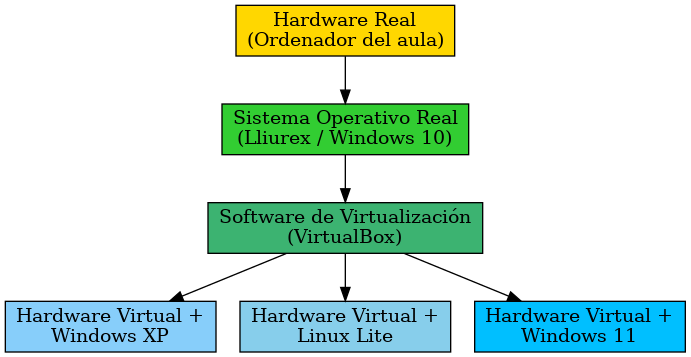
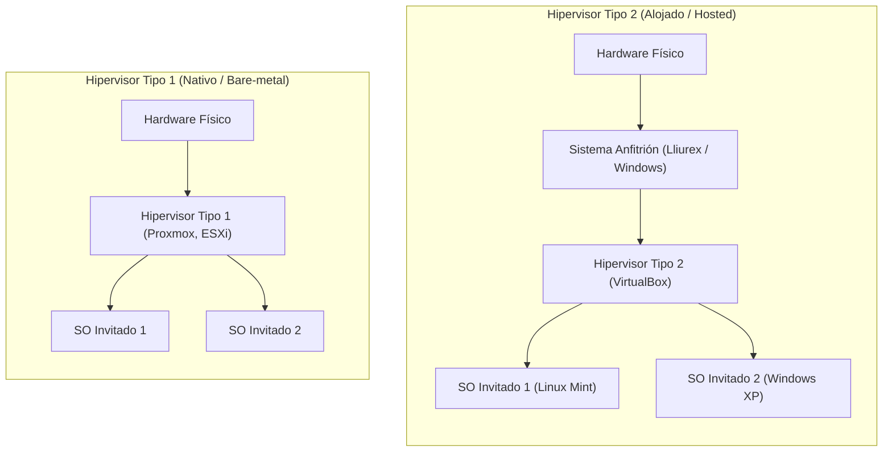

# Introducción a la Virtualización con VirtualBox

En este tema abordamos la **virtualización**, una tecnología esencial en la administración de sistemas informáticos, el desarrollo de software y el despliegue de servicios web. 

Antes de configurar un servidor web en producción, es imprescindible disponer de un entorno seguro y aislado donde experimentar, instalar sistemas operativos de servidor y realizar pruebas sin poner en riesgo el equipo físico.

---

## 1. ¿Qué es la virtualización?

La **virtualización** es una tecnología que permite crear versiones virtuales (basadas en software) de recursos informáticos que tradicionalmente son físicos, tales como el procesador (CPU), la memoria RAM, el disco duro o los adaptadores de red.

A través de la virtualización, un único ordenador físico puede ejecutar **múltiples sistemas operativos de forma simultánea**, independientes entre sí y aislados del sistema principal.

### Concepto de Máquina Virtual (MV / VM)

Una **Máquina Virtual (MV)** es un ordenador completo simulado por software. Para el sistema operativo instalado dentro de ella (sistema invitado), la máquina virtual se comporta como si estuviera ejecutándose sobre un ordenador físico real:
- Dispone de su propia **BIOS/UEFI virtual**.
- Detecta una **CPU virtual** (vCPU) y **memoria RAM virtual**.
- Dispone de una **tarjeta de red virtual** y una **tarjeta gráfica virtual**.
- Utiliza un archivo en el disco real que funciona como su **disco duro virtual** (habitualmente formato `.vdi` en VirtualBox).

---

## 2. Arquitectura de la virtualización: Análisis del esquema

Para entender con precisión cómo encajan todas las piezas, analicemos el siguiente esquema basado en la infraestructura que utilizamos en el aula:


{: .img .img-350}

El funcionamiento se divide en cuatro capas claramente diferenciadas:

### 1. Hardware Real (Ordenador del aula)
Es la máquina física tangible situada en el aula de informática. Contiene la placa base, el procesador (CPU multinúcleo Intel o AMD), los módulos físicos de memoria RAM (por ejemplo, 8 GB o 16 GB), el disco de almacenamiento (SSD/HDD) y la tarjeta de red Ethernet conectada a la red del centro educativo.

### 2. Sistema Operativo Real o Anfitrión (*Host OS*)
Es el sistema operativo instalado directamente en el disco duro físico del equipo. En nuestro caso habitual, es **Lliurex** o **Windows 10/11**. 
- Controla de forma directa los controladores (*drivers*) y el hardware real.
- Es el sistema que arranca al encender el ordenador y sobre el que iniciamos sesión para trabajar a diario.

### 3. Software de Virtualización: Hipervisor (*VirtualBox*)
Es el programa encargado de gestionar y coordinar la virtualización. En nuestro caso empleamos **Oracle VM VirtualBox**.
- Actúa como un intermediario o árbitro: intercepta las peticiones de los sistemas virtuales y las traduce para que la CPU y la memoria reales las ejecuten.
- Gestiona la asignación y limitación de memoria RAM, espacio en disco y tiempo de procesador asignado a cada máquina virtual.

### 4. Hardware Virtual y Sistemas Operativos Invitados (*Guest OS*)
Son las máquinas virtuales creadas por el usuario. Como se observa en la imagen, sobre una misma máquina física podemos tener configuradas distintas máquinas virtuales:
- **Windows XP**, **Linux Lite**, **Windows 11** o, en nuestro caso para servicios web, **Linux Mint**.
- Cada una funciona de manera autónoma, con sus propios archivos, usuarios, servicios y programas instalados, ajena a lo que ocurre en las demás.

---

## 3. Tipos de Hipervisores

El software encargado de crear y gestionar máquinas virtuales se denomina **hipervisor** (*hypervisor*) o **VMM** (*Virtual Machine Monitor*). Existen dos arquitecturas principales:



| Característica | Hipervisor Tipo 1 (Bare-Metal) | Hipervisor Tipo 2 (Hosted) |
| :--- | :--- | :--- |
| **Instalación** | Directamente sobre el hardware físico (sin SO previo). | Sobre un Sistema Operativo anfitrión ya existente. |
| **Rendimiento** | **Máximo** (acceso directo a CPU y memoria). | **Medio** (pasa a través de la capa del SO anfitrión). |
| **Uso habitual** | Centros de Datos (CPD), servidores en la nube y grandes empresas. | Entornos de estudio, desarrollo de software, laboratorios y aulas. |
| **Ejemplos** | Proxmox VE, VMware ESXi, Microsoft Hyper-V Server. | **Oracle VirtualBox**, VMware Workstation, Parallels Desktop. |

> **VirtualBox** es un **Hipervisor de Tipo 2**. Nos permite trabajar de forma cómoda dentro de nuestra sesión de usuario de Lliurex o Windows sin alterar la instalación del equipo del aula.
{: .alert-info}

---

## 4. ¿Por qué es útil la virtualización?

La virtualización supuso una revolución en el sector tecnológico y sigue siendo una competencia fundamental por múltiples motivos:

### 🛡️ 1. Aislamiento y Seguridad (*Sandboxing*)
Una máquina virtual opera en una "caja de arena" (*sandbox*). Si durante la instalación de un servidor web modificamos permisos incorrectamente, abrimos puertos vulnerables o incluso entra un virus informático en la máquina invitada, **el sistema operativo anfitrión y el ordenador físico quedan completamente protegidos e intactos**.

### 💻 2. Multiplataforma y Aprendizaje
Permite aprender administración de sistemas Linux (como **Linux Mint** o Ubuntu Server) y herramientas de servidor (Apache, MariaDB, PHP) desde un equipo con Lliurex o Windows sin necesidad de reparticionar discos duros ni arriesgar el arranque del sistema (*dual boot*).

### 📸 3. Instantáneas (*Snapshots*)
VirtualBox permite tomar una **instantánea** del estado exacto de la máquina virtual (memoria, archivos y configuración) en un momento determinado:
- Si vas a actualizar un CMS como WordPress o modificar la configuración de red de Linux, tomas una instantánea antes de empezar.
- Si algo sale mal o el sistema deja de arrancar, puedes restaurar la instantánea y el sistema volverá a funcionar en cuestión de segundos.

### 📦 4. Portabilidad y Copias de Seguridad
Toda la máquina virtual se almacena en el ordenador como un archivo de disco virtual (`.vdi`) y un archivo de configuración (`.vbox`). Esto permite:
- Exportar la máquina completa a un paquete estándar (`.ova`).
- Copiar la máquina en una memoria USB o subirla a la nube para continuar la práctica en casa exactamente en el punto donde se dejó en clase.

### ⚡ 5. Ahorro de Costes y Consolidación de Servidores
En el mundo profesional, antes de la virtualización cada servicio (servidor web, servidor de correo, base de datos) requería un servidor físico independiente para evitar conflictos. Con la virtualización, un único servidor físico potente puede alojar decenas de servidores virtuales, reduciendo el consumo eléctrico, la refrigeración y el coste de equipamiento.

---

## 5. Conceptos clave en VirtualBox para Servicios Web

### Asignación de Recursos de Hardware
- **Memoria RAM:** Se debe reservar memoria suficiente para el sistema invitado (por ejemplo, 3072 MB o 4096 MB para Linux Mint), pero **nunca superar el 50% de la RAM física del anfitrión** para evitar que el equipo del aula se bloquee por falta de memoria.
- **Disco duro virtual (Reserva Dinámica):** VirtualBox crea un disco `.vdi`. Con la opción de **reserva dinámica**, el archivo solo ocupará en el disco físico el espacio que los datos de Linux Mint vayan llenando realmente, en lugar de reservar los 25 GB de golpe desde el primer instante.

### Modos de Red en VirtualBox
La configuración de red define cómo se comunica la máquina virtual con el resto del mundo:

```
[Red Local del Aula / Internet]
            |
    +-------+-------+
    |               |
 [Modo NAT]   [Adaptador Puente]
    |               |
(Salida web)  (Visible como otro PC en la red)
```

1. **NAT (Network Address Translation):**  
   - Modo por defecto. La máquina virtual tiene acceso a Internet a través de la conexión del anfitrión, pero desde fuera (otros compañeros del aula) nadie puede conectarse directamente a la máquina virtual sin configurar reenvío de puertos (*Port Forwarding*).
2. **Adaptador Puente (*Bridged Adapter*):**  
   - La máquina virtual se conecta a la tarjeta de red física del ordenador y solicita su propia dirección IP al router del aula.  
   - La MV aparece como si fuese un ordenador físico independiente más en la red local. Es el modo ideal cuando queremos que otro compañero acceda a nuestro servidor web WordPress introduciendo nuestra IP en su navegador.

### Guest Additions
Son un paquete de controladores y aplicaciones del sistema que se instalan dentro del sistema invitado (Linux Mint). Permiten:
- Ajustar automáticamente la resolución de pantalla al cambiar el tamaño de la ventana de VirtualBox.
- Compartir el portapapeles (copiar y pegar texto entre el anfitrión y la MV).
- Arrastrar y soltar archivos y carpetas compartidas bidireccionales.
