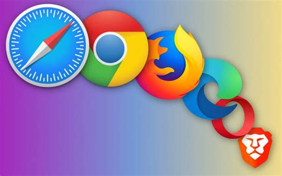

# Aplicaciones | Actividad 1: Sistemas operativos comunes y aplicaciones

_Origen: `aplicaciones.html` del SCORM._

Aplicaciones | Actividad 1: Sistemas operativos comunes y aplicaciones 

document.body.className+=" js";jQuery(function(){loadPage()})

# Aplicaciones

Las **aplicaciones** son **programas que se ejecutan sobre un Sistema Operativo** y que son manejadas directamente por los usuarios. Suelen tener propósitos específicos orientados a las necesidades de las personas que usan un ordenador.

¿Habéis realizado alguna de estas actividades?

1. Navegar por Internet.
2. Escribir un documento e imprimirlo.
3. Jugar a un videojuego.

En el caso de que alguna respuesta sea afirmativa, entonces habéis manejado alguna vez una aplicación. Veámoslas punto por punto.

**1. Navegar por Internet**

Para navegar por Internet se necesita utilizar una aplicación conocida como **Navegador Web (o browser)**. Probablemente hayas utilizado **Mozilla Firefox, Microsoft Internet Explorer o Google Chrome**.

**Iconos de los navegadores web más importantes**

    

**2. Escribir un documento e imprimirlo**

Para escribir un documento es necesario un **editor de textos o**, si se prefiere una herramienta más potente, un **procesador de textos**. Probablemente hayáis utilizado en clase el **procesador de textos LibreOffice Writer**. También es posible que hayáis utilizado **Microsoft Word**, ya que su uso está muy extendido.

**Procesador de Texto LibreOffice Writer**

 

**3. Jugar a un videojuego**

Todo videojuego es un programa informático. Existen multitud de **plataformas** que son **capaces de ejecutar juegos: Linux, Windows, Mac OS X, navegadores web, móviles, tablets, etc**., pero **siempre que se ejecutan sobre un Sistema Operativo estamos hablando de programas**.

**Vídeojuego Manic Digger (clon de Minecraft pero de código abierto)**

## Actividad

**EJERCICIO 6: RELACIÓN 1**

**Realiza este ejercicio en tu libreta digital que has descargado desde la plataforma Web. Recuerda que más tarde el profesor puede preguntarte.**

# Ejemplos de aplicaciones de Linux

Como hemos comentado anteriormente, Linux es un S.O. sobre el que se construyen las distribuciones para incorporarle aplicaciones de usuario. Cada distribución suele tener un enfoque: unas van **enfocadas al usuario medio** que necesita **aplicaciones ofimáticas, soluciones web y herramientas sociales**. Otras van enfocadas hacía las **tareas de administración**. Otras van enfocadas hacia **la comunidad educativa**, como por ejemplo en el caso de Lliurex y que vamos a utilizar para ver qué aplicaciones contiene.

**Lliurex es una distribución de Linux** para la comunidad educativa de la Comunidad Valenciana. Además de **Firefox como navegador web y de LibreOffice como suite ofimática**, cuenta con numerosas aplicaciones educativas como por ejemplo:

**a) Fritzing:**Un simulador de electrónica para tecnología:

**Editor de circuitos electrónicos Fritzing**

 

**b) LibreCAD:**Una herramienta de Diseño Asistido por Ordenador:

 **Foto original de LibreCAD**  

 

**c) SciTE:**Un editor para diferentes lenguajes de programación:

**SciTE es un editor de textos multiplataforma escrito por Neil Hodgson**

# Ejemplos de aplicaciones de Windows

**Windows es un Sistema Operativo de pago** que incluye con su licencia aplicaciones como **editores de texto, un navegador web (Internet Explorer)  o un programa básico de dibujo, el paint**. Para herramientas más completas como suites ofimáticas o programas de dibujo avanzados debemos complementar el sistema con nuevas instalaciones. Veamos, por ejemplo, la **comparación entre el programa de dibujo que incorpora (Paint) y un programa de dibujo y edición de imagen más profesional como es el GIMP**.

**a) Paint:**Programa de dibujo incluido en el Sistema Operativo:

**Programa de dibujo Paint incluido de serie en Windows**

 

**b) Bloc de notas:** Este **editor de texto** nativo de Windows, además del diseño, esta herramienta mejora la función de buscar y reemplazar y añade nuevas funciones a partir de Windows11, como deshacer texto en varios niveles:

**Editor de Texto NotePad**

**c) Media Player**: El **reproductor multimedia** de Windows también se ha rediseñado y optimizado, a partir de Windows11, con el fin de mejorar la escucha y visualización de contenidos multimedia. Una parte muy importante aquí es que muestra la **biblioteca de música**. Para gestionarla encontramos multitud de funciones que se acaban de integrar:

**Reproductor de Windows Media Player**

**d) GIMP:**Es una alternativa **mucho más potente que Paint que además es multiplataforma**. Puede ser instalado en Windows:

**Foto original de Newton2**

# Ejemplos de aplicaciones de Mac OS

**Mac OS tiene que ejecutar su propio software, que suele ser accesible a través de** paquetes descargables o directamente desde **la tienda App Store**. Otro **software** que está **incluido con la adquisición del Sistema Operativo es:**

**a) Safari:** Navegador web propietario de Apple:

**Explicación del navegador Safari extraído de la wikipedia**

**b) Quick Time:** QuickTime Player permite realizar **operaciones** habituales **de edición de vídeo** como **cortar, reorganizar y girar**. También puedes dividir un vídeo en varios clips y manipularlos individualmente:

**Programa Quick Time**

# Aplicaciones Web

Las aplicaciones web **tienen la ventaja de que son accesibles a través de un navegador**. Por lo tanto, **da igual de que el  navegador esté instalado sobre un S.O. Windows, Linux o Mac OS**, están diseñadas para funcionar en cualquier caso.

**a) GMail:** Un **ejemplo de aplicación web** es el **correo electrónico de GMail** al que se puede acceder desde cualquier dispositivo que cuente con un navegador web apropiado. Esto es lo que podríamos ver a través del navegador:

**Entorno web multiplataforma de GMail**

## Actividad

**EJERCICIOS 7 y 8: RELACIÓN 1**

**Realiza estos ejercicios en tu libreta digital que has descargado desde la plataforma Web. Recuerda que más tarde el profesor puede preguntarte.**

[Creado con eXeLearning (Ventana nueva)](https://exelearning.net/)

