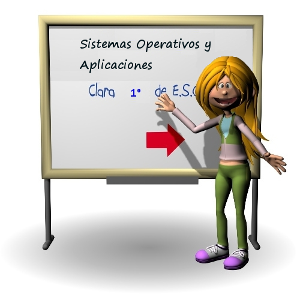

# Actividad 1: Sistemas operativos comunes y aplicaciones

Un **sistema operativo****(S.O.)** es un conjunto de programas que permite manejar la **memoria, disco, medios de almacenamiento de información** y los diferentes periféricos o recursos de nuestra computadora (**teclado, ratón, impresora...**). Dicho de otra manera: es el programa **(software)** más importante, sin el sistema operativo tus programas como Word o Excel no funcionan y no puedes usar impresoras, teclados, etc. Básicamente sin un sistema operativo tu dispositivo no sirve para nada.

En esta primera sesión de la unidad, estudiaremos las los siguientes puntos:

1. **Sistemas Operativos:** Veremos los sistemas operativos más utilizados: Windows. Linux, Mac OS así como los sistemas operativos para smartphone más utilizados por excelencia que son iOS y Android.
2. **Aplicaciones:** En este punto, veremos qué es una aplicación y diferentes tipos de aplicaciones así como diferentes aplicaciones de ejemplo que se encuentran disponibles en los diferentes sistemas operativos estudiados.

[👉 Siguiente](./sistemas_operativos_familia_windows)