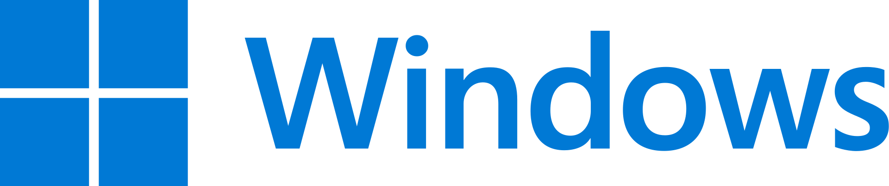
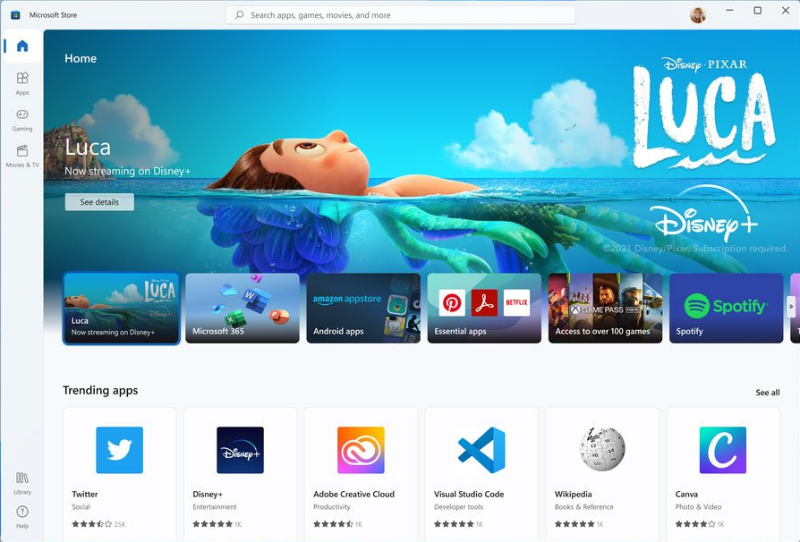
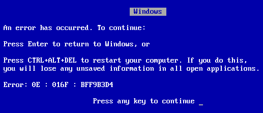
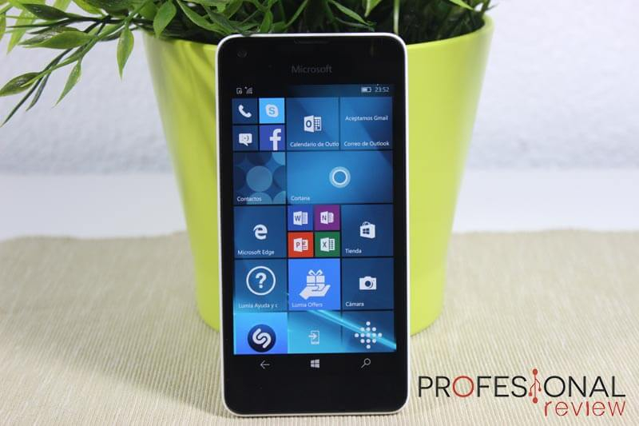

# Sistemas Operativos: Familia Windows

## ¿QUÉ ES UN SISTEMA OPERATIVO?

> Un **Sistema Operativo (S.O. en adelante) es un programa que se utiliza como capa intermedia entre los programas que usa un usuario y un ordenador** (o sistema informático de diversa índole). De esta forma, el S.O. permite al usuario trabajar con las aplicaciones sin necesidad de conocer las cuestiones técnicas del funcionamiento de un ordenador por dentro. 
{: .alert-info}

Ejemplos de S.O. ampliamente utilizados son:

* Windows
* Linux (y sus distribuciones, entre ellas LliureX que está basada en la distribución de Ubuntu)
* Mac OS
* Android
* iOs

Sobre el Sistema Operativo se pueden instalar programas de usuario. Estos junto con los programas de usuario que vienen preinstalados forman el conjunto de programas de usuario. Veamos algunos ejemplos:

* Si uso un programa ofimático como Word de Microsoft, estaré utilizando un programa que se ha instalado sobre el S.O.
* Si uso un navegador como Mozilla Firefox sobre Linux, probablemente estaré utilizando un programa de usuario que viene preinstalado sobre el S.O.

Nótese en ambos casos que no trabajamos directamente sobre el S.O., sino que lo hacemos sobre **aplicaciones de usuario** que están instaladas sobre un S.O.

### WINDOWS

La **primera versión de Microsoft Windows**, **versión 1.0**, presentada en diciembre de 1985, compitió con el sistema operativo de Apple. Carecía de un cierto grado de funcionalidad y **logró muy poca popularidad**. Windows 1.0 no era un sistema operativo completo; más bien era una extensión gráfica de MS-DOS:

**Primer logo de Windows (1985-1991)**

Conjuntos de Sistemas Operativos de la empresa **Microsoft**, entre los que se encuentran:

* Windows 95
* Windows XP
* Windows Vista
* Windows 7
* Windows 8
* Windows 10
* Windows 11

**Logo actual de Windows, ¿Cuál te gusta más?**

Su característica principal es que es un S.O. basado en una **interfaz gráfica** cuyo elemento principal es la **ventana**. Veamos una imagen de una ventana:

**Imagen de una ventana del S.O. Windows11**

Como se puede observar una ventana es una zona gráfica de forma rectangular que puede contener elementos gráficos. Esta ventana puede **redimensionarse, minimizarse y cerrarse**. Comentemos que, probablemente, estéis leyendo estos apuntes a través de un navegador que está contenido dentro de una ventana.

Al ser uno de los primeros S.O. gráficos, Windows llegó a **dominar el mercado**, siendo especialmente importante su incursión en los ordenadores de escritorio a **nivel doméstico**.

Otra de las características de Windows es que es **de** **pago**. El código fuente es propiedad de Microsoft y **se necesita licencia** de uso.

Los **puntos débiles** que se le han achacado a **Windows** han sido:

1. **Escasa estabilidad** en sus primeras versiones.
2. Muy vulnerable ante los **virus**.

Recuerdo de su **inestabilidad inicial**, especialmente **en Windows 95**, tenemos la **pantalla azul de fallo de hardware**, que anunciaba que había habido algún fallo y que el sistema no podía continuar ejecutándose:

**Pantalla azul de Windows**

Antes de terminar con Windows, comentemos que aunque **casi todas las versiones de Windows se han centrado en los ordenadores de escritorio y portátiles**, a partir de Windows 8, Microsoft se ha querido acercar al mercado de los móviles y de las tablets creando su **sistema operativo para móviles** llamado **Windows Mobile**. Su **última versión,****Windows 10 Mobile**, apareció en 2010 con la curiosa interfaz Metro que caracterizó a Windows 8 y 8.1, e influyó en 10 y 11. No obstante, Microsoft nunca siguió la estrategia correcta para llevar este sistema operativo al éxito. En general, **no consiguieron un ecosistema de aplicaciones comparable al de iOS y Android,** y ese fue su gran problema. Finalmente, **Microsoft tiró la toalla** y abandonó completamente el proyecto. Oficialmente, lo abandonaron en 2020, pero el gran declive comenzó en cuanto vieron que Windows 10 Mobile (lanzado en 2015) no conseguía revertir ninguno de sus problemas.

**El Microsoft Lumia 550, con Windows 10 Mobile, funcionaba muy bien para su bajo precio.**

## Actividad:

> **EJERCICIO 1: RELACIÓN 1**. Realiza este ejercicio en tu libreta digital que has descargado desde la plataforma Web. Recuerda que más tarde el profesor puede preguntarte.
{: .alert-success}

[👉 Siguiente](./sistemas_operativos_linux_y_sus_distribuciones)