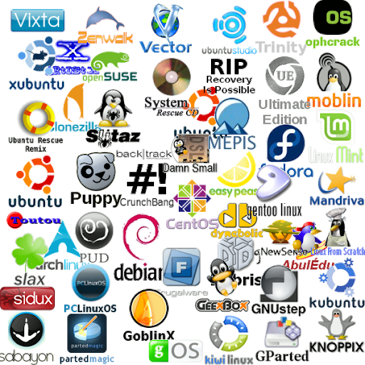
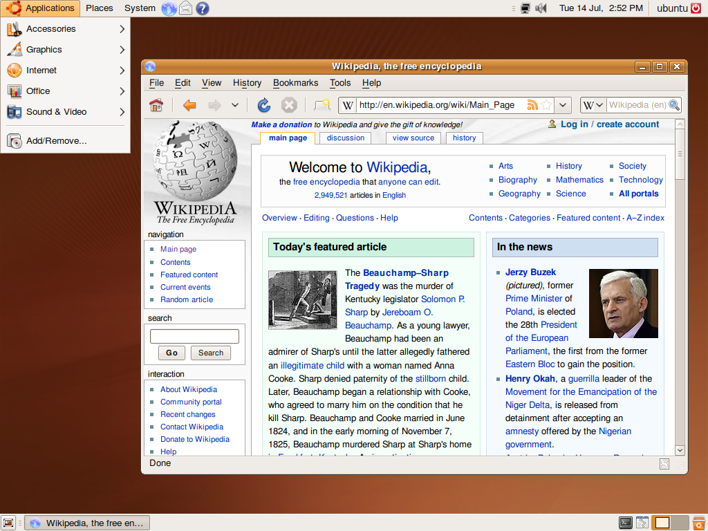
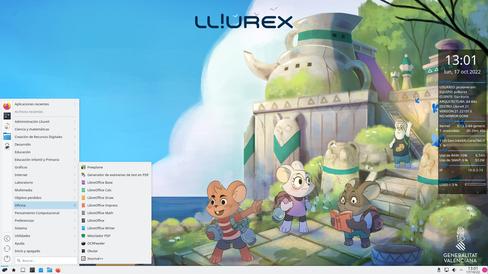

# Sistemas Operativos: LINUX y sus Distribuciones

## Linux y sus distribuciones

Linux es un núcleo de Sistema Operativo **libre** basado en **Unix**. Al ser libre su uso es **gratuito**.

El hecho de que Linux sea un núcleo hace que se creen multitud de **distribuciones**. Una **distribución de Linux** **es un software basado en el núcleo de Linux que incluye distintos paquetes de aplicaciones**. 

**Distribuciones de Linux más conocidas**
{: .centrado}

La iniciativa de **software libre** alcanza su máxima expresión cuando en el equipo se instala el sistema operativo **GNU Linux** en lugar de Windows. Existen múltiples distribuciones gratuitas (OpenSuse, Fedora, Debian, Red Hat, Ubuntu, etc). Algunos han visto en esta diversidad uno de los principales problemas para su implantación. No obstante todos ellos ofrecen un **entorno gratuito totalmente visual y gráfico que facilita el uso de aplicaciones**.  Algunas **Comunidades Autónomas españolas** han creado y distribuido a los centros sus propias versiones de Linux: Guadalinex (Andalucía), Linex (Extremadura), MAX (Madrid), **LliureX (Comunidad Valenciana)**, etc. En la actualidad a nivel mundial la tendencia que parece consolidarse es **Ubuntu**. 

Ejemplos de distribuciones más utilizadas:

* **Ubuntu:** Una distribución para usuario medio y novel con ciertas similitudes con Windows.
* **Lliurex:** Una distribución educativa en la que el núcleo de Linux viene acompañado con aplicaciones de utilidad educativa
* **Wifislax:** Una distribución con herramientas de monitorización de red. Muy utilizada por hackers por sus herramientas de hackeo de redes.

### Ubuntu

Es una distribución GNU/Linux que ofrece un **interesante sistema operativo para equipos de escritorio y servidores en el ámbito educativo**. Es una distribución basada en **[Debian](http://es.wikipedia.org/wiki/Debian)** cuyas principales características son:

* Facilidad de manejo
* Actualizaciones frecuentes
* Facilidad de instalación del sistema
* Búsqueda e instalación de programas robusta y fácil al basarse en paquetes.
* Libertad de uso y distribución.

El término **“[Ubuntu](http://es.wikipedia.org/wiki/Ubuntu)” proviene del zulú y significa “humanidad hacia otros” o bien “yo soy porque nosotros somos”**. Precisamente su slogan “Linux para seres humanos” (Linux for Human Beings) pretende enfatizar esa facilidad de manejo. Está patrocinado por [Canonical Ltd.](http://www.canonical.com/) Se trata de una compañía británica privada fundada y financiada por el empresario sudafricano Mark Shuttleworth. Esta empresa ofrece **Ubuntu de forma libre y gratuita** aprovechando las aportaciones de los desarrolladores de una amplia comunidad a nivel mundial. En lugar de lucrarse por la distribución del sistema, su financiación se obtiene del soporte técnico.

**Logo de Ubuntu (distribución de Linux)**
{: .centrado}

 Veamos una pantalla del mismo:

**Pantallazo de ubuntu**
{: .centrado}

Como puede observarse en la foto, al igual que Windows, **Ubuntu está basado también** en el concepto de **ventana**. Además, comparte muchas similitudes con el S.O. de Microsoft.

Entre las **aplicaciones de usuario**, Ubuntu cuenta por ejemplo con:

* Aplicaciones ofimáticas: Paquete de programas ofimáticos OpenOffice: Writer, Calc, Impress, Draw.
* Navegador web: Mozilla Firefox
* Cliente de mensajería instantánea: Empathy
* Cliente de correo: Thunderbird
* Reproductor de música: Rythembox
* Reproductor de vídeo: VLC

Algunas **aplicaciones de Windows no son desarrolladas para los sistemas Linux (Adobe Photoshop, Microsoft Word...)**. Sin embargo, existe una **alternativa** **libre** a cada uno de estos programas. A poco que investigues en la web encontrarás cada una de ellas. Debido a que la mayoría de programas son libres y que estos se encuentran en continuo desarrollo, **el número de aplicaciones existentes bajo Linux es impresionante**.

### Lliurex

**Distribución** educativa **realizada por** la **Conselleria d'Educació de la Generalitat Valenciana**.

**LliureX** es el proyecto de la **[Consellería de Educación, Cultura y Deporte de la Generalitat](http://www.ceice.gva.es/ "Conselleria d'Educació, Investigació, Cultura i Esport de la Generalitat Valenciana")** que tiene como objetivo principal la introducción de las TIC en el sistema educativo Valenciano. El proyecto consiste en la creación y mantenimiento de un conjunto de sistema operativo y aplicaciones, basado en [**software libre**](https://ca.wikipedia.org/wiki/Programari_lliure), y denominado del mismo modo. Este conjunto de aplicaciones con sistema operativo es conocido con el nombre de distribución **[GNU/Linux](https://www.xataka.com/basics/cual-es-la-diferencia-entre-linux-y-gnu-linux)**.

LliureX es, por lo tanto, **la distribución [GNU/Linux](https://www.gnu.org/gnu/gnu-history.md) valenciana destinada a la docencia educativa.**

**Escritorio de Lliurex**
{: .centrado}

Como **sistema operativo**, LliureX se encarga de gestionar los **recursos físicos del ordenador y de proveer de servicios básicos los programas de aplicación**. Pero LliureX no es un sistema operativo diseñado desde cero, sino que aprovecha las ventajas del **software libre** y utiliza como núcleo el conocido sistema [**Linux**](https://ca.wikipedia.org/wiki/Linux_(nucli)). Como **conjunto de aplicaciones**, LliureX dispone de un enorme catálogo de software libre enfocado a facilitar la tarea educativa.

## Actividad

> **EJERCICIO 2**: Realiza este ejercicio en tu libreta digital que has descargado desde la plataforma Web. Recuerda que más tarde el profesor puede preguntarte.
{: .alert-success}

[👈 Atrás](./sistemas_operativos_familia_windows)
[👉 Siguiente](./sistemas_operativos_mac_os)